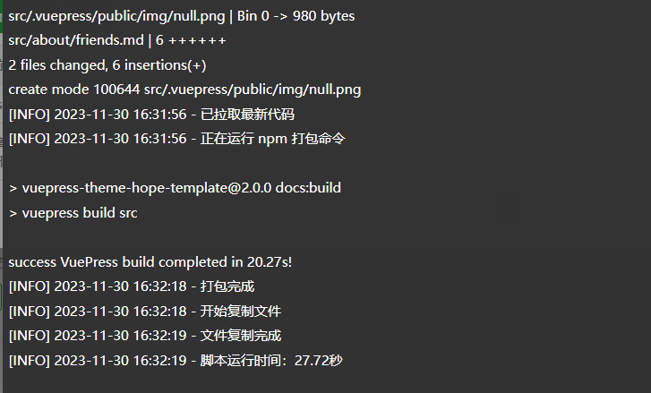
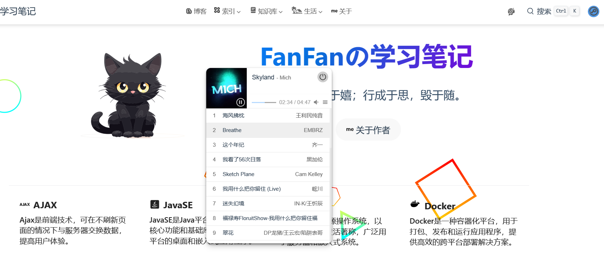

---
# 这是文章的标题
title: 关于本站
icon: info
order: 1
# 你可以自定义封面图片
#cover: /assets/images/cover3.jpg
# 这是页面的图标
#icon: file
# 这是侧边栏的顺序
#order: 1
# 设置作者
#author: fanfan
# 设置写作时间
date: 2021-01-01
# 一个页面可以有多个分类
#category:
#  - 使用指南
# 一个页面可以有多个标签
#tag:
#  - 页面配置
#  - 使用指南
# 此页面会在文章列表置顶
sticky: false
# 此页面会出现在文章收藏中
star: false
# 你可以自定义页脚
footer: 这是测试显示的页脚
# 你可以自定义版权信息
#copyright: 无版权
index: false
# 是否显示在文章列表中
article: false
---


### :sparkles:建站初衷

​		从小时候开始接触智能手机, 就被互联网这个概念深深的吸引住了;大概是13年左右,当时喜欢玩一些手机的单机游戏,奈何绝大部分游戏都需要短信内购,对一个当时买5毛钱辣条都要犹豫的我来说,确实是一个很困扰的事.

​		也是在13年刚上初中的时候,接触到葫芦侠这个平台,彻底打开了新世界的大门,号称当时最牛X的破解平台,有最全的破解游戏,还有着各种技术教程,那时候总因为流量不够用而困扰,在葫芦侠上偶然看到免流教程,抱着好奇的态度试了试,果然可以,给了我不小的震撼.

​		之后,便在平台上学习一些技术,从手机root后使用lua脚本修改天天酷跑 接触到使用模块让微信QQ自动抢红包,群机器人等一些有趣的技术,到15年的时候,沉迷于游戏脚本的制作和在平台发布一些自己技术帖,后来意识到这些东西触及到法律,便不再往这个方面投入精力了

​		有句话说,兴趣是最好的老师,19年参加高考后,填志愿就选了自己感兴趣的计算机专业, 可是在大学期间并没有把主要精力放在学习上,在学业上也是为了应付, 临近实习的的时候才开始幡然醒悟,于是恶补编程知识。知识学完之后如果没有总结的话,是没有一个完整的知识框架, 便开始在微软的noteOne 这个软件上记录, 但是noteOne用起来还是有一些让人很不舒服的点,比如没法在手机上查看,分享给别人及其困难,也不好迁移, 后来陆陆续续的接触到 印象笔记 语雀这类软件 , 可以说 语雀这个软件绝对是市面上 Top1的笔记软件,它的知识库分享和完全支持导入导出Markdown格式 文件 对于我来说实在是太友好了。

​		后来我心血来潮想搭个博客，把我的文字分享上去。最开始玩的是WordPress，还弄了个服务器和域名。然后碰了碰Typecho这些博客系统，结果都有一个毛病——写文章得用它们的怪怪的编辑器，一个字"不好用"。

​		最后，遇见了Hexo这个静态博客，不需要服务器，更不用域名。最棒的是，可以全身心地专注于写作，只需把自己的Markdown笔记放进对应文件夹，然后在控制台输入"hexo g && hexo d"，就会自动部署到GitHub上！

​		然而，用了大概一年左右，发现了Hexo也有点不顺心的地方：社区主题多，但要自定义太麻烦；更新速度慢，还有，想要对框架玩二次改装，得用最基本的CSS和JS来“掩盖瑕疵”。

​		当我深入研究Vue文档时，我就像发现了藏宝图一样！它采用了VuePress，简洁利落、直截了当，速度还快得让人瞠目结舌。基于Vite，它在编辑Markdown时几乎没有延迟，保存后页面不用刷新就能更新，简直就像在用VSCode本地预览一样！这玩意儿用的是Vue的渲染引擎，结合了Vite的编译和打包，还支持TypeScript、Sass，甚至还能搞定Vue组件。开发博客的体验简直和搞WebApp一样，比起Hexo高出了好几个级别。虽然生态系统可能还没完全成熟，2.0版本也还没稳定发布，但它的强大之处无人能挡啊！缺点是生态不成熟，很多功能需要自己去手动开发，但是对于一个职业程序员来说，这并不是一个很难的问题。并且我通过WebHook 实现博客的自动化部署只需要`git push`提交代码，服务器会自动执行我写好的脚本实现自动化部署

> 其实我就是懒~~



​		关于域名，fanliu.top  为什么要注册这个域名呢,不得不提一段往事了,以后有时间再讲吧。

### 💘 关于本站

由于博客框架从hexo切换到了VuePress后,markdown记录的笔记有一些不兼容,后续会慢慢迁移过来

本博客基于 VuePress 和 vuepress-theme-hope 搭建 和 魔改 

博主借鉴 墨七大佬的思路 开发了一款全局的音乐播放器。可以通过顶部导航栏右上角的 按钮打开 



音源通过Python爬虫 爬取对应歌单的`音源文件,封面,作者,歌曲名 `

json示例

```json
[
    {
        "author": "王利民纯音",
        "lrc": "https://api2.52jan.com/qqmusic/lrc/001To4tG4UAuNW.lrc",
        "pic": "https://y.qq.com/music/photo_new/T002R300x300M000001PkaY90CFWqG.jpg",
        "title": "海风拂枕",
        "url": "https://api2.52jan.com/qqmusic/001To4tG4UAuNW"
    },
    {
        "author": "EMBRZ",
        "lrc": "https://api2.52jan.com/qqmusic/lrc/003kHw374BUJWD.lrc",
        "pic": "https://y.qq.com/music/photo_new/T002R300x300M000000vfsYu1T64L9.jpg",
        "title": "Breathe",
        "url": "https://api2.52jan.com/qqmusic/003kHw374BUJWD"
    }
]    
```

博客中的部分图片和音乐源于网络，侵删

本博客文章采用 CC BY-NC-SA 4.0 协议，转载请注明出处

欢迎小伙伴们交换友链，具体说明可在 友链页 查看。


### 🙋 免责声明

本站以分享互联网经验、学习知识为目的，所有文章所涉及使用的工具、资源等均来自互联网， 仅供学习和研究使用，版权归作者所有，如果无意之中侵犯了您的版权，请来信告知。本站将在第一时间删除！另外， 本站内的文章多为博主原创，大部分是由CSDN平台和稀土掘金 搬迁过来，仅供学习交流之用，不参与商业用途。

遵守相关法律法规，由于本站资源部分来源于网络，开发也是使用开源模板，故无法核实资源侵权的真实性，无论出于何种目的要求本站删除内容，“您”均需要提供相关证明，否则不予处理。

