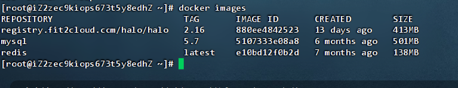
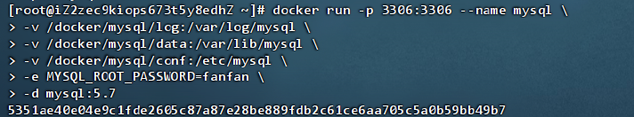
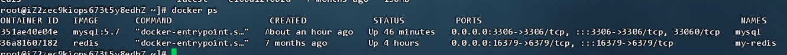
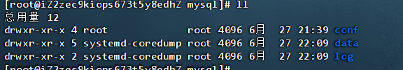
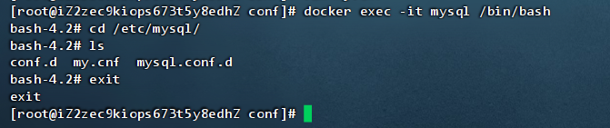

## docker安装MySQL_全网最佳教程

### 0. Linux centos版本 懒人一键部署脚本

新服务器中 直接在 shell命令框中 复制并运行以下脚本 即可一键部署

```sh
wget https://file.fanliu.top/mysql/install_docker_mysql.sh -O install_docker_mysql.sh && chmod +x install_docker_mysql.sh && ./install_docker_mysql.sh
```

此教程适合用于企业项目中的 MySQL，配置注释详细全面，并准备了一键安装的脚本

### 1. 使用命令拉取mysql

拉取mysql的命令为 **docker pull mysql** ，但是这样的话，docker会自动帮你拉取最新的版本的mysql，一般最好就是在mysql后面指定版本号，才能拉取到想要的版本。我这里选择拉取mysql5.7，命令如下

```sh
docker pull mysql:5.7
```

### 2. 检查下载的mysql镜像

我们可以使用如下命令检查当前下载好的镜像：

```sh
sudo docker images
```



### 3. 创建对应映射挂载目录

```sh
mkdir -p /docker/mysql/conf/conf.d
mkdir -p /docker/mysql/conf/mysql.conf.d
mkdir -p /docker/mysql/data
mkdir -p /docker/mysql/log
```

### 4. 运行docker命令初始化启动容器

```sh
docker run -p 3306:3306 --name mysql \
-v /docker/mysql/log:/var/log/mysql \
-v /docker/mysql/data:/var/lib/mysql \
-v /docker/mysql/conf:/etc/mysql \
-e MYSQL_ROOT_PASSWORD=fanfan \
-d mysql:5.7
```



运行命令查询是否启动成功（此命令查询正在运行的容器）

```sh
docker ps
```



出现mysql的容器说明正常运行

### 5. 在云服务器和防火墙开放对应端口

略

### 6. 测试连接

略

### 7. 查看mysql挂载的文件夹

```sh
cd /docker/mysql
ll
```



### 8. 修改mysql默认配置

1. 进入mysql 的挂载目录

   ```sh
   cd /docker/mysql/conf
   ```

2. 通过vim命令创建配置文件 my.cnf

   ```sh
   vim my.cnf
   ```

3. 复制插入一下配置并保存（可按需调整）

   这个配置文件包含详细的注释，帮助你理解每个配置项的作用。确保根据你的实际需求和硬件资源进一步调整这些设置。

   ```ini
   [client]
   # 设置客户端的默认字符集为utf8
   default-character-set=utf8
   
   [mysql]
   # 设置MySQL命令行工具的默认字符集为utf8
   default-character-set=utf8
   
   [mysqld]
   # 个人设置
   # 设置默认存储引擎为InnoDB
   default_storage_engine = InnoDB
   # 表名大小写不敏感
   lower_case_table_names = 1
   
   # 日志设置
   # 错误日志文件路径
   log-error = /var/log/mysql/error.log
   # 启用慢查询日志
   slow-query-log = 1
   # 慢查询日志文件路径
   slow-query-log-file = /var/log/mysql/slow.log
   # 定义慢查询的时间阈值为10秒
   long_query_time = 10
   
   # 性能优化设置
   # 设置关键缓冲区大小
   key_buffer_size = 256M
   # 禁用查询缓存（MySQL 8.0后移除查询缓存）
   query_cache_type = 0
   # 设置查询缓存的大小限制
   query_cache_limit = 1M
   # 设置线程缓存大小
   thread_cache_size = 16
   # 设置InnoDB缓冲池大小，根据可用内存调整，建议不超过总内存的70%
   innodb_buffer_pool_size = 512M
   # 设置InnoDB日志文件大小
   innodb_log_file_size = 128M
   # 平衡性能和数据安全性，生产环境可能需要设为1
   innodb_flush_log_at_trx_commit = 2
   # 为每个表使用单独的表空间文件
   innodb_file_per_table = 1
   # 设置最大连接数，根据实际需要调整
   max_connections = 500
   
   # Innodb 设置
   # 使用直接I/O以减少操作系统的缓存冲突
   innodb_flush_method = O_DIRECT
   # 设置InnoDB的I/O容量，根据硬件性能调整
   innodb_io_capacity = 2000
   # 设置InnoDB的读I/O线程数
   innodb_read_io_threads = 4
   # 设置InnoDB的写I/O线程数
   innodb_write_io_threads = 4
   
   # 内存设置
   # 设置表缓存大小，根据表数量调整
   table_open_cache = 2000
   # 调整排序缓冲区大小，避免排序操作过多使用临时文件
   sort_buffer_size = 4M
   # 调整连接缓冲区大小，优化连接操作
   join_buffer_size = 4M
   
   # 查询优化
   # 调整临时表大小，避免使用磁盘临时表
   tmp_table_size = 64M
   # 设置最大堆表大小
   max_heap_table_size = 64M
   # 调整读缓冲区大小，优化全表扫描
   read_buffer_size = 2M
   # 调整随机读缓冲区大小
   read_rnd_buffer_size = 4M
   
   # 连接设置
   # 设置连接超时时间，释放不活跃的连接
   wait_timeout = 600
   # 设置交互式连接超时时间
   interactive_timeout = 600
   
   # 主从复制设置
   # 设置服务器唯一ID
   server-id = 1
   # 设置二进制日志过期时间
   expire_logs_days = 10
   # 启用二进制日志
   log_bin = /var/log/mysql/mysql-bin.log
   # 设置二进制日志格式
   binlog_format = ROW
   # 确保每次事务提交后同步二进制日志
   sync_binlog = 1
   
   # 安全设置
   # 设置绑定地址为0.0.0.0，允许远程连接
   bind-address = 0.0.0.0
   # 禁止DNS解析，提升性能
   skip-name-resolve
   # 禁止符号链接，增加安全性
   skip-symbolic-links
   # 禁用本地文件加载，防止安全漏洞
   local-infile = 0
   ```

4. 重启mysql的docker容器进行重载我们的配置

   ```sh
   docker restart mysql
   ```

5. 进入docker中的mysql容器内部查看文件是否配置成功

   ```sh
   # 1、进入操作台
   docker exec -it mysql /bin/bash
   # 2、进入mysql配置文件目录
   cd /etc/mysql/
   # 3、列出文件
   ls
   # 4、看一眼该文件
   cat my.cnf
   # 5、没问题就退出
   exit
   ```

   

### 9. 设置容器随docker自启动

```sh
# 设置mysql每次开机随docker自启动
docker update mysql --restart=always
```

### 10. 懒人一键部署脚本

```sh
#!/bin/bash

# 设置变量
MYSQL_VERSION="5.7"
MYSQL_CONTAINER_NAME="mysql"
MYSQL_ROOT_PASSWORD="fanfan"
MYSQL_CONF_DIR="/docker/mysql/conf"
MYSQL_DATA_DIR="/docker/mysql/data"
MYSQL_LOG_DIR="/docker/mysql/log"
MY_CNF_FILE="$MYSQL_CONF_DIR/my.cnf"

# 拉取 MySQL 镜像
echo "Pulling MySQL $MYSQL_VERSION image..."
docker pull mysql:$MYSQL_VERSION

# 创建映射挂载目录
echo "Creating directories for MySQL..."
mkdir -p $MYSQL_CONF_DIR/conf.d
mkdir -p $MYSQL_CONF_DIR/mysql.conf.d
mkdir -p $MYSQL_DATA_DIR
mkdir -p $MYSQL_LOG_DIR

# 创建 MySQL 配置文件
echo "Creating my.cnf file..."
cat <<EOF > $MY_CNF_FILE
[client]
# 设置客户端的默认字符集为utf8
default-character-set=utf8

[mysql]
# 设置MySQL命令行工具的默认字符集为utf8
default-character-set=utf8

[mysqld]
# 个人设置
# 设置默认存储引擎为InnoDB
default_storage_engine = InnoDB
# 表名大小写不敏感
lower_case_table_names = 1

# 日志设置
# 错误日志文件路径
log-error = /var/log/mysql/error.log
# 启用慢查询日志
slow-query-log = 1
# 慢查询日志文件路径
slow-query-log-file = /var/log/mysql/slow.log
# 定义慢查询的时间阈值为10秒
long_query_time = 10

# 性能优化设置
# 设置关键缓冲区大小
key_buffer_size = 256M
# 禁用查询缓存（MySQL 8.0后移除查询缓存）
query_cache_type = 0
# 设置查询缓存的大小限制
query_cache_limit = 1M
# 设置线程缓存大小
thread_cache_size = 16
# 设置InnoDB缓冲池大小，根据可用内存调整，建议不超过总内存的70%
innodb_buffer_pool_size = 512M
# 设置InnoDB日志文件大小
innodb_log_file_size = 128M
# 平衡性能和数据安全性，生产环境可能需要设为1
innodb_flush_log_at_trx_commit = 2
# 为每个表使用单独的表空间文件
innodb_file_per_table = 1
# 设置最大连接数，根据实际需要调整
max_connections = 500

# Innodb 设置
# 使用直接I/O以减少操作系统的缓存冲突
innodb_flush_method = O_DIRECT
# 设置InnoDB的I/O容量，根据硬件性能调整
innodb_io_capacity = 2000
# 设置InnoDB的读I/O线程数
innodb_read_io_threads = 4
# 设置InnoDB的写I/O线程数
innodb_write_io_threads = 4

# 内存设置
# 设置表缓存大小，根据表数量调整
table_open_cache = 2000
# 调整排序缓冲区大小，避免排序操作过多使用临时文件
sort_buffer_size = 4M
# 调整连接缓冲区大小，优化连接操作
join_buffer_size = 4M

# 查询优化
# 调整临时表大小，避免使用磁盘临时表
tmp_table_size = 64M
# 设置最大堆表大小
max_heap_table_size = 64M
# 调整读缓冲区大小，优化全表扫描
read_buffer_size = 2M
# 调整随机读缓冲区大小
read_rnd_buffer_size = 4M

# 连接设置
# 设置连接超时时间，释放不活跃的连接
wait_timeout = 600
# 设置交互式连接超时时间
interactive_timeout = 600

# 主从复制设置
# 设置服务器唯一ID
server-id = 1
# 设置二进制日志过期时间
expire_logs_days = 10
# 启用二进制日志
log_bin = /var/log/mysql/mysql-bin.log
# 设置二进制日志格式
binlog_format = ROW
# 确保每次事务提交后同步二进制日志
sync_binlog = 1

# 安全设置
# 设置绑定地址为0.0.0.0，允许远程连接
bind-address = 0.0.0.0
# 禁止DNS解析，提升性能
skip-name-resolve
# 禁止符号链接，增加安全性
skip-symbolic-links
# 禁用本地文件加载，防止安全漏洞
local-infile = 0
EOF

# 运行 Docker 命令启动 MySQL 容器
echo "Starting MySQL container..."
docker run -p 3306:3306 --name $MYSQL_CONTAINER_NAME \
-v $MYSQL_LOG_DIR:/var/log/mysql \
-v $MYSQL_DATA_DIR:/var/lib/mysql \
-v $MYSQL_CONF_DIR:/etc/mysql \
-e MYSQL_ROOT_PASSWORD=$MYSQL_ROOT_PASSWORD \
-d mysql:$MYSQL_VERSION

# 设置 MySQL 容器随 Docker 自启动
echo "Setting MySQL container to restart always..."
docker update $MYSQL_CONTAINER_NAME --restart=always

# 检查 MySQL 容器状态
echo "Checking MySQL container status..."
docker ps | grep $MYSQL_CONTAINER_NAME

echo "MySQL setup completed successfully."

```

复制保存上述脚本为 `setup_mysql.sh` 文件，并赋予执行权限：

```sh
chmod +x setup_mysql.sh
```

然后运行脚本：

```sh
./setup_mysql.sh
```

该脚本将自动完成 MySQL 镜像拉取、目录创建、配置文件生成、容器启动和自启动配置


### 11. docker-compose部署

#### 1. 创建初始文件夹

```
mkdir -p /docker/mysql/conf/conf.d
mkdir -p /docker/mysql/conf/mysql.conf.d
mkdir -p /docker/mysql/data
mkdir -p /docker/mysql/log
```

#### 2. 创建 `my.cnf`

在 `/docker/mysql/conf` 目录中创建一个名为 `my.cnf` 的文件，内容如下：

```ini
[client]
# 设置客户端的默认字符集为utf8
default-character-set=utf8

[mysql]
# 设置MySQL命令行工具的默认字符集为utf8
default-character-set=utf8

[mysqld]
# 个人设置
# 设置默认存储引擎为InnoDB
default_storage_engine = InnoDB
# 表名大小写不敏感
lower_case_table_names = 1

# 日志设置
# 错误日志文件路径
log-error = /var/log/mysql/error.log
# 启用慢查询日志
slow-query-log = 1
# 慢查询日志文件路径
slow-query-log-file = /var/log/mysql/slow.log
# 定义慢查询的时间阈值为10秒
long_query_time = 10

# 性能优化设置
# 设置关键缓冲区大小
key_buffer_size = 256M
# 禁用查询缓存（MySQL 8.0后移除查询缓存）
query_cache_type = 0
# 设置查询缓存的大小限制
query_cache_limit = 1M
# 设置线程缓存大小
thread_cache_size = 16
# 设置InnoDB缓冲池大小，根据可用内存调整，建议不超过总内存的70%
innodb_buffer_pool_size = 512M
# 设置InnoDB日志文件大小
innodb_log_file_size = 128M
# 平衡性能和数据安全性，生产环境可能需要设为1
innodb_flush_log_at_trx_commit = 2
# 为每个表使用单独的表空间文件
innodb_file_per_table = 1
# 设置最大连接数，根据实际需要调整
max_connections = 500

# Innodb 设置
# 使用直接I/O以减少操作系统的缓存冲突
innodb_flush_method = O_DIRECT
# 设置InnoDB的I/O容量，根据硬件性能调整
innodb_io_capacity = 2000
# 设置InnoDB的读I/O线程数
innodb_read_io_threads = 4
# 设置InnoDB的写I/O线程数
innodb_write_io_threads = 4

# 内存设置
# 设置表缓存大小，根据表数量调整
table_open_cache = 2000
# 调整排序缓冲区大小，避免排序操作过多使用临时文件
sort_buffer_size = 4M
# 调整连接缓冲区大小，优化连接操作
join_buffer_size = 4M

# 查询优化
# 调整临时表大小，避免使用磁盘临时表
tmp_table_size = 64M
# 设置最大堆表大小
max_heap_table_size = 64M
# 调整读缓冲区大小，优化全表扫描
read_buffer_size = 2M
# 调整随机读缓冲区大小
read_rnd_buffer_size = 4M

# 连接设置
# 设置连接超时时间，释放不活跃的连接
wait_timeout = 600
# 设置交互式连接超时时间
interactive_timeout = 600

# 主从复制设置
# 设置服务器唯一ID
server-id = 1
# 设置二进制日志过期时间
expire_logs_days = 10
# 启用二进制日志
log_bin = /var/log/mysql/mysql-bin.log
# 设置二进制日志格式
binlog_format = ROW
# 确保每次事务提交后同步二进制日志
sync_binlog = 1

# 安全设置
# 设置绑定地址为0.0.0.0，允许远程连接
bind-address = 0.0.0.0
# 禁止DNS解析，提升性能
skip-name-resolve
# 禁止符号链接，增加安全性
skip-symbolic-links
# 禁用本地文件加载，防止安全漏洞
local-infile = 0
```

#### 3. 创建 `docker-compose.yaml`

在 `/docker/mysql/` 目录中创建一个名为 `docker-compose.yaml` 的文件，内容如下：

```yaml
version: '3.0'

services:
  mysql:
    image: mysql:5.7
    container_name: mysql
    restart: always
    environment:
      MYSQL_ROOT_PASSWORD: 123456
    ports:
      - "3306:3306"
    volumes:
      - /docker/mysql/log:/var/log/mysql
      - /docker/mysql/data:/var/lib/mysql
      - /docker/mysql/conf:/etc/mysql
```

#### 4. 启动 MySQL 容器

在 `mysql-docker/` 目录中，运行以下命令来启动 MySQL 容器：

```sh
/docker/mysql/docker-compose up -d
```

#### 5. 检查 MySQL 容器状态

要检查 MySQL 容器是否运行，使用以下命令：

```sh
docker-compose ps
```

这个 `docker-compose` 文件将自动完成 MySQL 镜像拉取、目录创建、配置文件挂载、容器启动和自启动配置，并包含所需的注释。这样，你的 MySQL 容器就可以根据配置文件自动化启动，并且保持数据和日志持久化。