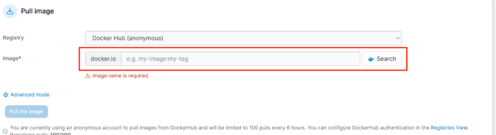

### 简介

> porttainer其实是很方便docker管理工具，自己用了也挺熟练的，可以说linux上安装docker，那么必须安装porttainer，考虑到有些小伙伴可能对porttainer不是很熟悉，所以做一个详细的教程，以便学习

#### 介绍

Portainer是一款**开源的容器管理工具**，旨在简化Docker容器和Kubernetes集群的管理。通过提供一个直观的Web界面，Portainer可以帮助用户轻松地创建、管理和维护容器，而无需使用复杂的命令行工具。

#### 功能

**容器管理工具：**Portainer支持Docker和Kubernetes，提供了一个统一的管理平台，帮助用户轻松管理和监控容器。

**支持Docker和Kubernetes：**Portainer与Docker和Kubernetes完美集成，为用户提供了一个简单易用的界面来管理容器和集群。

**简化操作：**Portainer通过Web界面简化了容器管理，用户无需熟练掌握Docker和Kubernetes命令即可完成各种操作。

### 部署

> 我这里用到的是Linux中安装docker的情况下，运行docker命令一键部署的方式，相对来说是比较方便的。

```shell
-- 拉取镜像， 已有镜像，不需要拉取
docker pull portainer/portainer-ce
-- 命令行创建容器
docker run -d -p 9000:9000 -v /var/run/docker.sock:/var/run/docker.sock --restart=always --name prtainer portainer/portainer-ce
```

> 这段代码表示的是拉取portainer-ce的镜像，然后创建一个名字为prtainer的docker容器，设置为一直运行（服务器重启，portainer也会跟随启动），映射端口为9000容器端口为9000

- 运行完这段代码，你的portainer就已经启动起来了
- 现在输入你服务器的ip加上端口号9000。 例：123.123.123.123:9000
- 等待网页刷新容器启动进入portainer的初始化界面


- 现在要做的就是设置用户名和密码


- 恭喜你，点击Get Started 就可以进入portainer的主功能区了

### 使用

#### docker容器介绍


1. 这个界面就是服务器的一个docker,我们点击进入

2. 点击containers进入docker容器运行管理（本机容器列表：支持启动、停止、杀进程、重启、删除、添加容器等操作，和敲命令效果是一样的。）


2. 点击进入查看docker容器的运行情况

#### 容器管理（Containers）

查看容器列表：登录Portainer后，点击左侧菜单栏的“容器”选项，你将看到当前Docker环境中所有容器的列表。

启动、停止和重启容器：在容器列表中，你可以看到每个容器右侧的操作按钮，包括启动、停止和重启。点击相应的按钮，即可对容器进行相应操作。

查看容器日志：点击容器列表中的容器名称，进入容器详情页面。在此页面，点击“日志”选项卡，你可以查看容器的运行日志。

进入容器控制台：在容器详情页面，点击“控制台”选项卡，然后点击“连接”按钮，即可进入容器的命令行控制台。

容器升级：**使用Portainer更新单一容器是非常简单的事情**。

随意进入某个容器的详情，点击**编辑（Edit)**：


在编辑页面，更改镜像名称：


**注：如果想要更新容器到最新版，只需要添加latest即可；如果是更新到特别版本，请在尾部添加特定版本号，这些在docker hub上均可找到对应的信息。**

然后点击**部署容器**即可：


#### 管理镜像（Images）

##### 查看镜像列表：

点击左侧菜单栏的“镜像”选项，你将看到当前Docker环境中所有镜像的列表。

搜索和拉取镜像：在镜像页面，点击右上角的“拉取镜像”按钮，输入镜像名称和标签，然后点击“拉取镜像”按钮，即可从Docker Hub或其他镜像仓库拉取镜像。



##### 删除镜像：

在镜像列表中，点击每个镜像右侧的垃圾桶图标，即可删除镜像。


#### 管理网络（Networks）

##### 查看网络列表：

点击左侧菜单栏的“网络”选项，你将看到当前Docker环境中所有网络的列表。

##### 创建网络：

在网络页面，点击右上角的“创建网络”按钮，选择网络类型（桥接、主机或覆盖），输入网络名称，然后点击“创建网络”按钮，即可创建新的网络。

##### 删除网络：

在网络列表中，点击每个网络右侧的垃圾桶图标，即可删除网络。


#### 管理堆栈（Stacks）

##### 查看堆栈列表：

点击左侧菜单栏的“堆栈”选项，你将看到当前Docker环境中所有堆栈的列表。堆栈是一组相关联的服务，使用Docker Compose文件定义，稍后我们也会用该功能带着大家做一些很酷的事情。

##### 创建堆栈：

在堆栈页面，点击右上角的“创建堆栈”按钮，输入堆栈名称，选择部署方式（Web编辑器、上传Compose文件或从URL部署），然后点击“创建堆栈”按钮，即可部署新的堆栈。

##### 更新堆栈：

在堆栈列表中，点击堆栈名称进入堆栈详情页面。在此页面，你可以修改Docker Compose文件，然后点击“更新堆栈”按钮，以便应用新的配置。

##### 删除堆栈：

在堆栈列表中，点击每个堆栈右侧的垃圾桶图标，即可删除堆栈。

### 高级操作

#### 自定义配置阿里云镜像加速仓库

> 下载镜像较慢的情况下，可以使用镜像加速仓库

1. 创建阿里云镜像


2. 成功创建阿里云镜像


