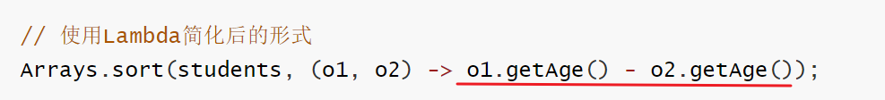
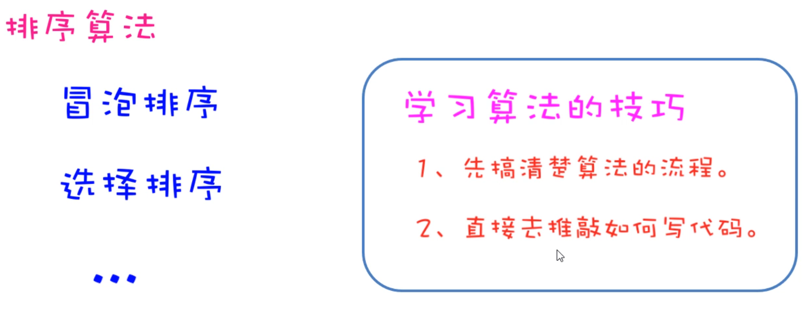
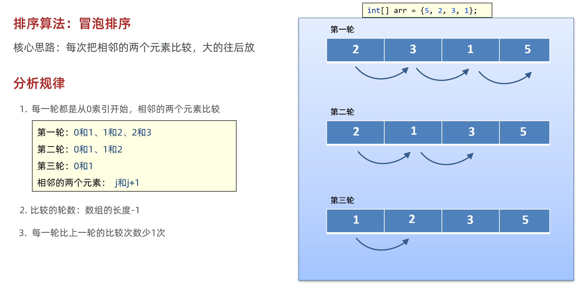
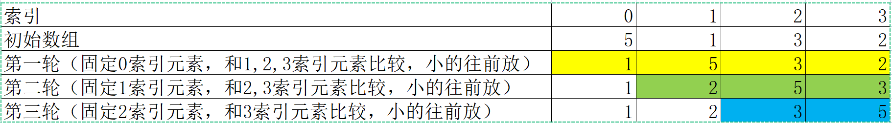
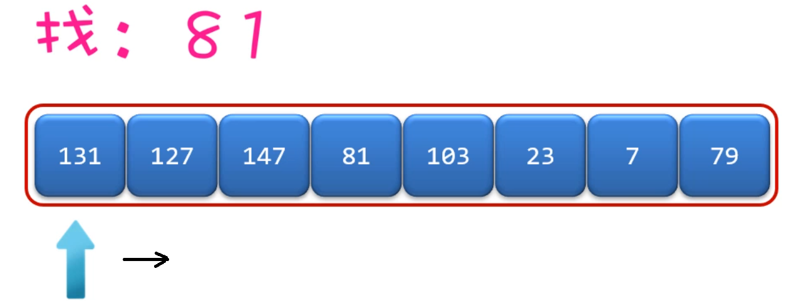
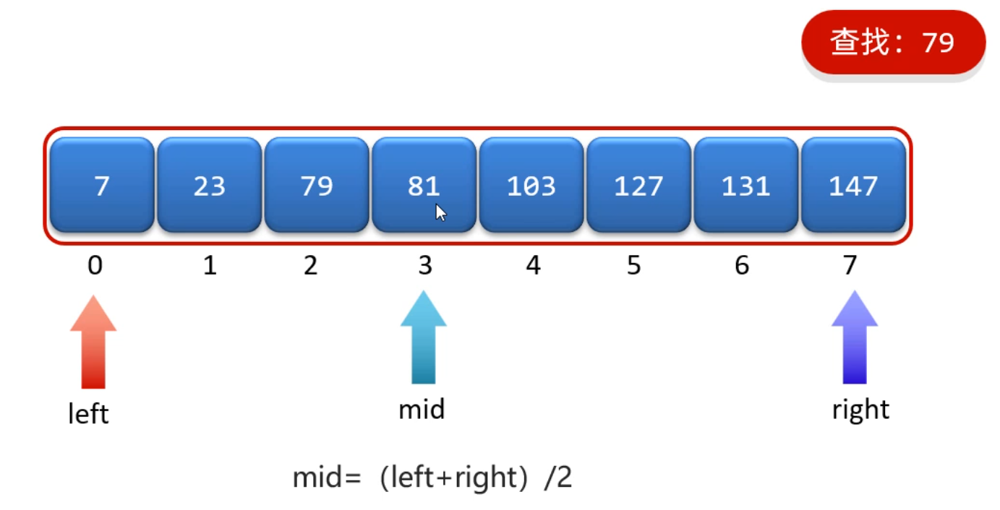
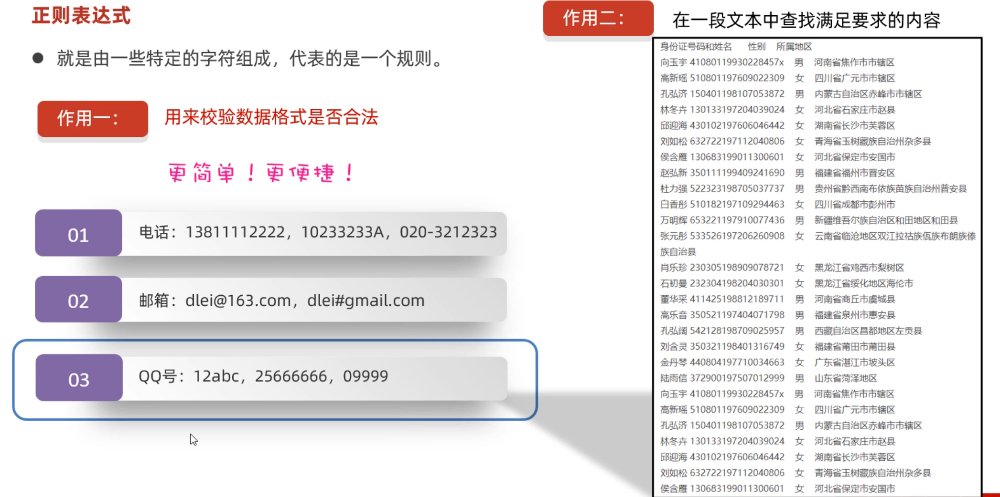
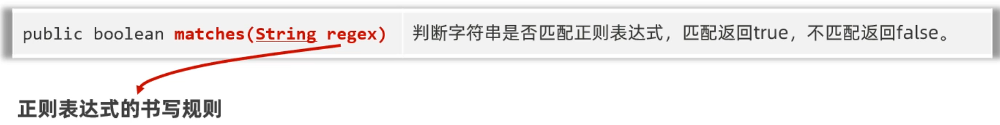
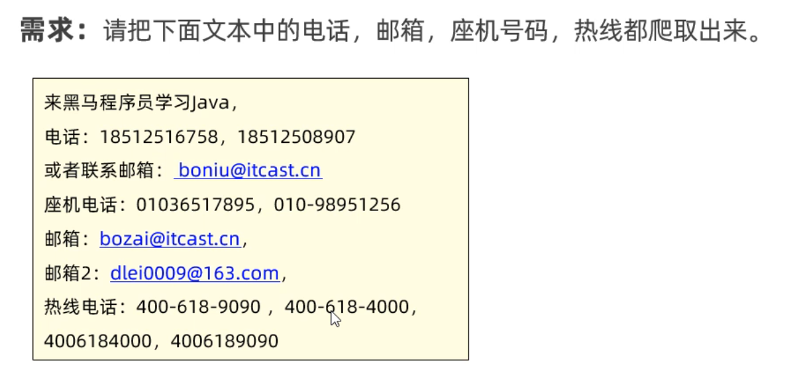
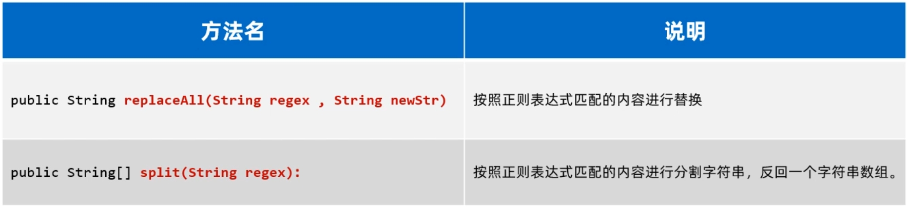

# day05-算法和数据结构


## 一、JDK8新特性-Lambda表达式

接下来，我们学习一个JDK8新增的一种语法形式，叫做Lambda表达式。**作用：用于简化匿名内部类代码的书写。**

### 2.1 Lambda表达式基本使用

怎么去简化呢？Lamdba是有特有的格式的，按照下面的格式来编写Lamdba。

```java
(被重写方法的形参列表) -> {
    被重写方法的方法体代码;
}
```

需要给说明一下的是，在使用Lambda表达式之前，必须先有一个接口，而且接口中只能有一个抽象方法。**（注意：不能是抽象类，只能是接口）**

像这样的接口，我们称之为函数式接口，只有基于函数式接口的匿名内部类才能被Lambda表达式简化。

```java
public interface Swimming{
    void swim();
}
```

有了以上的Swimming接口之后，接下来才能再演示，使用Lambda表达式，简化匿名内部类书写。

```java
public class LambdaTest1 {
    public static void main(String[] args) {
        // 目标：认识Lambda表达式.
        //1.创建一个Swimming接口的匿名内部类对象
		Swimming s = new Swimming(){
             @Override
             public void swim() {
                 System.out.println("学生快乐的游泳~~~~");
             }
         };
         s.swim();
		
        //2.使用Lambda表达式对Swimming接口的匿名内部类进行简化
        Swimming s1 = () -> {
              System.out.println("学生快乐的游泳~~~~");
        };
        s1.swim();
    }
}
```

好的，我们现在已经知道Lamdba表达式可以简化基于函数式接口的匿名内部类的书写。接下来，我们可以把刚才使用Arrays方法时的代码，使用Lambda表达式简化一下了。

```java
public class LambdaTest2 {
    public static void main(String[] args) {
        // 目标：使用Lambda简化函数式接口。
        double[] prices = {99.8, 128, 100};
		//1.把所有元素*0.8: 先用匿名内部类写法
        Arrays.setAll(prices, new IntToDoubleFunction() {
            @Override
            public double applyAsDouble(int value) {
                // value = 0  1  2
                return prices[value] * 0.8;
            }
        });
		//2.把所有元素*0.8: 改用Lamdba表达式写法
        Arrays.setAll(prices, (int value) -> {
                return prices[value] * 0.8;
        });

        System.out.println(Arrays.toString(prices));
        System.out.println("-----------------------------------------------");
		
        Student[] students = new Student[4];
        students[0] = new Student("蜘蛛精", 169.5, 23);
        students[1] = new Student("紫霞", 163.8, 26);
        students[2] = new Student("紫霞", 163.8, 26);
        students[3] = new Student("至尊宝", 167.5, 24);
		//3.对数组中的元素按照年龄升序排列: 先用匿名内部类写法
        Arrays.sort(students, new Comparator<Student>() {
            @Override
            public int compare(Student o1, Student o2) {
                return Double.compare(o1.getHeight(), o2.getHeight()); // 升序
            }
        });
		//4.对数组中的元素按照年龄升序排列: 改用Lambda写法
        Arrays.sort(students, (Student o1, Student o2) -> {
                return Double.compare(o1.getHeight(), o2.getHeight()); // 升序
        });
        System.out.println(Arrays.toString(students));
    }
}
```

好的，各位同学，恭喜大家！到这里，你已经学会了Lambda表达式的基本使用了。


### 2.2 Lambda表达式省略规则

刚才我们学习了Lambda表达式的基本使用。Java觉得代码还不够简单，于是还提供了Lamdba表达式的几种简化写法。具体的简化规则如下

```java
1.Lambda的标准格式
	(参数类型1 参数名1, 参数类型2 参数名2)->{
		...方法体的代码...
		return 返回值;
	}

2.在标准格式的基础上()中的参数类型可以直接省略
	(参数名1, 参数名2)->{
		...方法体的代码...
		return 返回值;
	}
	
3.如果{}总的语句只有一条语句，则{}可以省略、return关键字、以及最后的“;”都可以省略
	(参数名1, 参数名2)-> 结果
	
4.如果()里面只有一个参数，则()可以省略
	(参数名)->结果
```

接下来从匿名内部类开始、到Lambda标准格式、再到Lambda简化格式，一步一步来简化一下。同学们体会一下简化的过程。

```java
public class LambdaTest2 {
    public static void main(String[] args) {
        // 目标：使用Lambda简化函数式接口。
        double[] prices = {99.8, 128, 100};
		//1.对数组中的每一个元素*0.8: 匿名内部类写法
        Arrays.setAll(prices, new IntToDoubleFunction() {
            @Override
            public double applyAsDouble(int value) {
                // value = 0  1  2
                return prices[value] * 0.8;
            }
        });
		//2.需求：对数组中的每一个元素*0.8,使用Lambda表达式标准写法
        Arrays.setAll(prices, (int value) -> {
                return prices[value] * 0.8;
        });
		//3.使用Lambda表达式简化格式1——省略参数类型
        Arrays.setAll(prices, (value) -> {
            return prices[value] * 0.8;
        });
		//4.使用Lambda表达式简化格式2——省略()
        Arrays.setAll(prices, value -> {
            return prices[value] * 0.8;
        });
        //5.使用Lambda表达式简化格式3——省略{}
        Arrays.setAll(prices, value -> prices[value] * 0.8 );

        System.out.println(Arrays.toString(prices));
        
        System.out.println("------------------------------------

        Student[] students = new Student[4];
        students[0] = new Student("蜘蛛精", 169.5, 23);
        students[1] = new Student("紫霞", 163.8, 26);
        students[2] = new Student("紫霞", 163.8, 26);
        students[3] = new Student("至尊宝", 167.5, 24);
		
        //1.使用匿名内部类
        Arrays.sort(students, new Comparator<Student>() {
            @Override
            public int compare(Student o1, Student o2) {
                return Double.compare(o1.getHeight(), o2.getHeight()); // 升序
            }
        });
		//2.使用Lambda表达式表达式——标准格式
        Arrays.sort(students, (Student o1, Student o2) -> {
                return Double.compare(o1.getHeight(), o2.getHeight()); // 升序
        });
		//3.使用Lambda表达式表达式——省略参数类型
        Arrays.sort(students, ( o1,  o2) -> {
            return Double.compare(o1.getHeight(), o2.getHeight()); // 升序
        });
		//4.使用Lambda表达式表达式——省略{}
        Arrays.sort(students, ( o1,  o2) -> Double.compare(o1.getHeight(), o2.getHeight()));


        System.out.println(Arrays.toString(students));
    }
}
```

到这里，恭喜你，对Lamdba表达式的所有写法，就学习完毕了。


## 二、JDK8新特性-方法引用

各位小伙伴，接下来我们学习JDK8的另一个新特性，叫做方法引用。我们知道Lambda是用来简化匿名代码的书写格式的，而方法引用是用来进一步简化Lambda表达式的，它简化的更加过分。

到这里有小伙伴可能就想慰问Java爸爸了：“之前的代码挺好的呀！好不容易学会，你又来搞这些，把我都搞晕了。“    说句大实话，确实有这样的问题，学习新的东西肯定会增加我们的学习成本，从心理上来说多少是有写抗拒的。但是从另一个角度想，一旦我们学会了，会大大简化我们的代码书写，提高我们编写代码的效率，而且这些新的语法都是有前提条件的，遇到的时候就简化得了。再退一步想，就算你没有学会，还是用以前的办法一点问题也没有。

给大家交代清楚了，学习方法引用可能存在的一些心理特点之后，接下来我们再正式学习方法引用的代码怎么编写。

### 3.1 静态方法引用

我们先学习静态方法的引用，还是用之前Arrays代码来做演示。现在准备好下面的代码

```java
public class Test1 {
    public static void main(String[] args) {
        Student[] students = new Student[4];
        students[0] = new Student("蜘蛛精", 169.5, 23);
        students[1] = new Student("紫霞", 163.8, 26);
        students[2] = new Student("紫霞", 163.8, 26);
        students[3] = new Student("至尊宝", 167.5, 24);

        // 原始写法：对数组中的学生对象，按照年龄升序排序
        Arrays.sort(students, new Comparator<Student>() {
            @Override
            public int compare(Student o1, Student o2) {
                return o1.getAge() - o2.getAge(); // 按照年龄升序排序
            }
        });

        // 使用Lambda简化后的形式
        Arrays.sort(students, (o1, o2) -> o1.getAge() - o2.getAge());
    }
}
```

现在，我想要把下图中Lambda表达式的方法体，用一个静态方法代替



准备另外一个类CompareByData类，用于封装Lambda表达式的方法体代码；

```java
public class CompareByData {
    public static int compareByAge(Student o1, Student o2){
        return o1.getAge() - o2.getAge(); // 升序排序的规则
    }
}
```

现在我们就可以把Lambda表达式的方法体代码，改为下面的样子

```java
Arrays.sort(students, (o1, o2) -> CompareByData.compareByAge(o1, o2));
```

Java为了简化上面Lambda表达式的写法，利用方法引用可以改进为下面的样子。**实际上就是用类名调用方法，但是把参数给省略了。**这就是静态方法引用

```java
//静态方法引用：类名::方法名
Arrays.sort(students, CompareByData::compareByAge);
```

### 3.2 实例方法引用

还是基于上面的案例，我们现在来学习一下实例方法的引用。现在，我想要把下图中Lambda表达式的方法体，用一个实例方法代替。


在CompareByData类中，再添加一个实例方法，用于封装Lambda表达式的方法体


接下来，我们把Lambda表达式的方法体，改用对象调用方法

```java
CompareByData compare = new CompareByData();
Arrays.sort(students, (o1, o2) -> compare.compareByAgeDesc(o1, o2)); // 降序
```

最后，再将Lambda表达式的方法体，直接改成方法引用写法。**实际上就是用类名调用方法，但是省略的参数**。这就是实例方法引用

```java
CompareByData compare = new CompareByData();
Arrays.sort(students, compare::compareByAgeDesc); // 降序
```

> 给小伙伴的寄语：一定要按照老师写的步骤，一步一步来做，你一定能学会的！！！ 


### 3.3 特定类型的方法引用

各位小伙伴，我们继续学习特定类型的方法引用。在学习之前还是需要给大家说明一下，这种特定类型的方法引用是没有什么道理的，只是语法的一种约定，遇到这种场景，就可以这样用。

```java
Java约定：
    如果某个Lambda表达式里只是调用一个实例方法，并且前面参数列表中的第一个参数作为方法的主调，后面的所有参数都是作为该实例方法的入参时，则就可以使用特定类型的方法引用。
格式：
	类型::方法名
```

```java
public class Test2 {
    public static void main(String[] args) {
        String[] names = {"boby", "angela", "Andy" ,"dlei", "caocao", "Babo", "jack", "Cici"};
        
        // 要求忽略首字符大小写进行排序。
        Arrays.sort(names, new Comparator<String>() {
            @Override
            public int compare(String o1, String o2) {
                // 制定比较规则。o1 = "Andy"  o2 = "angela"
                return o1.compareToIgnoreCase(o2);
            }
        });
		
        //lambda表达式写法
        Arrays.sort(names, ( o1,  o2) -> o1.compareToIgnoreCase(o2) );
        
        //特定类型的方法引用！
        Arrays.sort(names, String::compareToIgnoreCase);

        System.out.println(Arrays.toString(names));
    }
}
```


### 3.4 构造器引用

各位小伙伴，我们学习最后一种方法引用的形式，叫做构造器引用。还是先说明一下，构造器引用在实际开发中应用的并不多，目前还没有找到构造器的应用场景。所以大家在学习的时候，也只是关注语法就可以了。

现在，我们准备一个JavaBean类，Car类

```java
public class Car {
    private String name;
    private double price;

    public Car() {

    }

    public Car(String name, double price) {
        this.name = name;
        this.price = price;
    }

    public String getName() {
        return name;
    }

    public void setName(String name) {
        this.name = name;
    }

    public double getPrice() {
        return price;
    }

    public void setPrice(double price) {
        this.price = price;
    }

    @Override
    public String toString() {
        return "Car{" +
                "name='" + name + '\'' +
                ", price=" + price +
                '}';
    }
}
```

因为方法引用是基于Lamdba表达式简化的，所以也要按照Lamdba表达式的使用前提来用，需要一个函数式接口，接口中代码的返回值类型是Car类型

```java
interface CreateCar{
    Car create(String name, double price);
}
```

最后，再准备一个测试类，在测试类中创建CreateCar接口的实现类对象，先用匿名内部类创建、再用Lambda表达式创建，最后改用方法引用创建。同学们只关注格式就可以，不要去想为什么（语法就是这么设计的）。

```java
public class Test3 {
    public static void main(String[] args) {
        // 1、创建这个接口的匿名内部类对象。
        CreateCar cc1 = new CreateCar(){
            @Override
            public Car create(String name, double price) {
                return new Car(name, price);
            }
        };
		//2、使用匿名内部类改进
        CreateCar cc2 = (name,  price) -> new Car(name, price);

        //3、使用方法引用改进：构造器引用
        CreateCar cc3 = Car::new;
        
        //注意：以上是创建CreateCar接口实现类对象的几种形式而已，语法一步一步简化。
        
        //4、对象调用方法
        Car car = cc3.create("奔驰", 49.9);
        System.out.println(car);
    }
}
```


## 三、常见算法

### 1.1 认识算法

接下来，我们认识一下什么是算法。算法其实是解决某个实际问题的过程和方法。比如百度地图给你规划路径，计算最优路径的过程就需要用到算法。再比如你在抖音上刷视频时，它会根据你的喜好给你推荐你喜欢看的视频，这里也需要用到算法。

我们为什么要学习算法呢？主要目的是训练我们的编程思维，还有就是面试的时候，面试官也喜欢问一下算法的问题来考察你的技术水平。最后一点，学习算法是成为一个高级程序员的必经之路。

当然我们现在并不会学习非常复杂的算法，万丈高楼平地起，我们现在只需要学习几种常见的基础算法就可以了。而且Java语言本身就内置了一些基础算法给我们使用，实际上自己也不会去写这些算法。


### 1.2 冒泡排序

接下来，我们学习一种算法叫排序算法，它可以价格无序的整数，排列成从小到大的形式（升序），或者从大到小的形式（降序）

排序算法有很多种，我们这里只学习比较简单的两种，一种是冒泡排序，一种是选择排序。学习算法我们先要搞清楚算法的流程，然后再去“推敲“如何写代码。（**注意，我这里用的次是推敲，也就是说算法这样的代码并不是一次成型的，是需要反复修改才能写好的**）。




先来学习冒泡排序，先来介绍一下，冒泡排序的流程

```java
冒泡排序核心思路：每次将相邻的两个元素继续比较
如下图所示：
   第一轮比较 3次
   第二轮比较 2次
   第三轮比较 1次
```



```java
public class Test1 {
    public static void main(String[] args) {
        // 1、准备一个数组
        int[] arr = {5, 2, 3, 1};

        // 2、定义一个循环控制排几轮
        for (int i = 0; i < arr.length - 1; i++) {
            // i = 0  1  2           【5， 2， 3， 1】    次数
            // i = 0 第一轮            0   1   2         3
            // i = 1 第二轮            0   1             2
            // i = 2 第三轮            0                 1

            // 3、定义一个循环控制每轮比较几次。
            for (int j = 0; j < arr.length - i - 1; j++) {
                // 判断当前位置的元素值，是否大于后一个位置处的元素值，如果大则交换。
                if(arr[j] > arr[j+1]){
                    int temp = arr[j + 1];
                    arr[j + 1] = arr[j];
                    arr[j] = temp;
                }
            }
        }
        System.out.println(Arrays.toString(arr));
    }
}
```


### 1.2 选择排序

刚才我们学习了冒泡排序，接下来我们学习了另一种排序方法，叫做选择排序。按照我们刚才给大家介绍的算法的学习方式。先要搞清楚算法的流程，再去推敲代码怎么写。

所以我们先分析选择排序算法的流程：选择排序的核心思路是，每一轮选定一个固定的元素，和其他的每一个元素进行比较；经过几轮比较之后，每一个元素都能比较到了。



接下来，按照选择排序的流程编写代码

```java
ublic class Test2 {
    public static void main(String[] args) {
        // 1、准备好一个数组
        int[] arr = {5, 1, 3, 2};
        //           0  1  2  3

        // 2、控制选择几轮
        for (int i = 0; i < arr.length - 1; i++) {
            // i = 0 第一轮    j = 1 2 3
            // i = 1 第二轮    j = 2 3
            // i = 2 第三轮    j = 3
            // 3、控制每轮选择几次。
            for (int j = i + 1; j < arr.length; j++) {
                // 判断当前位置是否大于后面位置处的元素值，若大于则交换。
                if(arr[i] > arr[j]){
                    int temp = arr[i];
                    arr[i] = arr[j];
                    arr[j] = temp;
                }
            }
        }
        System.out.println(Arrays.toString(arr));
    }
}
```


### 1.3 查找算法

接下来，我们学习一个查找算法叫做二分查找。在学习二分查找之前，我们先来说一下基本查找，从基本查找的弊端，我们再引入二分查找，这样我们的学习也会更加丝滑一下。

**先聊一聊基本查找：**假设我们要查找的元素是81，如果是基本查找的话，只能从0索引开始一个一个往后找，但是如果元素比较多，你要查找的元素比较靠后的话，这样查找的此处就比较多。性能比较差。



**再讲二分查找**：二分查找的主要特点是，每次查找能排除一般元素，这样效率明显提高。**但是二分查找要求比较苛刻，它要求元素必须是有序的，否则不能进行二分查找。**

- 二分查找的核心思路

```java
第1步：先定义两个变量，分别记录开始索引(left)和结束索引(right)
第2步：计算中间位置的索引，mid = (left+right)/2;
第3步：每次查找中间mid位置的元素，和目标元素key进行比较
		如果中间位置元素比目标元素小，那就说明mid前面的元素都比目标元素小
			此时：left = mid+1
    	如果中间位置元素比目标元素大，那说明mid后面的元素都比目标元素大
    		此时：right = mid-1
		如果中间位置元素和目标元素相等，那说明mid就是我们要找的位置
			此时：把mid返回		
注意：一搬查找一次肯定是不够的，所以需要把第1步和第2步循环来做，只到left>end就结束，如果最后还没有找到目标元素，就返回-1.
```



```java
/**
 * 目标：掌握二分查找算法。
 */
public class Test3 {
    public static void main(String[] args) {
        // 1、准备好一个数组。
        int[] arr = {7, 23, 79, 81, 103, 127, 131, 147};

        System.out.println(binarySearch(arr, 150));

        System.out.println(Arrays.binarySearch(arr, 81));
    }

    public static int binarySearch(int[] arr, int data){
        // 1、定义两个变量，一个站在左边位置，一个站在右边位置
        int left = 0;
        int right = arr.length - 1;

        // 2、定义一个循环控制折半。
        while (left <= right){
            // 3、每次折半，都算出中间位置处的索引
            int middle = (left + right) / 2;
            // 4、判断当前要找的元素值，与中间位置处的元素值的大小情况。
            if(data < arr[middle]){
                // 往左边找，截止位置（右边位置） = 中间位置 - 1
                right = middle - 1;
            }else if(data > arr[middle]){
                // 往右边找，起始位置（左边位置） = 中间位置 + 1
                left = middle + 1;
            }else {
                // 中间位置处的元素值，正好等于我们要找的元素值
                return middle;
            }
        }
        return -1; // -1特殊结果，就代表没有找到数据！数组中不存在该数据！
    }
}
```


## 四、正则表达式

接下来，我们学习一个全新的知识，叫做正则表达式。**正则表达式其实是由一些特殊的符号组成的，它代表的是某种规则。**

> 正则表达式的作用1：用来校验字符串数据是否合法
>
> 正则表达式的作用2：可以从一段文本中查找满足要求的内容



### 5.1 正则表达式初体验

现在，我们就以QQ号码为例，来体验一下正则表达式的用法。注意：现在仅仅只是体验而已，我们还没有讲正则表达式的具体写法。

- 不使用正则表达式，校验QQ号码代码是这样的

```java
public static boolean checkQQ(String qq){
        // 1、判断qq号码是否为null
        if(qq == null || qq.startsWith("0") || qq.length() < 6 || qq.length() > 20){
            return false;
        }

        // 2、qq至少是不是null,不是以0开头的，满足6-20之间的长度。
        // 判断qq号码中是否都是数字。
        // qq = 2514ghd234
        for (int i = 0; i < qq.length(); i++) {
            // 根据索引提取当前位置处的字符。
            char ch = qq.charAt(i);
            // 判断ch记住的字符，如果不是数字，qq号码不合法。
            if(ch < '0' || ch > '9'){
                return false;
            }
        }
        // 3、说明qq号码肯定是合法
        return true;
    }
```

- 用正则表达式代码是这样的

```java
public static boolean checkQQ1(String qq){
    return qq != null && qq.matches("[1-9]\\d{5,19}");
}
```

我们发现，使用正则表达式，大大简化的了代码的写法。这个代码现在不用写，体验到正则表达式的优势就可以了。


### 5.2 正则表达式书写规则

前面我们已经体验到了正则表达式，可以简化校验数据的代码书写。这里需要用到一个方法叫`matches(String regex)`。这个方法时属于String类的方法。



这个方法是用来匹配一个字符串是否匹配正则表达式的规则，参数需要调用者传递一个正则表达式。但是正则表达式不能乱写，是有特定的规则的。

下面我们就学习一下，正则表达式的规则。从哪里学呢？在API中有一个类叫做Pattern，我们可以到API文档中搜索，关于正则表达式的规则，这个类都告诉我们了。我这里把常用的已经给大家整理好了。


我们将这些规则，在代码中演示一下

```java
//字符类
       //1. 验证字符串内容是否以h开头，以d结尾，中间是a,e,i,o,u中某个字符
        String regex ="h[aeiou]d";
        System.out.println("\"had\".matches(regex) = " + "had".matches(regex));
        System.out.println("\"hbd\".matches(regex) = " + "hbd".matches(regex));

        //2. 验证字符串内容是否以h开头，以d结尾，中间不是a,e,i,o,u中的某个字符
        String regex2 ="[^aeiou]";
        System.out.println("\"had\".matches(regex) = " + "had".matches(regex2));
        System.out.println("\"hbd\".matches(regex) = " + "hbd".matches(regex2));

        //3. 验证字符串内容是否a-z的任何一个小写字符开头，后跟ad
        String regex3="[a-d]ad";
        System.out.println("\"aad\".matches(regex) = " + "aad".matches(regex3));
        System.out.println("\"bad\".matches(regex) = " + "bbd".matches(regex3));
        System.out.println("\"bbd\".matches(regex) = " + "bbd".matches(regex3));

        //4. 验证字符串内容是否以a-d或者m-p之间某个字符开头，后跟ad
        String regex4="[a-d[m-p]]ad";
        System.out.println("\"aad\".matches(regex4) = " + "aad".matches(regex4));
        System.out.println("\"mad\".matches(regex4) = " + "mad".matches(regex4));
        System.out.println("\"bbd\".matches(regex4) = " + "bbd".matches(regex4));
```

```java
//预定义字符类
//1. 验证字符串内容是否3位数字
        //String regex ="[0-9][0-9][0-9]";
        String regex ="\\d\\d\\d";
        System.out.println("\"123\".matches(regex) = " + "123".matches(regex));
        System.out.println("\"a12\".matches(regex) = " + "a12".matches(regex));

        //2. 验证手机号：1开头，第二位：3/5/8，剩下9位都是0-9的数字
        //String regex2 ="1[358][0-9][0-9][0-9][0-9][0-9][0-9][0-9][0-9][0-9]";
        String regex2 ="1[358]\\d\\d\\d\\d\\d\\d\\d\\d\\d";
        System.out.println("\"13123456789\".matches(regex2) = " + "13123456789".matches(regex2));
        System.out.println("\"14123456789\".matches(regex2) = " + "14123456789".matches(regex2));

        //3. 验证字符串是否以h开头，以d结尾，中间是任何字符
        String regex3="h.d";
        System.out.println("\"had\".matches(regex3) = " + "had".matches(regex3));
        System.out.println("\"hzd\".matches(regex3) = " + "hzd".matches(regex3));
        
        //4. 验证字符串内容是否是：had. 。
        //String regex4="had.";//错误的验证规则
        //.默认表示任意字符,而这里值匹配普通的点,\.表示点,而\本身又表示转义字符,所以需要对\本身进行转义。\\.表示点
        String regex4="had\\.";
        System.out.println("\"had.\".matches(regex4) = " + "had.".matches(regex4));
        System.out.println("\"hada\".matches(regex4) = " + "hada".matches(regex4));
```

```java
//数量词类
 //1. 验证字符串内容是否是三位数字
        //String regex="\\d\\d\\d";
        String regex="\\d{3}";
        System.out.println("\"123\".matches(regex) = " + "123".matches(regex));
        System.out.println("\"1234\".matches(regex) = " + "1234".matches(regex));
        System.out.println("\"12a\".matches(regex) = " + "12a".matches(regex));

        //2. 验证字符串内容是否是多位数字
        String regex2="\\d+";
        System.out.println("\"\".matches(regex2) = " + "".matches(regex2));
        System.out.println("\"123\".matches(regex2) = " + "123".matches(regex2));
        System.out.println("\"123a\".matches(regex2) = " + "123a".matches(regex2));

        //3. 验证字符串内容是否是手机号
        String regex3="[1-9][358]\\d{9}";
        System.out.println("\"13123456789\".matches(regex3) = " + "13123456789".matches(regex3));
        System.out.println("\"14123456789\".matches(regex3) = " + "14123456789".matches(regex3));
```


### 5.3 正则表达式应用案例

学习完正则表达式的规则之后，接下来我们再利用正则表达式，去校验几个实际案例。

```java
/**
 * 目标：校验用户输入的电话、邮箱、时间是否合法。
 */

public class Test {
    public static void main(String[] args) {
        //校验电话号码
        System.out.println("checkPhone(\"18600001111\") = " + checkPhone("18600001111"));
        //校验邮箱
        System.out.println("checkEmail(\"dlei@163.com\") = " + checkEmail("dlei@163.com"));
    }

    public static boolean checkPhone(String phone) {
        String regex1 = "[1-9][3-9]\\d{9}";
        String regex2 = "0\\d{2}-?\\d{6,8}";
        //上述两种规则,必须完全满足其中1种,即满足第1中规则或第2种规则,每种规则又必须是一个整理。
        //String regex=(第一种规则)或(第二种规则)
        String regex="([1-9][3-9]\\d{9})|(0\\d{2}-?\\d{6,8})";

        return phone.matches(regex);

    }

    public static boolean checkEmail(String email){
        //.域名.域名...  点和域名要么都出现要么都不出现 且最少1次,最多2次
        String regex="\\w{2,}@\\w{2,20}(\\.\\w{2,}){1,2}";
        return email.matches(regex);
    }

}

```


### 5.4 正则表达式信息爬取

各位小伙伴，在前面的课程中，我们学习了正则表达式的作用之一，用来校验数据格式的正确性。接下来我们学习**正则表达式的第二个作用：在一段文本中查找满足要求的内容**

我们还是通过一个案例给大家做演示：案例需求如下



```java
/**
 * 目标：掌握使用正则表达式查找内容。
 */
public class Test {
    public static void main(String[] args) {
        String data = "来黑马程序员学习Java，\n" +
                "电话：18512516758，18512508907\n" +
                "或者联系邮箱： boniu@itcast.cn\n" +
                "座机电话：01036517895，010-98951256\n" +
                "邮箱：bozai@itcast.cn，\n" +
                "邮箱2：dlei0009@163.com，\n" +
                "热线电话：400-618-9090 ，400-618-4000，\n" +
                "4006184000，4006189090\n";


        //定义匹配规则
        //String regex="(规则A)|(规则B)...";
        String regexEmail = "\\w{2,}@\\w{2,10}(\\.\\w{2,10}){1,2}";
        String regexPhone = "(1[3-9]\\d{9})|(0\\d{2,5}-?\\d{5,15})|400-?\\d{3,8}-?\\d{3,8}";
        String regex = "(" + regexPhone + ")|(" + regexEmail + ")";
        //String regex = "(1[3-9]\\d{9})|(0\\d{2,7}-?[1-9]\\d{4,19})|(\\w{2,}@\\w{2,20}(\\.\\w{2,10}){1,2})"
        //        + "|(400-?\\d{3,7}-?\\d{3,7})";
        //获取匹配对象
        Pattern pattern = Pattern.compile(regex);
        //将符合匹配规则的数据,封装到结果集中
        Matcher matcher = pattern.matcher(data);
        while (matcher.find()) {
            System.out.println("matcher.group() = " + matcher.group());
            //System.out.println("matcher.group(2) = " + matcher.group(2));
        }

    }
}
```

```
需求2：只需要把每个邮箱中的用户名爬取出来。
public class Test2 {
    public static void main(String[] args) {
        String data = "来黑马程序员学习Java，\n" +
                "电话：18512516758，18512508907\n" +
                "或者联系邮箱： boniu@itcast.cn\n" +
                "座机电话：01036517895，010-98951256\n" +
                "邮箱：bozai@itcast.cn，\n" +
                "邮箱2：dlei0009@163.com，\n" +
                "热线电话：400-618-9090 ，400-618-4000，\n" +
                "4006184000，4006189090\n";

        String regex ="(\\w{2,})@\\w{2,10}(\\.\\w{2,10}){1,2}";
        Pattern pattern = Pattern.compile(regex);
        Matcher matcher = pattern.matcher(data);
        while (matcher.find()){
            System.out.println("matcher.group(1) = " + matcher.group(1));
        }

    }
}

```

```java
需求3：某系统的日志文件记录了当天进入系统的全部用户信息，需要把这些用户的名字爬取出来另作他用
public class Test3 {
    public static void main(String[] args) {
        //String data ="欢迎张全蛋光临本系统！他删库并跑路\n" +
        //        "欢迎李二狗子光临本系统！\n" +
        //        "欢迎马六子光临本系统！它浏览了很多好看的照片！\n" +
        //        "欢迎夏洛光临本系统！他在六点钟送出了一个嘉年华\n";
        String data ="欢迎张全蛋光临王五光临本系统！他删库并跑路\n" ;

        String regex ="欢迎(.+)光临";// 欢迎张全蛋光临王五光临
        //String regex ="欢迎(.+?)光临";//非贪婪式匹配  以尽可能小的单位匹配  欢迎张全蛋光临

        Pattern pattern = Pattern.compile(regex);
        Matcher matcher = pattern.matcher(data);
        while (matcher.find()){
            System.out.println("matcher.group() = " + matcher.group());
            System.out.println("matcher.group(1) = " + matcher.group(1));
        }

    }
}
```


### 5.5 正则表达式搜索、替换

接下来，我们学习一下正则表达式的另外两个功能，替换、分割的功能。需要注意的是这几个功能需要用到Stirng类中的方法。这两个方法其实我们之前学过，只是当时没有学正则表达式而已。



```java
/**
 * 目标：掌握使用正则表达式做搜索替换，内容分割。
 */
public class RegexTest5 {
    public static void main(String[] args) {
        // 1、public String replaceAll(String regex , String newStr)：按照正则表达式匹配的内容进行替换
        // 需求1：请把下面字符串中的不是汉字的部分替换为 “-”
        String s1 = "古力娜扎ai8888迪丽热巴999aa5566马尔扎哈fbbfsfs42425卡尔扎巴";
        System.out.println(s1.replaceAll("\\w+", "-"));
        
        // 需求2(拓展)：某语音系统，收到一个口吃的人说的“我我我喜欢编编编编编编编编编编编编程程程！”，需要优化成“我喜欢编程！”。
        String s2 = "我我我喜欢编编编编编编编编编编编编程程程";
        System.out.println(s2.replaceAll("(.)\\1+", "$1"));
       //(.)\1+中  \\1表示组,整句含义表示,组1中的字符出现1次或多次,即同一个字符出现多次。
        //如果写成(.)+表示任意字符1次或多次,则会将整个字符串识别为一个整体,进行替换
        //$记录组  $1-->表示替换为当前规则中,正则规则里面的第1组的内容

        // 2、public String[] split(String regex)：按照正则表达式匹配的内容进行分割字符串，反回一个字符串数组。
        // 需求1：请把下面字符串中的人名取出来，使用切割来做
        String s3 = "古力娜扎ai8888迪丽热巴999aa5566马尔扎哈fbbfsfs42425卡尔扎巴";
        String[] names = s3.split("\\w+");
        System.out.println(Arrays.toString(names));
    }
}
```


