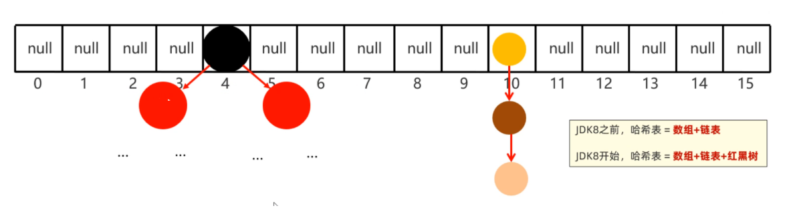
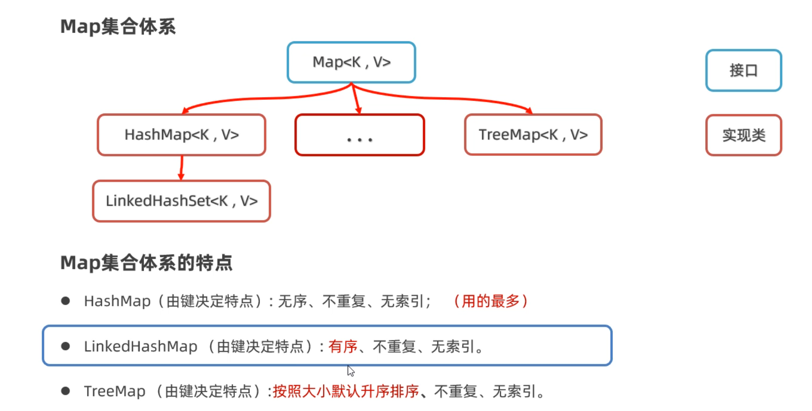
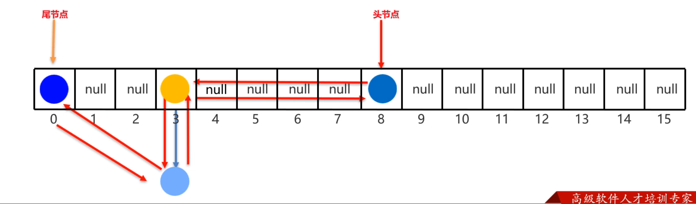
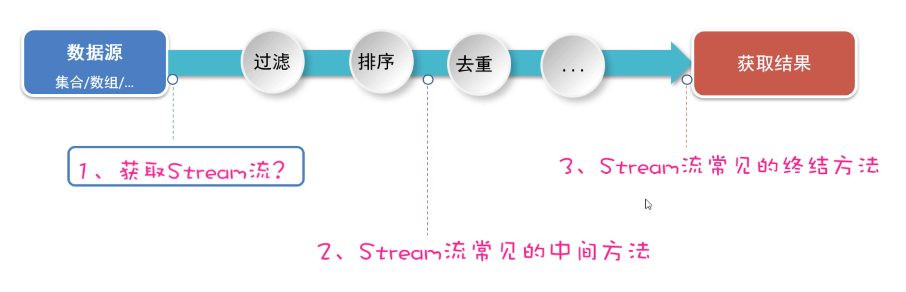

# day08-Map集合、Stream流、File类

## 一、Map集合

同学们，在前面几节课我们已经学习了Map集合的常用方法，以及遍历方式。

下面我们要学习的是Map接口下面的是三个实现类HashMap、LinkedHashMap、TreeMap。实际上这三个实现类并没有什么特有方法需要我们学习，它们的方法就是前面学习Map的方法。这里我们主要学习它们的底层原理。

### 1.1 HashMap

首先，我们学习HashMap集合的底层原理。前面我们学习过HashSet的底层原理，实际上HashMap底层原理和HashSet是一样的。为什么这么说呢？因为我们往HashSet集合中添加元素时，实际上是把元素作为添加添加到了HashMap集合中。

下面是Map集合的体系结构，HashMap集合的特点是由键决定的： **它的键是无序、不能重复，而且没有索引的**。再各种Map集合中也是用得最多的一种集合。

刚才我们说，HashSet底层就是HashMap，我们可以看源码验证这一点，如下图所示，我们可以看到，创建HashSet集合时，底层帮你创建了HashMap集合；往HashSet集合中添加添加元素时，底层却是调用了Map集合的put方法把元素作为了键来存储。所以实际上根本没有什么HashSet集合，把HashMap的集合的值忽略不看就是HashSet集合。


HashSet的原理我们之前已经学过了，所以HashMap是一样的，底层是哈希表结构。



```java
HashMap底层数据结构: 哈希表结构
	JDK8之前的哈希表 = 数组+链表
	JDK8之后的哈希表 = 数组+链表+红黑树
	哈希表是一种增删改查数据，性能相对都较好的数据结构
	
往HashMap集合中键值对数据时，底层步骤如下
	第1步：当你第一次往HashMap集合中存储键值对时，底层会创建一个长度为16的数组
	第2步：把键然后将键和值封装成一个对象，叫做Entry对象
	第3步：再根据Entry对象的键计算hashCode值（和值无关）
	第4步：利用hashCode值和数组的长度做一个类似求余数的算法，会得到一个索引位置
	第5步：判断这个索引的位置是否为null，如果为null,就直接将这个Entry对象存储到这个索引位置
		   如果不为null，则还需要进行第6步的判断
	第6步：继续调用equals方法判断两个对象键是否相同
		  如果equals返回false，则以链表的形式往下挂
		  如果equals方法true,则认为键重复，此时新的键值对会替换就的键值对。
	
HashMap底层需要注意这几点：
	1.底层数组默认长度为16，如果数组中有超过12个位置已经存储了元素，则会对数组进行扩容2倍
	  数组扩容的加载因子是0.75，意思是：16*0.75=12 	
   	
    2.数组的同一个索引位置有多个元素、并且在8个元素以内(包括8)，则以链表的形式存储
    	JDK7版本：链表采用头插法（新元素往链表的头部添加）
    	JDK8版本：链表采用尾插法（新元素我那个链表的尾部添加）
    	
    3.数组的同一个索引位置有多个元素、并且超过了8个，则以红黑树形式存储
    
```

从HashMap底层存储键值对的过程中我们发现：决定键是否重复依赖与两个方法，一个是hashCode方法、一个是equals方法。有两个键计算得到的hashCode值相同，并且两个键使用equals比较为true，就认为键重复。

**所以，往Map集合中存储自定义对象作为键，为了保证键的唯一性，我们应该重写hashCode方法和equals方法。**

比如有如下案例：往HashMap集合中存储Student对象作为键，学生的家庭住址当做值。要求，当学生对象的姓名和年龄相同时就认为键重复。

```java
public class Student  {
    private String name;
    private int age;
    private double height;

   
    @Override
    public boolean equals(Object o) {
        if (this == o) return true;
        if (o == null || getClass() != o.getClass()) return false;
        Student student = (Student) o;
        return age == student.age && Double.compare(student.height, height) == 0 && Objects.equals(name, student.name);
    }

    @Override
    public int hashCode() {
        return Objects.hash(name, age, height);
    }

    public Student() {
    }

    public Student(String name, int age, double height) {
        this.name = name;
        this.age = age;
        this.height = height;
    }

	//...get,set方法自己补全....

    @Override
    public String toString() {
        return "Student{" +
                "name='" + name + '\'' +
                ", age=" + age +
                ", height=" + height +
                '}';
    }
}
```

写一个测试类，在测试类中，创建HashMap集合，键是Student类型，值是Stirng类型

```java
/**
 * 目标：掌握Map集合下的实现类：HashMap集合的底层原理。
 */
public class Test1HashMap {
    public static void main(String[] args) {
        Map<Student, String> map = new HashMap<>();
        map.put(new Student("蜘蛛精", 25, 168.5), "盘丝洞");
        map.put(new Student("蜘蛛精", 25, 168.5), "水帘洞");
        map.put(new Student("至尊宝", 23, 163.5), "水帘洞");
        map.put(new Student("牛魔王", 28, 183.5), "牛头山");
        System.out.println(map);
    }
}
```

上面存储的键，有两个蜘蛛精，但是打印出只会有最后一个。


### 1.2 LinkedHashMap

学习完HashMap集合的特点，以及底层原理。接下来我们学习一下LinkedHashMap集合。

- LinkedHashMap集合的特点也是由键决定的：**有序的、不重复、无索引**。



```java
/**
 * 目标：掌握LinkedHashMap的底层原理。
 */
public class Test2LinkedHashMap {
    public static void main(String[] args) {
        // Map<String, Integer> map = new HashMap<>();    //  按照键 无序，不重复，无索引。
        LinkedHashMap<String, Integer> map = new LinkedHashMap<>(); //  按照键 有序，不重复，无索引。
        map.put("手表", 100);
        map.put("手表", 220);
        map.put("手机", 2);
        map.put("Java", 2);
        map.put(null, null);
        System.out.println(map);
    }
}
```

运行上面代码发现，如果是LinedHashMap集合键存储和取出的顺序是一样的


如果是HashMap，键存储和取出的顺序是不一致的


- LinkedHashMap的底层原理，和LinkedHashSet底层原理是一样的。底层多个一个双向链表来维护键的存储顺序。

​      取元素时，先取头节点元素，然后再依次取下一个几点，一直到尾结点。所以是有序的。




### 1.3 TreeMap

最后，我们再学习Map集合下面的另一个子类叫TreeMap。根据我们前面学习其他Map集合的经验，我们应该可以猜出TreeMap有什么特点。

- TreeMap集合的特点也是由键决定的，默认按照键的升序排列，键不重复，也是无索引的。


- TreeMap集合的底层原理和TreeSet也是一样的，底层都是红黑树实现的。所以可以对键进行排序。

  比如往TreeMap集合中存储Student对象作为键，排序方法有两种。直接看代码吧

**排序方式1：**写一个Student类，让Student类实现Comparable接口

```java
//第一步：先让Student类，实现Comparable接口
public class Student implements Comparable<Student>{
    private String name;
    private int age;
    private double height;
	//无参数构造方法
    public Student(){}
    //全参数构造方法
    public Student(String name, int age, double height){
        this.name=name;
        this.age=age;
        this.height=height;
    }
    //...get、set、toString()方法自己补上..
    
    //按照年龄进行比较，只需要在方法中让this.age和o.age相减就可以。
    /*
    原理：
    在往TreeSet集合中添加元素时，add方法底层会调用compareTo方法，根据该方法的
    结果是正数、负数、还是零，决定元素放在后面、前面还是不存。
    */
    @Override
    public int compareTo(Student o) {
        //this：表示将要添加进去的Student对象
        //o: 表示集合中已有的Student对象
        return this.age-o.age;
    }
}
```

**排序方式2：**在创建TreeMap集合时，直接传递Comparator比较器对象。

```java
/**
 * 目标：掌握TreeMap集合的使用。
 */
public class Test3TreeMap {
    public static void main(String[] args) {
        Map<Student, String> map = new TreeMap<>(new Comparator<Student>() {
            @Override
            public int compare(Student o1, Student o2) {
                return Double.compare(o1.getHeight(), o2.getHeight());
            }
        });
//        Map<Student, String> map = new TreeMap<>(( o1,  o2) ->   Double.compare(o2.getHeight(), o1.getHeight()));
        map.put(new Student("蜘蛛精", 25, 168.5), "盘丝洞");
        map.put(new Student("蜘蛛精", 25, 168.5), "水帘洞");
        map.put(new Student("至尊宝", 23, 163.5), "水帘洞");
        map.put(new Student("牛魔王", 28, 183.5), "牛头山");
        System.out.println(map);
    }
}
```

这种方式都可以对TreeMap集合中的键排序。**注意：只有TreeMap的键才能排序，HashMap键不能排序。**


### 1.4 集合嵌套

各位同学，到现在为止我们把Map集合和Collection集合的都已经学习完了。但是在实际开发中可能还会存在一种特殊的用法。就是把一个集合当做元素，存储到另一个集合中去，我们把这种用法称之为集合嵌套。

下面通过一个案例给大家演示一下


- 案例分析

```java
1.从需求中我们可以看到，有三个省份，每一个省份有多个城市
	我们可以用一个Map集合的键表示省份名称，而值表示省份有哪些城市
2.而又因为一个身份有多个城市，同一个省份的多个城市可以再用一个List集合来存储。
	所以Map集合的键是String类型，而指是List集合类型
	HashMap<String, List<String>> map = new HashMap<>();
```

- 代码如下

```java
/**
 * 目标：理解集合的嵌套。
 * 江苏省 = "南京市","扬州市","苏州市“,"无锡市","常州市"
 * 湖北省 = "武汉市","孝感市","十堰市","宜昌市","鄂州市"
 * 河北省 = "石家庄市","唐山市", "邢台市", "保定市", "张家口市"
 */
public class Test {
    public static void main(String[] args) {
        // 1、定义一个Map集合存储全部的省份信息，和其对应的城市信息。
        Map<String, List<String>> map = new HashMap<>();

        List<String> cities1 = new ArrayList<>();
        Collections.addAll(cities1, "南京市","扬州市","苏州市" ,"无锡市","常州市");
        map.put("江苏省", cities1);

        List<String> cities2 = new ArrayList<>();
        Collections.addAll(cities2, "武汉市","孝感市","十堰市","宜昌市","鄂州市");
        map.put("湖北省", cities2);

        List<String> cities3 = new ArrayList<>();
        Collections.addAll(cities3, "石家庄市","唐山市", "邢台市", "保定市", "张家口市");
        map.put("河北省", cities3);
        System.out.println(map);

        List<String> cities = map.get("湖北省");
        for (String city : cities) {
            System.out.println(city);
        }

        map.forEach((p, c) -> {
            System.out.println(p + "----->" + c);
        });
    }
}
```


## 二、JDK8新特性（Stream流）

各位同学，接下来我们学习一个全新的知识，叫做Stream流（也叫Stream API）。它是从JDK8以后才有的一个新特性，是专业用于对集合或者数组进行便捷操作的。有多方便呢？我们用一个案例体验一下，然后再详细学习。

### 2.1 Stream流体验

案例需求：有一个List集合，元素有`"张三丰","张无忌","周芷若","赵敏","张强"`，找出姓张，且是3个字的名字，存入到一个新集合中去。

```java
List<String> names = new ArrayList<>();
Collections.addAll(names, "张三丰","张无忌","周芷若","赵敏","张强");
System.out.println(names);
```

- 用传统方式来做，代码是这样的

```java
// 找出姓张，且是3个字的名字，存入到一个新集合中去。
List<String> list = new ArrayList<>();
for (String name : names) {
    if(name.startsWith("张") && name.length() == 3){
        list.add(name);
    }
}
System.out.println(list);
```

- 用Stream流来做，代码是这样的（ps: 是不是想流水线一样，一句话就写完了）

```java
List<String> list2 = names.stream().filter(s -> name.startsWith("张") && name.length() == 3).collect(Collectors.toList());
System.out.println(list2);
```

先不用知道这里面每一句话是什么意思，具体每一句话的含义，待会再一步步学习。现在只是体验一下。

学习Stream流我们接下来，会按照下面的步骤来学习。


### 2.2 Stream流的创建

好，接下来我们正式来学习Stream流。先来学习如何创建Stream流、或者叫获取Stream流。



```java
主要掌握下面四点：
	1、如何获取List集合的Stream流？
	2、如何获取Set集合的Stream流？
	3、如何获取Map集合的Stream流？
	4、如何获取数组的Stream流？
```

直接上代码演示

```java
/**
 * 目标：掌握Stream流的创建。
 */
public class StreamTest2 {
    public static void main(String[] args) {
       //1.单列集合
        List<Integer> list = new ArrayList<>();
        Collections.addAll(list,1,2,3,4,5,6);
        Stream<Integer> stream1 = list.stream();

        Set<Integer> set =new HashSet<>();
        Stream<Integer> stream2 = set.stream();
        //2.双列集合
        Map<String,Integer> map = new HashMap<>();

        Stream<String> stream3 = map.keySet().stream();

        Stream<Integer> stream4 = map.values().stream();

        //3.数组
        int[] arr={1,2,3,4,5,6};
        IntStream stream5 = Arrays.stream(arr);

        Stream<Integer> stream6 = Stream.of(1, 2, 3, 4, 5, 6);
    }
}

```


### 2.3 Stream流中间方法

在上一节，我们学习了创建Stream流的方法。接下来我们再来学习，Stream流中间操作的方法。

**中间方法指的是：调用完方法之后其结果是一个新的Stream流，于是可以继续调用方法，这样一来就可以支持链式编程**（或者叫流式编程）。


话不多说，直接上代码演示

```java
/**
 * 目标：掌握Stream流提供的常见中间方法。
 */
public class StreamTest3 {
    public static void main(String[] args) {
       //注意:返回结果为Stream的方法都试延迟性方法,只有遇到终结性方法,才会执行。
        //下面的程序,我们使用forEach方法打印最终结果,forEach方法是终结性方法。

        //Stream<T> filter(Predicate<? super T> predicate)	用于对流中的数据进行过滤。
        /*
        Stream<Integer> stream = Stream.of(1, 2, 3, 4, 5, 6);
        Stream<Integer> stream2 = stream.filter((Integer i) -> {
            System.out.println("filter((Integer i)");
            return i % 2 == 0;
        });
        stream2.forEach((Integer i) -> {
            System.out.println(i);
        });
        */
        //Stream支持链式编程
        /*
        Stream.of(1, 2, 3, 4, 5, 6).filter((Integer i) -> {
            return i % 2 == 0;
        }).forEach((Integer i) -> {
            System.out.println(i);
        });
        */
        //简化后
        Stream.of(1, 2, 3, 4, 5, 6).filter(i -> i % 2 == 0).forEach(i -> System.out.println("filter:"+i));

        //Stream<T> sorted()	对元素进行升序排序
        Stream.of(1, 3, 2, 4, 6, 5).sorted().forEach((i -> System.out.println("sorted:"+i)));

        //Stream<T> sorted(Comparator<? super T> comparator)	按照指定规则排序
        /*Stream.of(1, 3, 2, 4, 6, 5).sorted(new Comparator<Integer>() {
            @Override
            public int compare(Integer o1, Integer o2) {
                return o2-o1;
            }
        }).forEach((i -> System.out.println("sorted-compare:"+i)));*/
        Stream.of(1, 3, 2, 4, 6, 5).sorted((o1,o2)->o2-o1).forEach((i -> System.out.println("sorted-compare:"+i)));


        //Stream<T> limit(long maxSize)	获取前几个元素
        Stream.of(1, 3, 2, 4, 6, 5).limit(3).forEach((i -> System.out.println("limit:"+i)));


        //Stream<T> skip(long n)	跳过前几个元素
        Stream.of(1, 3, 2, 4, 6, 5).skip(3).forEach((i -> System.out.println("skip:"+i)));


        //Stream<T>distinct()	去除流中重复的元素(根据存储对象的HashCode和euqals方法去重)。
        Stream.of(1, 2, 2, 2, 2, 3).distinct().forEach((i -> System.out.println("distinct:"+i)));

        //<R> Stream<R> map(Function<? super T,? extends R> mapper)	对元素进行加工，并返回对应的新流
        Stream.of(1, 2, 3).map((Integer i)->{return i*10;}).forEach((i -> System.out.println("map:"+i)));

        //static <T> Stream<T> concat(Stream a, Stream b)	合并a和b两个流为一个流
        Stream<Integer> sa = Stream.of(1, 2, 3);
        Stream<Integer> sb = Stream.of(11, 22, 33);
        Stream.concat(sa,sb).forEach((i -> System.out.println("concat:"+i)));
    }
}
```


### 2.5 Stream流终结方法

最后，我们再学习Stream流的终结方法。这些方法的特点是，调用完方法之后，其结果就不再是Stream流了，所以不支持链式编程。


我列举了下面的几个终结方法，接下来用几个案例来一个一个给同学们演示。


话不多说，直接上代码

```java
/**
 * 目标：Stream流的终结方法
 */
public class StreamTest4 {
    public static void main(String[] args) {
        //void forEach(Consumer action)	对此流运算后的元素执行遍历
        Stream.of(1, 2, 3).forEach((i) -> System.out.println(i));

        //long count()	统计此流运算后的元素个数
        long count = Stream.of(1, 2, 3).count();
        System.out.println("count = " + count);

        //Optional<T> max(Comparator<? super T> comparator)	获取此流运算后的最大值(末位)元素
        Optional<Integer> max = Stream.of(1, 2, 3).max(((o1, o2) -> o1 - o2));
        System.out.println("max.get() = " + max.get());

        //Optional<T> min(Comparator<? super T> comparator)	获取此流运算后的最小值(首位)元素
        Optional<Integer> min = Stream.of(1, 2, 3).min(((o1, o2) -> o1 - o2));
        System.out.println("min.get() = " + min.get());
    }
}
```

到这里，关于Stream流的操常见操作我们就已经学习完了。当然Stream流还有一些其他的方法，同学们遇到了也可以自己再研究一下。


## 三、File类

接下来，我们要学习的知识是一个File类。但是在讲这个知识点之前，我想先和同学们聊点别的，聊完之后再回过来学习File你会更容易理解一些。

- 先问大家一个问题，目前你写代码时存储数据，可以用哪些方案?  

  答案如下图所示：可以是变量、可以是数组、可以是对象、可以是集合，但是这些数据都是存储在内存中的，只要程序执行结束，或者断点了，数据就消失了。不能永久存储。


- 有些数据要长久保存，该怎么办呢？

  答案如下图所示：可以将数据以文件的形式存在硬盘里，即使程序结束了，断点了只要硬盘没坏，数据就永久存在。

  

**而现在要学习的File类，它的就用来表示当前系统下的文件（也可以是文件夹）**，通过File类提供的方法可以获取文件大小、判断文件是否存在、创建文件、创建文件夹等。


**但是需要我们注意：**File对象只能对文件进行操作，不能操作文件中的内容。


### 3.1 File对象的创建

学习File类和其他类一样，第一步是创建File类的对象。 想要创建对象，我们得看File类有哪些构造方法。


下面我们演示一下，File类创建对象的代码

```java
需求我们注意的是：路径中"\"要写成"\\"， 路径中"/"可以直接用
```

```java
/**
 * 目标：掌握File创建对象，代表具体文件的方案。
 */
public class FileTest1 {
    public static void main(String[] args) {
        // 1、创建一个File对象，指代某个具体的文件。
        // 路径分隔符
        // File f1 = new File("D:/resource/ab.txt");
        // File f1 = new File("D:\\resource\\ab.txt");
        File f1 = new File("D:" + File.separator +"resource" + File.separator + "ab.txt");
        System.out.println(f1.length()); // 文件大小

        File f2 = new File("D:/resource");
        System.out.println(f2.length());

        // 注意：File对象可以指代一个不存在的文件路径
        File f3 = new File("D:/resource/aaaa.txt");
        System.out.println(f3.length());
        System.out.println(f3.exists()); // false

        // 我现在要定位的文件是在模块中，应该怎么定位呢？
        // 绝对路径：带盘符的
        // File f4 = new File("D:\\code\\javasepromax\\file-io-app\\src\\itheima.txt");
        // 相对路径（重点）：不带盘符，默认是直接去工程下寻找文件的。
        File f4 = new File("file-io-app\\src\\itheima.txt");
        System.out.println(f4.length());
    }
}
```


### 3.2 File判断和获取方法

各位同学，刚才我们创建File对象的时候，会传递一个文件路径过来。但是File对象封装的路径是存在还是不存在，是文件还是文件夹其实是不清楚的。好在File类提供了方法可以帮我们做判断。


话不多少，直接上代码

```java
/**
     目标：掌握File提供的判断文件类型、获取文件信息功能
 */
public class FileTest2 {
    public static void main(String[] args) throws UnsupportedEncodingException {
        // 1.创建文件对象，指代某个文件
        File f1 = new File("D:/resource/ab.txt");
        //File f1 = new File("D:/resource/");

        // 2、public boolean exists()：判断当前文件对象，对应的文件路径是否存在，存在返回true.
        System.out.println(f1.exists());

        // 3、public boolean isFile() : 判断当前文件对象指代的是否是文件，是文件返回true，反之。
        System.out.println(f1.isFile());

        // 4、public boolean isDirectory()  : 判断当前文件对象指代的是否是文件夹，是文件夹返回true，反之。
        System.out.println(f1.isDirectory());
    }
}
```

除了判断功能还有一些获取功能，看代码

```java
File f1 = new File("D:/resource/ab.txt");

// 5.public String getName()：获取文件的名称（包含后缀）
System.out.println(f1.getName());

// 6.public long length()：获取文件的大小，返回字节个数
System.out.println(f1.length());

// 7.public long lastModified()：获取文件的最后修改时间。
long time = f1.lastModified();
SimpleDateFormat sdf = new SimpleDateFormat("yyyy/MM/dd HH:mm:ss");
System.out.println(sdf.format(time));

// 8.public String getPath()：获取创建文件对象时，使用的路径
File f2 = new File("D:\\resource\\ab.txt");
File f3 = new File("file-io-app\\src\\itheima.txt");
System.out.println(f2.getPath());
System.out.println(f3.getPath());

// 9.public String getAbsolutePath()：获取绝对路径
System.out.println(f2.getAbsolutePath());
System.out.println(f3.getAbsolutePath());
```


### 3.3 创建和删除方法

刚才有同学问老师，我们不能不用Java代码创建一个文件或者文件夹呀？答案是有的，不光可以创建还可以删除。

File类提供了创建和删除文件的方法，话不多少，看代码。

```java
/**
 * 目标：掌握File创建和删除文件相关的方法。
 */
public class FileTest3 {
    public static void main(String[] args) throws Exception {
        // 1、public boolean createNewFile()：创建一个新文件（文件内容为空），创建成功返回true,反之。
        File f1 = new File("D:/resource/itheima2.txt");
        System.out.println(f1.createNewFile());

        // 2、public boolean mkdir()：用于创建文件夹，注意：只能创建一级文件夹
        File f2 = new File("D:/resource/aaa");
        System.out.println(f2.mkdir());

        // 3、public boolean mkdirs()：用于创建文件夹，注意：可以创建多级文件夹
        File f3 = new File("D:/resource/bbb/ccc/ddd/eee/fff/ggg");
        System.out.println(f3.mkdirs());

        // 3、public boolean delete()：删除文件，或者空文件，注意：不能删除非空文件夹。
        System.out.println(f1.delete());
        System.out.println(f2.delete());
        File f4 = new File("D:/resource");
        System.out.println(f4.delete());
    }
}
```

需要注意的是：

```java
1.mkdir(): 只能创建单级文件夹、
2.mkdirs(): 才能创建多级文件夹
3.delete(): 文件可以直接删除，但是文件夹只能删除空的文件夹，文件夹有内容删除不了。
```


### 3.4 遍历文件夹方法

有人说，想获取到一个文件夹中的内容，有没有方法呀？也是有的，下面我们就学习两个这样的方法。


话不多少上代码，演示一下

```java
/**
 * 目标：掌握File提供的遍历文件夹的方法。
 */
public class FileTest4 {
    public static void main(String[] args) {
        // 1、public String[] list()：获取当前目录下所有的"一级文件名称"到一个字符串数组中去返回。
        File f1 = new File("D:\\course\\待研发内容");
        String[] names = f1.list();
        for (String name : names) {
            System.out.println(name);
        }

        // 2、public File[] listFiles():（重点）获取当前目录下所有的"一级文件对象"到一个文件对象数组中去返回（重点）
        File[] files = f1.listFiles();
        for (File file : files) {
            System.out.println(file.getAbsolutePath());
        }

        File f = new File("D:/resource/aaa");
        File[] files1 = f.listFiles();
        System.out.println(Arrays.toString(files1));
    }
}
```

这里需要注意几个问题

```java
1.当主调是文件时，或者路径不存在时，返回null
2.当主调是空文件夹时，返回一个长度为0的数组
3.当主调是一个有内容的文件夹时，将里面所有一级文件和文件夹路径放在File数组中，并把数组返回
4.当主调是一个文件夹，且里面有隐藏文件时，将里面所有文件和文件夹的路径放在FIle数组中，包含隐藏文件
5.当主调是一个文件夹，但是没有权限访问时，返回null
```

关于遍历文件夹的基本操作就学习完了。 但是有同学如果想要获取文件夹中子文件夹的内容，那目前还做不到。但是学习下面了下面的递归知识就，很容易做到了。


## 四、递归

各位同学，为了获取文件夹中子文件夹的内容，我们就需要学习递归这个知识点。但是递归是什么意思，我们需要单独讲一下。学习完递归是什么，以及递归的执行流程之后，我们再回过头来用递归来找文件夹中子文件夹的内容。

### 4.1 递归算法引入

- 什么是递归？

  递归是一种算法，从形式上来说，方法调用自己的形式称之为递归。

- 递归的形式：有直接递归、间接递归，如下面的代码。

```java
/**
 * 目标：认识一下递归的形式。
 */
public class RecursionTest1 {
    public static void main(String[] args) {
        test1();
    }

    // 直接方法递归
    public static void test1(){
        System.out.println("----test1---");
        test1(); // 直接方法递归
    }

    // 间接方法递归
    public static void test2(){
        System.out.println("---test2---");
        test3();
    }

    public static void test3(){
        test2(); // 间接递归
    }
}

```

如果直接执行上面的代码，会进入死循环，最终导致栈内存溢出


以上只是用代码演示了一下，递归的形式。在下一节，在通过一个案例来给同学们讲一讲递归的执行流程。


### 4.2 递归算法的执行流程

为了弄清楚递归的执行流程，接下来我们通过一个案例来学习一下。

案例需求：计算n的阶乘，比如5的阶乘 = 1 * 2 * 3 * 4 * 5 ； 6 的阶乘 =  1 * 2 * 3 * 4 * 5 * 6

分析需求用递归该怎么做

```java
假设f(n)表示n的阶乘，那么我们可以推导出下面的式子
	 f(5) = 1+2+3+4+5
    f(5) = f(4)+5
    f(4) = f(3)+4
    f(3) = f(2)+3
    f(2) = f(1)+2
    f(1) = 1
总结规律：
	除了f(1) = 1; 出口
	其他的f(n) = f(n-1)+n
```

我们可以把f(n)当做一个方法，那么方法的写法如下

```java
/**
 * 目标：掌握递归的应用，执行流程和算法思想。
 */
public class RecursionTest2 {
    public static void main(String[] args) {
        System.out.println("5的阶乘是：" + f(5));
    }

    //求n个数的阶乘
    public static int f(int n){
        // 终结点
        if(n == 1){
            return 1;
        }else {
            return f(n - 1) * n;
        }
    }
}
```

这个代码的执行流程，我们用内存图的形式来分析一下，该案例中递归调用的特点是：**一层一层调用，再一层一层往回返。**


### 4.3 递归文件搜索

学习完递归算法执行流程后，最后我们回过头来。再来看一下，如果使用递归来遍历文件夹。

案例需求：在`D:\\`判断下搜索QQ.exe这个文件，然后直接输出。

```java
1.先调用文件夹的listFiles方法，获取文件夹的一级内容，得到一个数组
2.然后再遍历数组，获取数组中的File对象
3.因为File对象可能是文件也可能是文件夹，所以接下来就需要判断
	判断File对象如果是文件，就获取文件名，如果文件名是`QQ.exe`则打印，否则不打印
	判断File对象如果是文件夹，就递归执行1,2,3步骤
所以：把1，2,3步骤写成方法，递归调用即可。
```

代码如下：

```java
/**
 * 目标：掌握文件搜索的实现。
 */
public class RecursionTest3 {
    public static void main(String[] args) throws Exception {
          searchFile(new File("D:/") , "QQ.exe");
    }

    /**
     * 去目录下搜索某个文件
     * @param dir  目录
     * @param fileName 要搜索的文件名称
     */
    public static void searchFile(File dir, String fileName) throws Exception {
        // 1、把非法的情况都拦截住
        if(dir == null || !dir.exists() || dir.isFile()){
            return; // 代表无法搜索
        }

        // 2、dir不是null,存在，一定是目录对象。
        // 获取当前目录下的全部一级文件对象。
        File[] files = dir.listFiles();

        // 3、判断当前目录下是否存在一级文件对象，以及是否可以拿到一级文件对象。
        if(files != null && files.length > 0){
            // 4、遍历全部一级文件对象。
            for (File f : files) {
                // 5、判断文件是否是文件,还是文件夹
                if(f.isFile()){
                    // 是文件，判断这个文件名是否是我们要找的
                    if(f.getName().contains(fileName)){
                        System.out.println("找到了：" + f.getAbsolutePath());
                        Runtime runtime = Runtime.getRuntime();
                        runtime.exec(f.getAbsolutePath());
                    }
                }else {
                    // 是文件夹，继续重复这个过程（递归）
                    searchFile(f, fileName);
                }
            }
        }
    }
}
```


