### 1. VMWare安装Linux操作系统找不到IP地址

输入linux指令ip addr  查看ip端口发现ip不存在

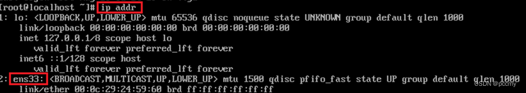

从图中可以看到，没有获取到linux系统的IP地址，这是为什么呢？

是由于启动服务器时未加载网卡，导致IP地址初始化失败而造成的。

那么接下来我们就需要来修改网络初始化配置，设定网卡在系统启动时初始化。


具体操作步骤如下：

第一种方法

1). 修改网卡的配置项


```cobol
cd / 进入根目录

cd etc 进入etc目录
      
cd sysconfig 进入sysconfig目录

cd network-scripts 进入network-scripts

vi ifcfg-ens33 编辑ifcfg-ens33文件

#进入文件后执行如下操作:

①. 按 i 键 进入编辑状态

②. 按↑↓键来移动光标, 删除no,输入yes

③. 按 ESC 键

④. 输入 :wq

⑤. 按 ENTER 保存退出
```

配置内容

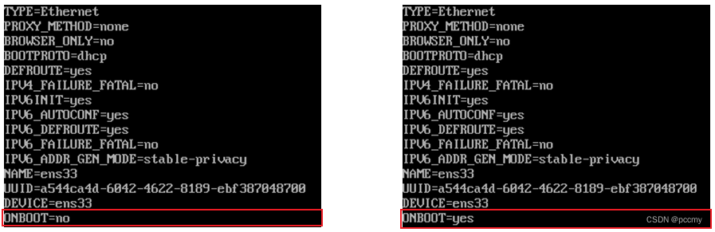

2). 重新启动虚拟机

重启之后, 再次输入root的用户名密码，登录到Linux系统之后，可以通过指令 ip addr 来[查看IP地址](https://so.csdn.net/so/search?q=查看IP地址&spm=1001.2101.3001.7020)。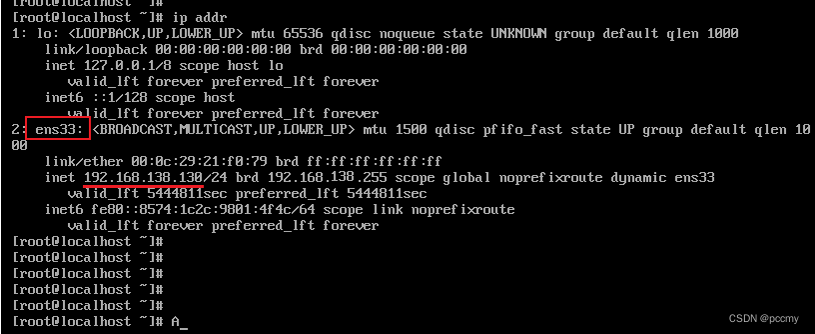这时候查看ip，发现ip正常可以使用

注意：如果修改配置后还无法查看ip，再使用下面方法

第二种方法：虚拟网络编辑器还原默认设置

步骤：关闭所有虚拟机/编辑/打开虚拟网络编辑器/还原默认设置/选择是

这时候可以这样操作

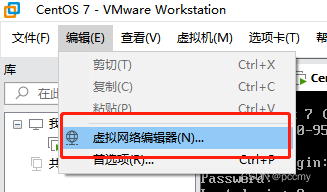

下一步

 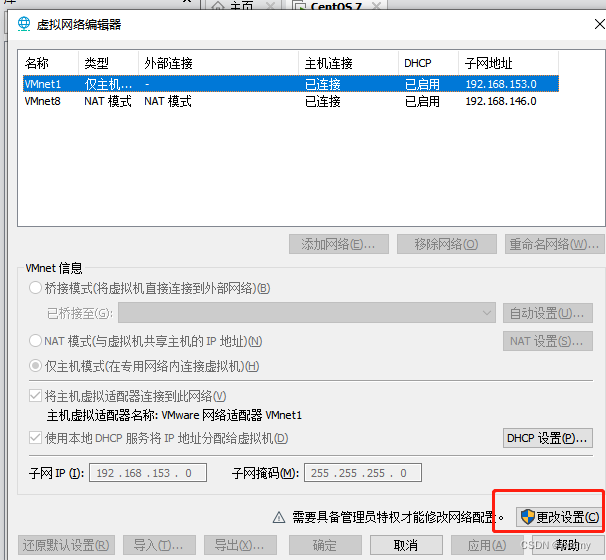

 下一步

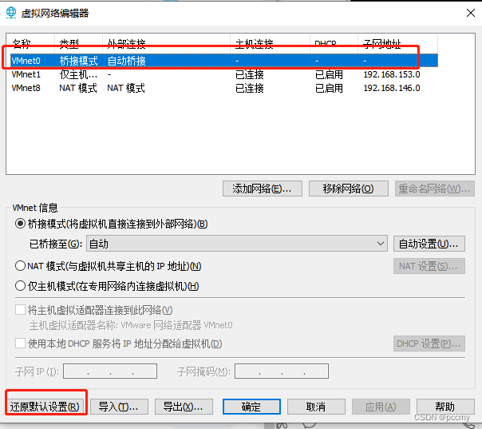

 然后重启虚拟机，输入ip addr指令

发现可以查看ip地址，问题解决

注意：虚拟网络编辑器还原默认设置一定要关闭虚拟机。


### 2. Linux系统root用户登录后显示 “-bash-4.2#” 解决方案

>  一.【问题】登录root用户的时候,不是[root@localhost ~]# 而是 -bash-4.2

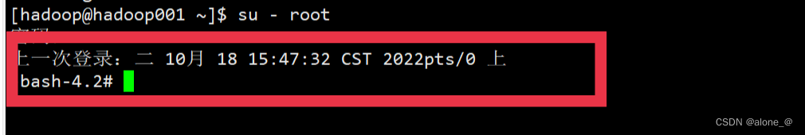

> 二.【***问题的原因是\***】不小心删除了/root文件夹下的.bash_profile与 .bashrc两个文件，这里我们只需要将这两个文件还原即可。具体操作如下: 1.查看/root目录下是否有文件缺失，这里使用命令ls -a，以显示隐藏文件，我们可以看到. bash_profile和. bashrc两个文件缺失
>
> 

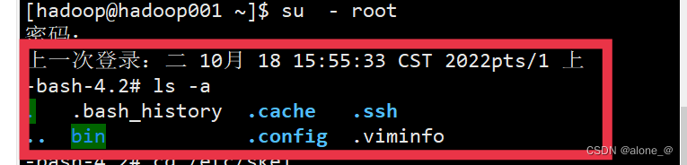

> 2.***找到. bash rc和. bash_profile两个文件的位置。我们可以看到，这两个文件在录/etc/skel下\***

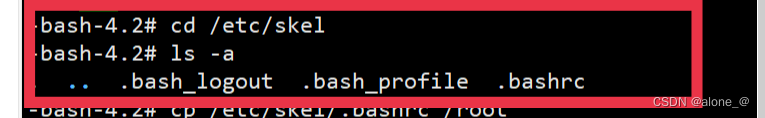

> 3.复制这两个文件到目录/ root下

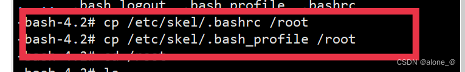

> 4.进入到目录/ root下查看，查看命令ls -a,可以看到已复制. bashrc和. bash_profile到/root目录下

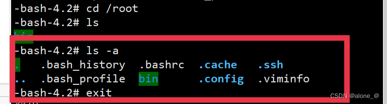 

> 5.此时我们只需键入reboot重启系统即可，重启后显示变为[root@localhost ~]#

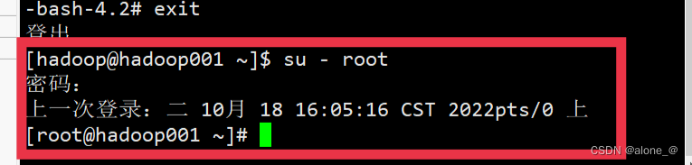


### 3.另一个程序已锁定文件的一部分，进程无法访问 打不开磁盘“”或它所依赖的某个快照磁盘。 模块“Disk”启动失败

今天虚拟机开启着，电脑意外重启。重启后导致虚拟机打不开，出现下面的问题。
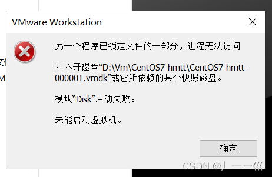
**解决办法：**
找到报错的这个目录，然后删除里面所有的.lck后缀的文件
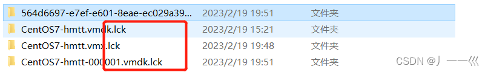
删除之后再次启动就可以启动成功了
