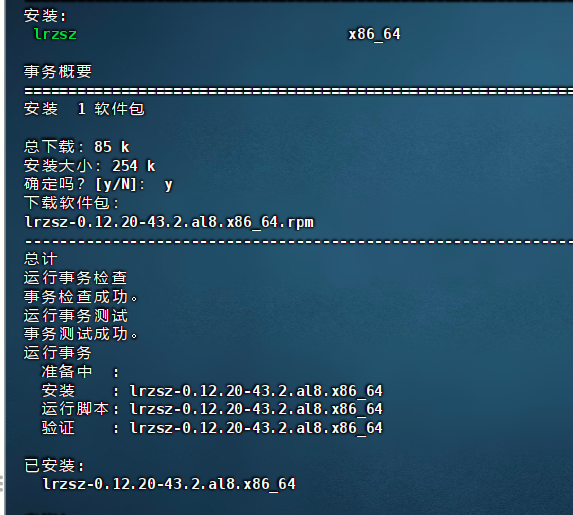

## Linux系统字体缺失的修复方法

> 在 Linux系统中如果部署一些处理 office文档 的服务的时候，会出处理后的文档字符为□的情况，若出现这种状况，则说明此服务器下缺少对应的字体文件。接着看处理方法

### 复制Windows系统字体

Windows系统 有着相对全面的字体库，所以我们可以将 Windows系统 下的字体复制过来。

Windows系统里的字体目录为：C:\Windows\Fonts，注意：该文件夹里有三种后缀的文件：.fon，.ttf，.ttc，我们只需要复制.ttf和.ttc后缀的文件。

先打开 C:\Windows\ 文件夹，将 Fonts目录打成zip压缩包。


打开shell工具连接我们的 Linux服务器（这里推荐 FinalShell ）


输入命令新建并进入 win字体的文件夹

```shell
sudo mkdir /usr/share/fonts/win_fonts
cd /usr/share/fonts/win_fonts
```


安装上传文件工具

```shell
sudo yum install lrzsz -y
```



输入 rz 上传文件


接着输入以下命令解压并删除压缩包

```shell
sudo yum install unzip -y
sudo unzip Fonts.zip
sudo rm -rf Fonts.zip
```

匹配删除不需要的文件

```shell
sudo rm -f /usr/share/fonts/win_fonts/*.fon
```

### 生成字体的索引信息

```shell
sudo mkfontscale
sudo mkfontdir
```

### 更新字体缓存

```shell
sudo fc-cache
```


ok，步骤走到这里，Linux服务器 上已经安装好Windows下的全部字体，可以重启您的项目试试结果了