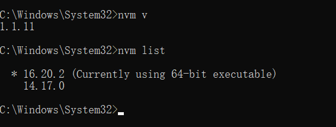

# nodejs版本切换工具-nvm

> 好久不见，别来无恙

最近在开发中，接手了几个vue的前端项目，需要用到node.js环境，但是在有些项目启动的时候不得不切换我node的版本，每次下载卸载很麻烦，这里就推荐一个node的包版本管理工具 nvm

### 介绍

1. Node Version Manager (NVM) 是一个用于管理 Node.js 版本的工具，它允许你在同一台计算机上轻松切换和管理不同的 Node.js 版本
2. 设计者为按用户安装并按 shell 调用。`nvm`适用于任何兼容 POSIX 的 shell（sh、dash、ksh、zsh、bash），特别是在以下平台上：unix、macOS 和 windows WSL

### 下载安装

这里只讲windows的下载安装，若需要其他版本，请移步[nvm的github仓库](https://github.com/nvm-sh/nvm)。

#### 下载

1. 下载 NVM for Windows 安装器（nvm-setup.zip）：https://github.com/coreybutler/nvm-windows/releases

2. 解压下载的安装器，并运行 `nvm-setup.exe`。

3. 安装向导将引导你完成安装过程。在安装期间，你可以选择要安装的 Node.js 版本和默认版本。

4. 安装完成后，打开一个新的命令提示符或 PowerShell 窗口，并运行以下命令来验证安装：

   ```shell
   nvm list-remote
   ```

   

   现在，你已经成功安装了 NVM，可以使用它来管理和切换不同版本的 Node.js。你可以使用 `nvm install` 命令来安装特定版本的 Node.js，使用 `nvm use` 命令来切换到不同版本，以及使用 `nvm ls` 命令来列出已安装的 Node.js 版本。

### 使用教程

1. 在使用中，我遇到**nvm下载node版本缓慢问题**，为了防止大家踩坑，所以将解决方法写在前面

   1. 找到nvm的安装目录下的settings.txt并打开

      

   2. 添加淘宝源

      

      ```
      node_mirror: https://npm.taobao.org/mirrors/node/
      npm_mirror: https://npm.taobao.org/mirrors/npm/
      ```

      复制上面的地址，改成和我一样就可以了，改成国内镜像会快很多

2. **安装特定版本的 Node.js：**

   ```shell
   nvm install <version>
   ```

   例如，要安装 Node.js 的 LTS 版本，你可以运行：

   ```shell
   nvm install --lts
   ```

   或要安装 Node.js 14.17.0 版本，你可以运行：

   ```
   nvm install 14.17.0
   ```

3. **切换到已安装的 Node.js 版本**：

   ```shell
   nvm use <version>
   ```

   例如，要切换到 Node.js 14.17.0 版本，你可以运行：

   ```
   nvm use 14.17.0
   ```

4. **列出已安装的 Node.js 版本**：

   ```shell
   nvm list
   ```

   这会显示你计算机上已安装的所有 Node.js 版本，并指示哪个版本是当前激活的。

5. **列出可用的 Node.js 版本**：

   ```shell
   nvm list available
   ```

   

   这会列出可用的 Node.js 版本，包括 LTS 版本和其他版本。

6. **将 Node.js 版本设置为默认版本**：

   ```shell
   nvm alias default <version>
   ```

   例如，要将 Node.js 14.17.0 设置为默认版本，你可以运行：

   ```shell
   nvm alias default 14.17.0
   ```

7. **卸载特定版本的 Node.js**：

   ```shell
   nvm uninstall <version>
   ```

   例如，要卸载 Node.js 14.17.0 版本，你可以运行：

   ```shell
   nvm uninstall 14.17.0
   ```

8. **切换Node.js 版本：**

   ```
   nvm use <version>
   ```

   例如，要使用 Node.js 14.17.0 版本，你可以运行：

   ```shell
   nvm use 14.17.0
   ```

   


现在，你已经可以熟练使用nvm了~~ 


> 这世界太大，勇敢的少年奔赴天涯。 --荣耀同行

