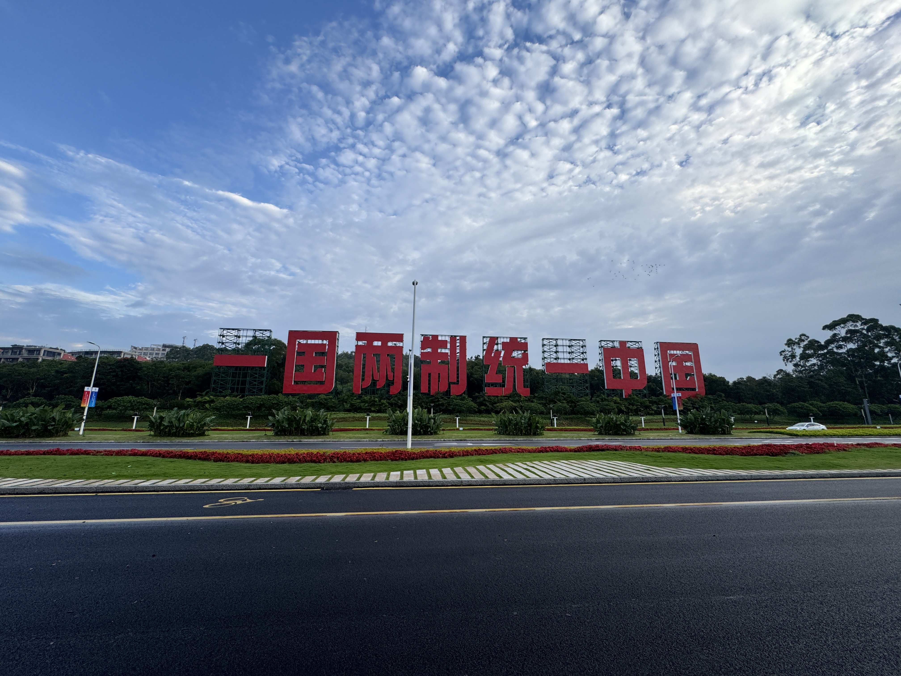
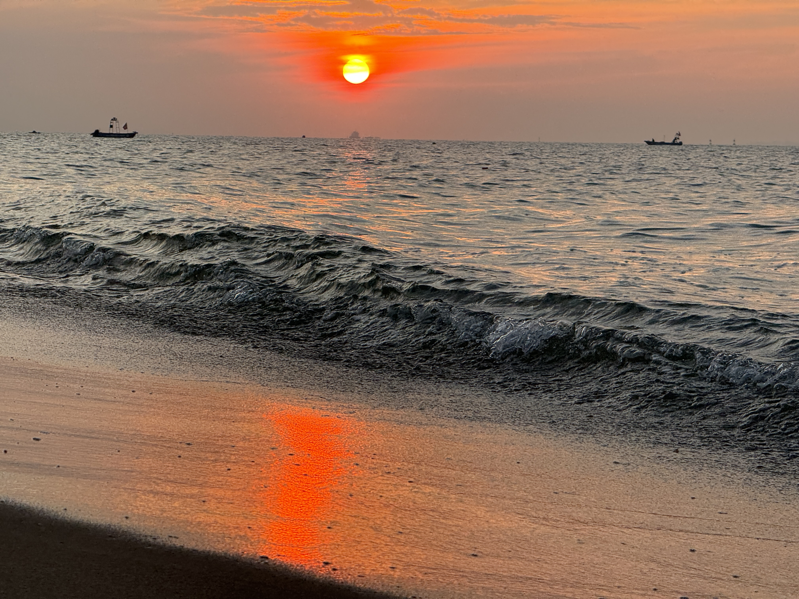
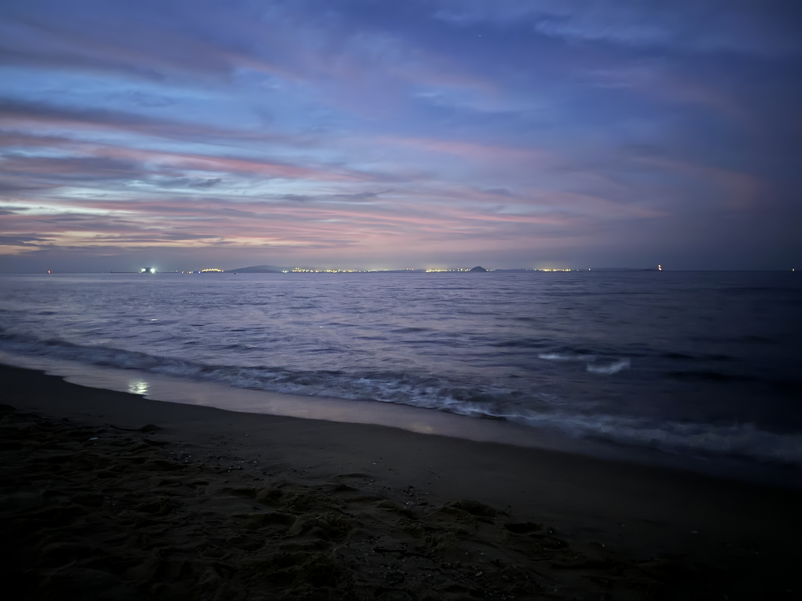
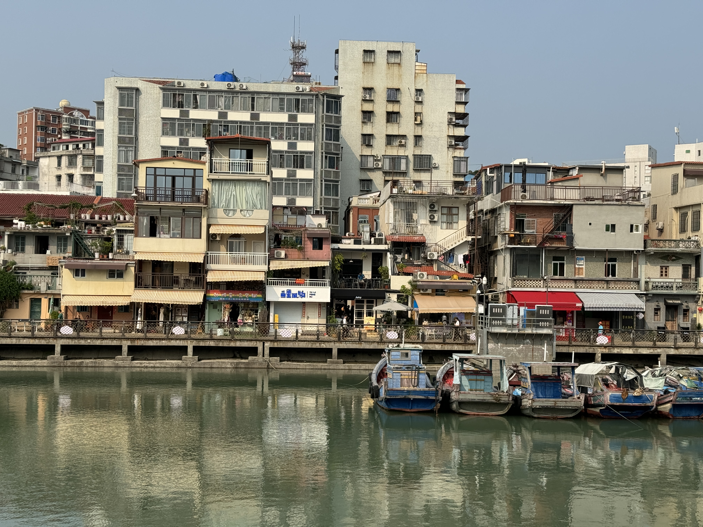
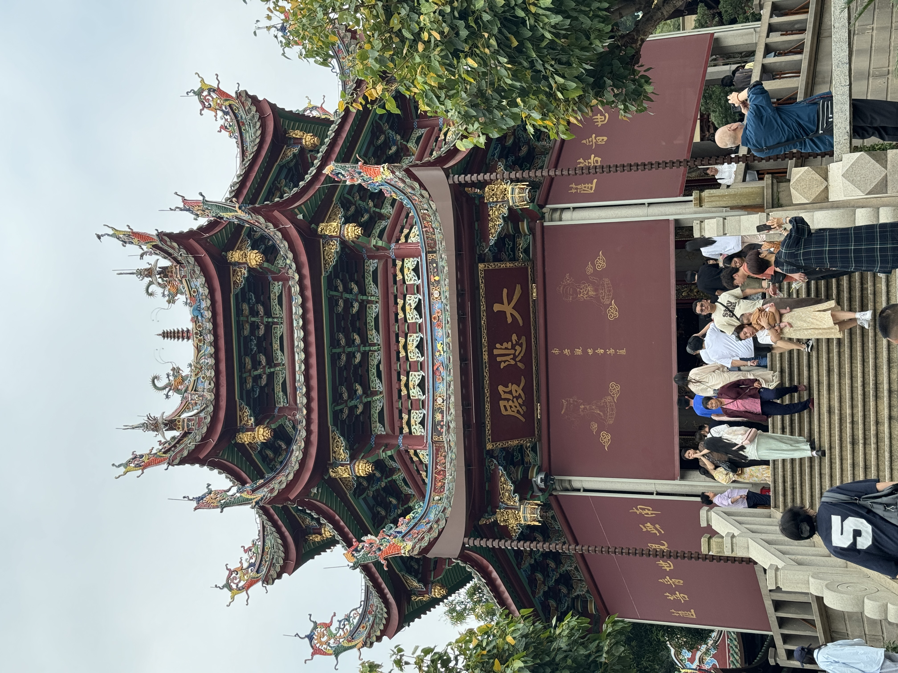
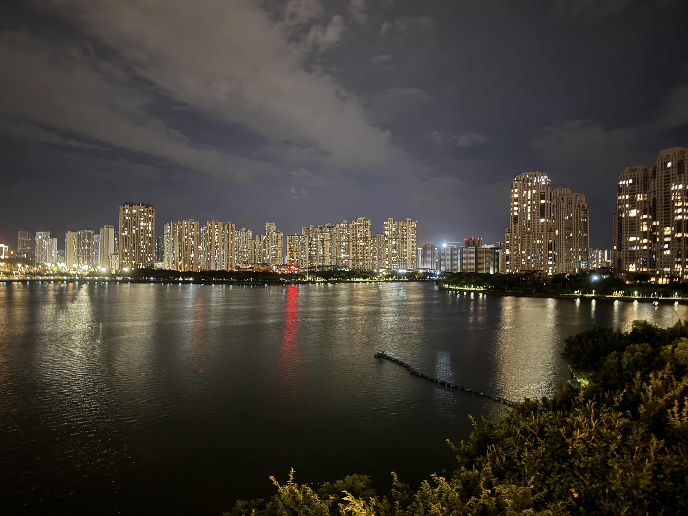
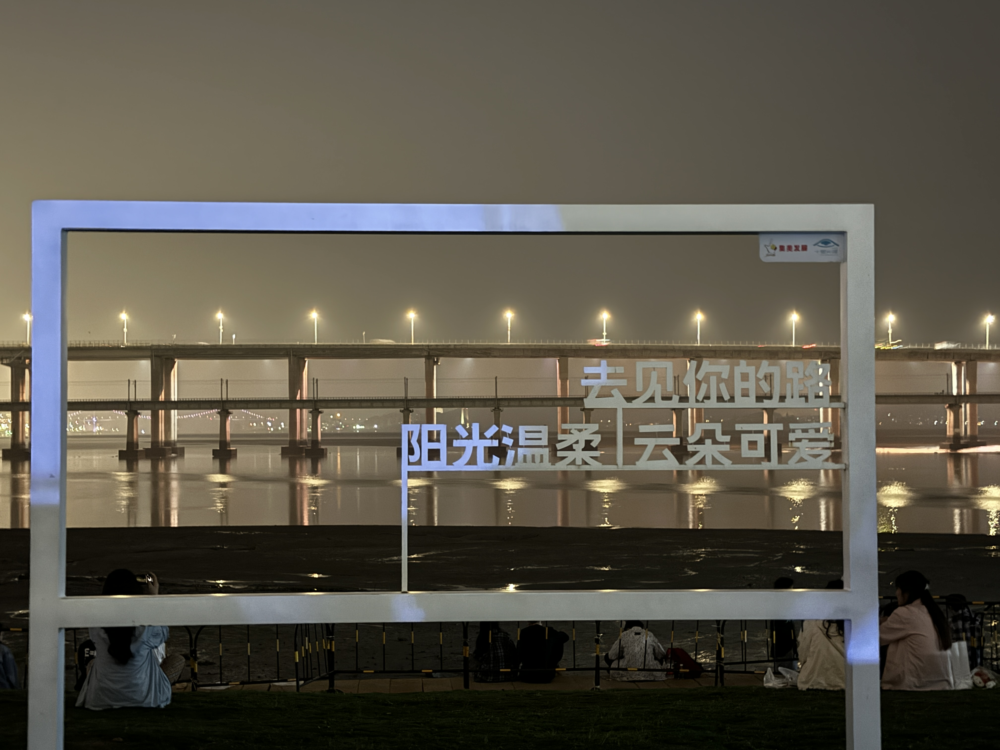
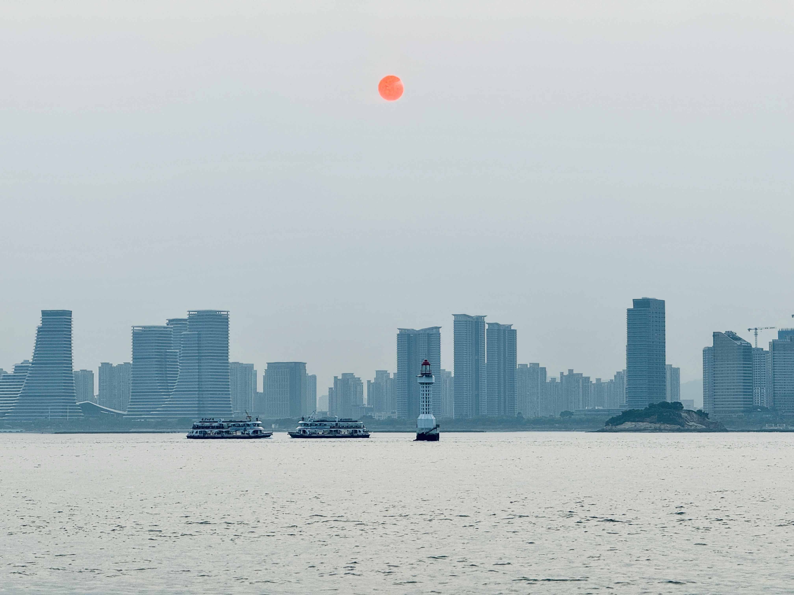
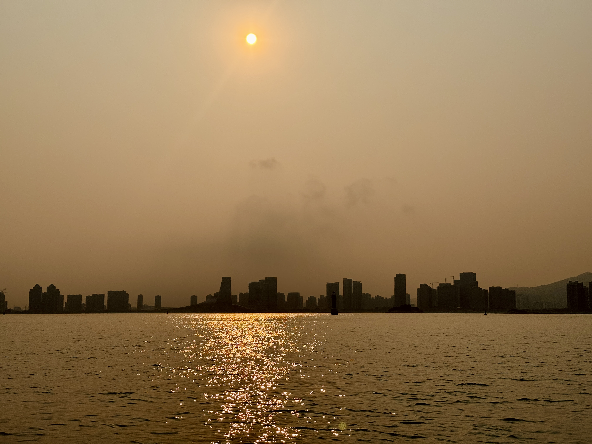

# 📍 厦门

### 🌞 椰风寨 一国两制沙滩

 位于厦门环岛南路，椰风寨是一个集海滨风光与休闲娱乐为一体的旅游景点。一国两制沙滩更是以其独特的地理位置和历史意义吸引着众多游客。

### 🎨 沙坡尾艺术西区

沙坡尾艺术西区位于厦门思明区，原本是一个老旧的工业区，经过改造后成为了一个充满艺术气息的文化创意园区。这里汇集了许多特色小店、咖啡馆、画廊和工作室，是感受厦门现代文化艺术氛围的好地方。

### 🙏 南普陀寺

 南普陀寺是福建省著名的佛教寺庙之一，位于五老峰下，是一座历史悠久、香火鼎盛的古刹。寺内古木参天，环境清幽，是礼佛祈福的好去处。

### 🎭 闽南朝天宫

作为厦门地区重要的道教活动场所，闽南朝天宫不仅承载着丰富的历史文化价值，同时也是体验当地民俗文化的重要地点。

### 🏞️ 湖边公园

湖边公园是厦门一个非常适合散步和休闲的地方，这里有着美丽的湖景和绿化环境，是市民和游客放松心情的好选择。

### 🌉 十里长堤

十里长堤是一条沿着海岸线修建的美丽步道，沿途风景优美，是欣赏海景、享受海风的好地方，也是摄影爱好者的天堂。

### 🏖️ 海湾公园

海湾公园位于厦门岛东部，是一个拥有广阔草坪和美丽海岸线的公园。这里不仅是休闲娱乐的好去处，也是举办各类户外活动的理想场地。

