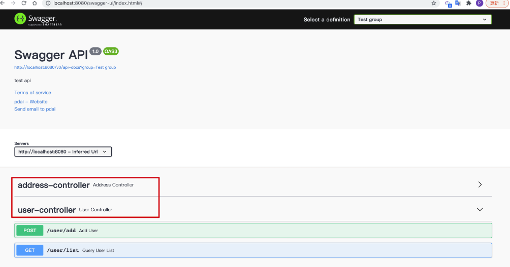
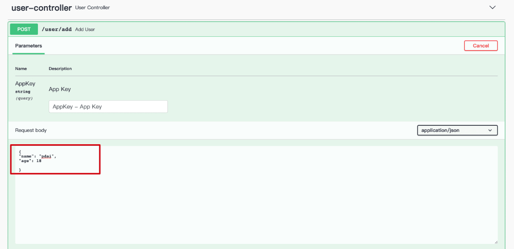
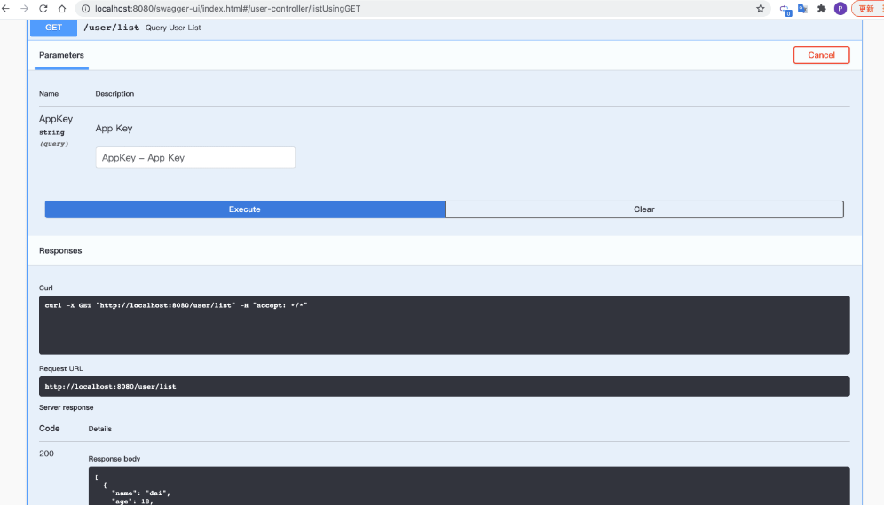
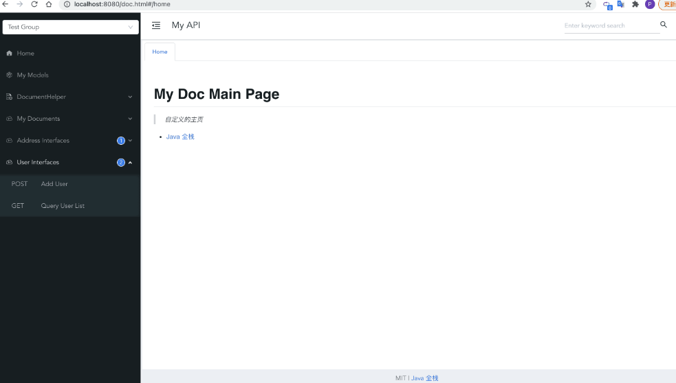
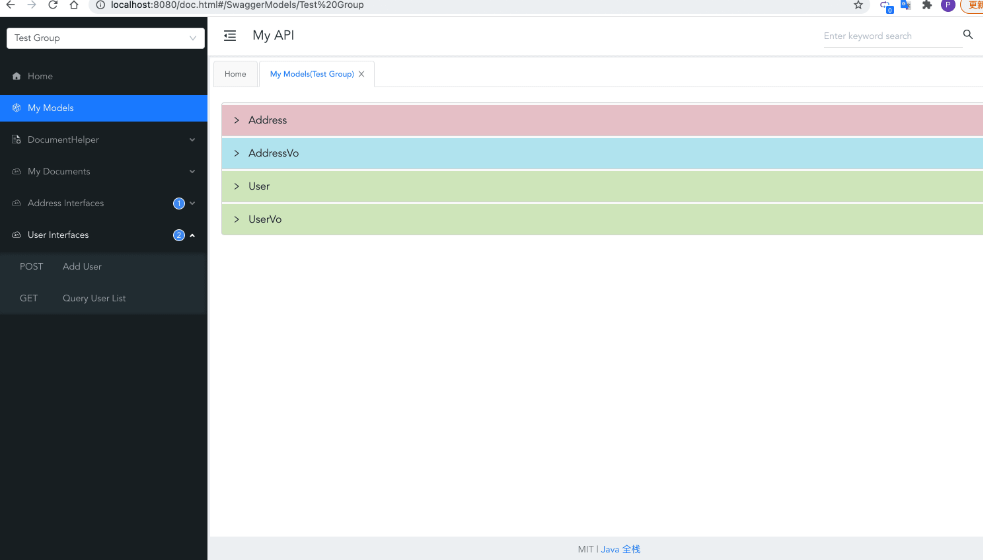
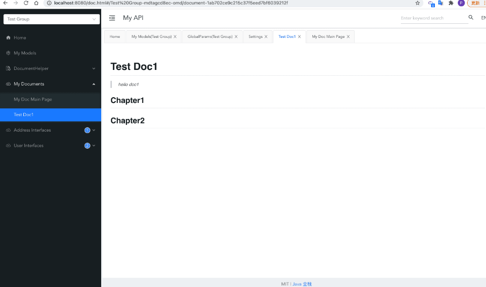
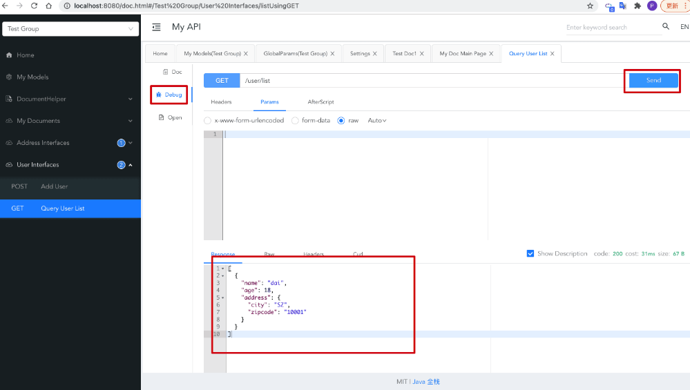

## 0. 准备知识点

> 在生成文档前，你需要了解下OpenAPI规范，Swagger，SpringFox，Knife4J，Swagger UI等之间的关系。

### 1. 什么是OpenAPI规范（OAS)？

[OpenAPI 规范（OAS）](https://fishead.gitbook.io/openapi-specification-zhcn-translation/3.0.0.zhcn#revisionHistory)定义了一个标准的、语言无关的 RESTful API 接口规范，它可以同时允许开发人员和操作系统查看并理解某个服务的功能，而无需访问源代码，文档或网络流量检查（既方便人类学习和阅读，也方便机器阅读）。正确定义 OAS 后，开发者可以使用最少的实现逻辑来理解远程服务并与之交互。

此外，文档生成工具可以使用 OpenAPI 规范来生成 API 文档，代码生成工具可以生成各种编程语言下的服务端和客户端代码，测试代码和其他用例。

官方GitHub地址： [OpenAPI-Specification](https://github.com/OAI/OpenAPI-Specification)

### 2. 什么是Swagger？

Swagger 是一个用于生成、描述和调用 RESTful 接口的 Web 服务。通俗的来讲，Swagger 就是将项目中所有（想要暴露的）接口展现在页面上，并且可以进行接口调用和测试的服务。

从上述 Swagger 定义我们不难看出 Swagger 有以下 3 个重要的作用：

- 将项目中所有的接口展现在页面上，这样后端程序员就不需要专门为前端使用者编写专门的接口文档；
- 当接口更新之后，只需要修改代码中的 Swagger 描述就可以实时生成新的接口文档了，从而规避了接口文档老旧不能使用的问题；
- 通过 Swagger 页面，我们可以直接进行接口调用，降低了项目开发阶段的调试成本。

Swagger3完全遵循了 OpenAPI 规范。Swagger 官网地址：[https://swagger.io/](https://swagger.io/)。

### 3. Swagger和SpringFox有啥关系？

Swagger 可以看作是一个遵循了 OpenAPI 规范的一项技术，而 springfox 则是这项技术的具体实现。 就好比 Spring 中的 IOC 和 DI 的关系 一样，前者是思想，而后者是实现。

### 4. 什么是Knife4J? 和Swagger什么关系？

> 本质是Swagger的增强解决方案，前身只是一个SwaggerUI（swagger-bootstrap-ui）

Knife4j是为Java MVC框架集成Swagger生成Api文档的增强解决方案, 前身是swagger-bootstrap-ui,取名kni4j是希望她能像一把匕首一样小巧,轻量,并且功能强悍!

Knife4j的前身是swagger-bootstrap-ui，为了契合微服务的架构发展,由于原来swagger-bootstrap-ui采用的是后端Java代码+前端Ui混合打包的方式,在微服务架构下显的很臃肿,因此项目正式更名为knife4j

更名后主要专注的方面

- 前后端Java代码以及前端Ui模块进行分离,在微服务架构下使用更加灵活
- 提供**专注于Swagger的增强解决方案**,不同于只是改善增强前端Ui部分

相关文档请参考：https://doc.xiaominfo.com/knife4j/documentation/

## 1. 实现案例之Swagger3

> 我们先看下最新Swagger3 如何配置和实现接口。

### 1. POM

根据上文介绍，我们引入springfox依赖包，最新的是3.x.x版本。和之前的版本比，只需要引入如下的starter包即可。

```xml
<dependency>
    <groupId>io.springfox</groupId>
    <artifactId>springfox-boot-starter</artifactId>
    <version>3.0.0</version>
</dependency>
```

### 2. Swagger Config

我们在配置中还增加了一些全局的配置，比如全局参数等

```java
package tech.pdai.springboot.swagger.config;

import io.swagger.annotations.ApiOperation;
import org.springframework.context.annotation.Bean;
import org.springframework.context.annotation.Configuration;
import org.springframework.http.HttpMethod;
import springfox.documentation.builders.*;
import springfox.documentation.oas.annotations.EnableOpenApi;
import springfox.documentation.schema.ScalarType;
import springfox.documentation.service.*;
import springfox.documentation.spi.DocumentationType;
import springfox.documentation.spring.web.plugins.Docket;
import tech.pdai.springboot.swagger.constant.ResponseStatus;

import java.util.ArrayList;
import java.util.List;
import java.util.stream.Collectors;

/**
 * swagger config for open api.
 *
 * @author pdai
 */
@Configuration
@EnableOpenApi
public class SwaggerConfig {

    /**
     * @return swagger config
     */
    @Bean
    public Docket openApi() {
        return new Docket(DocumentationType.OAS_30)
                .groupName("Test group")
                .apiInfo(apiInfo())
                .select()
                .apis(RequestHandlerSelectors.withMethodAnnotation(ApiOperation.class))
                .paths(PathSelectors.any())
                .build()
                .globalRequestParameters(getGlobalRequestParameters())
                .globalResponses(HttpMethod.GET, getGlobalResponse());
    }

    /**
     * @return global response code->description
     */
    private List<Response> getGlobalResponse() {
        return ResponseStatus.HTTP_STATUS_ALL.stream().map(
                a -> new ResponseBuilder().code(a.getResponseCode()).description(a.getDescription()).build())
                .collect(Collectors.toList());
    }

    /**
     * @return global request parameters
     */
    private List<RequestParameter> getGlobalRequestParameters() {
        List<RequestParameter> parameters = new ArrayList<>();
        parameters.add(new RequestParameterBuilder()
                .name("AppKey")
                .description("App Key")
                .required(false)
                .in(ParameterType.QUERY)
                .query(q -> q.model(m -> m.scalarModel(ScalarType.STRING)))
                .required(false)
                .build());
        return parameters;
    }

    /**
     * @return api info
     */
    private ApiInfo apiInfo() {
        return new ApiInfoBuilder()
                .title("Swagger API")
                .description("test api")
                .contact(new Contact("pdai", "http://pdai.tech", "suzhou.daipeng@gmail.com"))
                .termsOfServiceUrl("http://xxxxxx.com/")
                .version("1.0")
                .build();
    }
}
```

### 3. controller接口

```java
package tech.pdai.springboot.swagger.controller;

import io.swagger.annotations.Api;
import io.swagger.annotations.ApiImplicitParam;
import io.swagger.annotations.ApiOperation;
import org.springframework.http.ResponseEntity;
import org.springframework.web.bind.annotation.*;
import tech.pdai.springboot.swagger.entity.param.UserParam;
import tech.pdai.springboot.swagger.entity.vo.AddressVo;
import tech.pdai.springboot.swagger.entity.vo.UserVo;

import java.util.Collections;
import java.util.List;

/**
 * @author pdai
 */
@Api
@RestController
@RequestMapping("/user")
public class UserController {

    /**
     * http://localhost:8080/user/add .
     *
     * @param userParam user param
     * @return user
     */
    @ApiOperation("Add User")
    @PostMapping("add")
    @ApiImplicitParam(name = "userParam", type = "body", dataTypeClass = UserParam.class, required = true)
    public ResponseEntity<String> add(@RequestBody UserParam userParam) {
        return ResponseEntity.ok("success");
    }

    /**
     * http://localhost:8080/user/list .
     *
     * @return user list
     */
    @ApiOperation("Query User List")
    @GetMapping("list")
    public ResponseEntity<List<UserVo>> list() {
        List<UserVo> userVoList = Collections.singletonList(UserVo.builder().name("dai").age(18)
                .address(AddressVo.builder().city("SZ").zipcode("10001").build()).build());
        return ResponseEntity.ok(userVoList);
    }
}
```

### 3. 运行测试

打开文档API网页



测试添加一个用户



查询用户列表



## 2. 实现案例之Knife4J

> 这里展示目前使用Java生成接口文档的最佳实现: SwaggerV3(OpenAPI）+ Knife4J。

### 1. POM

```xml
<!-- https://mvnrepository.com/artifact/com.github.xiaoymin/knife4j-spring-boot-starter -->
<dependency>
    <groupId>com.github.xiaoymin</groupId>
    <artifactId>knife4j-spring-boot-starter</artifactId>
    <version>3.0.3</version>
</dependency>
```

### 2. yml配置

```yaml
server:
  port: 8080
knife4j:
  enable: true
  documents:
    - group: Test Group
      name: My Documents
      locations: classpath:wiki/*
  setting:
    # default lang
    language: en-US
    # footer
    enableFooter: false
    enableFooterCustom: true
    footerCustomContent: MIT | [Java 全栈]()
    # header
    enableHomeCustom: true
    homeCustomLocation: classpath:wiki/README.md
    # models
    enableSwaggerModels: true
    swaggerModelName: My Models
```

### 3. 注入配置

```java
package tech.pdai.springboot.knife4j.config;

import com.github.xiaoymin.knife4j.spring.extension.OpenApiExtensionResolver;
import io.swagger.annotations.ApiOperation;
import org.springframework.beans.factory.annotation.Autowired;
import org.springframework.context.annotation.Bean;
import org.springframework.context.annotation.Configuration;
import org.springframework.http.HttpMethod;
import springfox.documentation.builders.*;
import springfox.documentation.oas.annotations.EnableOpenApi;
import springfox.documentation.schema.ScalarType;
import springfox.documentation.service.*;
import springfox.documentation.spi.DocumentationType;
import springfox.documentation.spring.web.plugins.Docket;
import tech.pdai.springboot.knife4j.constant.ResponseStatus;

import java.util.ArrayList;
import java.util.List;
import java.util.stream.Collectors;

/**
 * swagger config for open api.
 *
 * @author pdai
 */
@Configuration
@EnableOpenApi
public class OpenApiConfig {

    /**
     * open api extension by knife4j.
     */
    private final OpenApiExtensionResolver openApiExtensionResolver;

    @Autowired
    public OpenApiConfig(OpenApiExtensionResolver openApiExtensionResolver) {
        this.openApiExtensionResolver = openApiExtensionResolver;
    }

    /**
     * @return swagger config
     */
    @Bean
    public Docket openApi() {
        String groupName = "Test Group";
        return new Docket(DocumentationType.OAS_30)
                .groupName(groupName)
                .apiInfo(apiInfo())
                .select()
                .apis(RequestHandlerSelectors.withMethodAnnotation(ApiOperation.class))
                .paths(PathSelectors.any())
                .build()
                .globalRequestParameters(getGlobalRequestParameters())
                .globalResponses(HttpMethod.GET, getGlobalResponse())
                .extensions(openApiExtensionResolver.buildExtensions(groupName))
                .extensions(openApiExtensionResolver.buildSettingExtensions());
    }

    /**
     * @return global response code->description
     */
    private List<Response> getGlobalResponse() {
        return ResponseStatus.HTTP_STATUS_ALL.stream().map(
                a -> new ResponseBuilder().code(a.getResponseCode()).description(a.getDescription()).build())
                .collect(Collectors.toList());
    }

    /**
     * @return global request parameters
     */
    private List<RequestParameter> getGlobalRequestParameters() {
        List<RequestParameter> parameters = new ArrayList<>();
        parameters.add(new RequestParameterBuilder()
                .name("AppKey")
                .description("App Key")
                .required(false)
                .in(ParameterType.QUERY)
                .query(q -> q.model(m -> m.scalarModel(ScalarType.STRING)))
                .required(false)
                .build());
        return parameters;
    }

    /**
     * @return api info
     */
    private ApiInfo apiInfo() {
        return new ApiInfoBuilder()
                .title("My API")
                .description("test api")
                .contact(new Contact("pdai", "http://pdai.tech", "suzhou.daipeng@gmail.com"))
                .termsOfServiceUrl("http://xxxxxx.com/")
                .version("1.0")
                .build();
    }
}
```

其中ResponseStatus封装

```java
package tech.pdai.springboot.knife4j.constant;

import lombok.AllArgsConstructor;
import lombok.Getter;

import java.util.Arrays;
import java.util.Collections;
import java.util.List;

/**
 * @author pdai
 */
@Getter
@AllArgsConstructor
public enum ResponseStatus {

    SUCCESS("200", "success"),
    FAIL("500", "failed"),

    HTTP_STATUS_200("200", "ok"),
    HTTP_STATUS_400("400", "request error"),
    HTTP_STATUS_401("401", "no authentication"),
    HTTP_STATUS_403("403", "no authorities"),
    HTTP_STATUS_500("500", "server error");

    public static final List<ResponseStatus> HTTP_STATUS_ALL = Collections.unmodifiableList(
            Arrays.asList(HTTP_STATUS_200, HTTP_STATUS_400, HTTP_STATUS_401, HTTP_STATUS_403, HTTP_STATUS_500
            ));

    /**
     * response code
     */
    private final String responseCode;

    /**
     * description.
     */
    private final String description;

}
```

### 4. Controller接口

```java
package tech.pdai.springboot.knife4j.controller;

import io.swagger.annotations.Api;
import io.swagger.annotations.ApiImplicitParam;
import io.swagger.annotations.ApiImplicitParams;
import io.swagger.annotations.ApiOperation;
import org.springframework.http.ResponseEntity;
import org.springframework.web.bind.annotation.PostMapping;
import org.springframework.web.bind.annotation.RequestMapping;
import org.springframework.web.bind.annotation.RestController;
import tech.pdai.springboot.knife4j.entity.param.AddressParam;

/**
 * Address controller test demo.
 *
 * @author pdai
 */
@Api(value = "Address Interfaces", tags = "Address Interfaces")
@RestController
@RequestMapping("/address")
public class AddressController {
    /**
     * http://localhost:8080/address/add .
     *
     * @param addressParam param
     * @return address
     */
    @ApiOperation("Add Address")
    @PostMapping("add")
    @ApiImplicitParams({
            @ApiImplicitParam(name = "city", type = "query", dataTypeClass = String.class, required = true),
            @ApiImplicitParam(name = "zipcode", type = "query", dataTypeClass = String.class, required = true)
    })
    public ResponseEntity<String> add(AddressParam addressParam) {
        return ResponseEntity.ok("success");
    }

}
```

### 5. 运行测试

自定义用户主页



model模型



全局参数 和配置


自定义文档



接口文档和测试接口


