# Spring Security入门

## 一、Spring Security简介

### 1. 概述

> Spring Security 是 Spring 家族中的一个安全管理框架，应用程序的两个主要区域是“认证”和“授权”（或者访问控制）

* 认证：

> 系统提供的用于识别用户身份的功能，通常提供用户名和密码进行登录其实就是在进行认证，认证的目的是让系统知道你是谁。

* 授权：

> 用户认证成功后，需要为用户授权，其实就是指定当前用户可以操作哪些功能。

* 权限数据模型

<!-- more -->

前面已经分析了认证和授权的概念，要实现最终的权限控制，需要有一套表结构支撑：

用户表t_user、权限表t_permission、角色表t_role、菜单表t_menu、用户角色关系表t_user_role、角色权限关系表t_role_permission、角色菜单关系表t_role_menu。

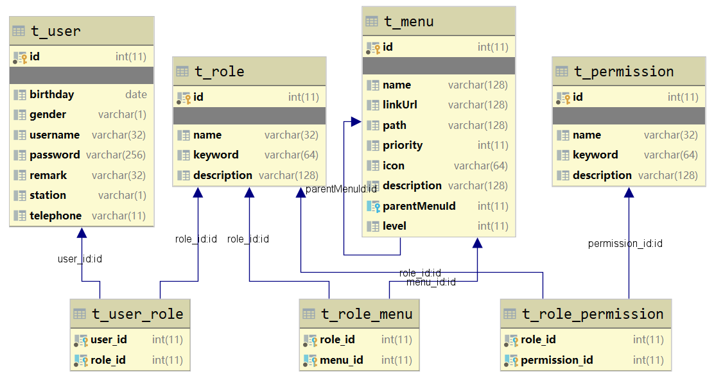

上述的7张表就构成了RBAC权限模型：


### 2. 快速入门

#### 1. 创建maven工程，pom文件导入依赖，创建启动类

```xml
<!--继承boot父工程-->
<parent>
    <artifactId>spring-boot-starter-parent</artifactId>
    <groupId>org.springframework.boot</groupId>
    <version>2.6.0</version>
</parent>

<dependencies>
    <!--web起步依赖-->
    <dependency>
        <groupId>org.springframework.boot</groupId>
        <artifactId>spring-boot-starter-web</artifactId>
    </dependency>

    <!--SpringSecurity起步依赖-->
    <dependency>
        <groupId>org.springframework.boot</groupId>
        <artifactId>spring-boot-starter-security</artifactId>
    </dependency>
</dependencies>
```

启动类：

```java
@SpringBootApplication
public class SsApplication {
    public static void main(String[] args) {
        SpringApplication.run(SsApplication.class, args);
    }
}
```


#### 2. 编写controller

```java
@RestController
public class HelloController {

    @GetMapping("/hello")
    public String hello(){
        System.out.println("hello...");
        return "Hello SpringSecurity~";
    }
}
```

#### 3. 访问controller

> 1. 会出现登录页面，表明springsecurity已经开始工作

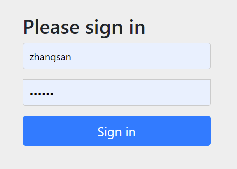


> 2. 输入默认的用户名： user ， 密码通过控制台可以找到springsecurity产生的密码

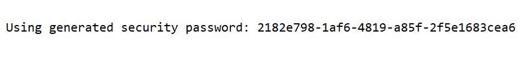

### 3.  细节处理

##### 3.1 自定义用户名和密码

> 在**application.yml**里面可以配置自定义的用户名和密码

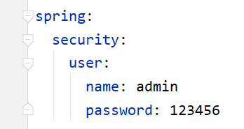

##### 3.2 修改日志级别

> 默认打印的springsecurity的日志级别是 info级别，如果想观察到更详细的日志信息，可以在**application.yml** 里面修改日志的打印级别 。 如果info看不到日志，可以尝试再设置低一些级别：
>
> 比如： debug 或者  trace 级别
>
> log.info()、log.error()
>
> 日志级别：fatal>error>warn>info>debug>trace

```yaml
logging:
  level:
    org:
      springframework:
        security: debug
```

### 4. 原理

#### 4.1 SpringBoot自动配置

> 默认情况下，只要在SpringBoot项目里面添加了SpringSecurity依赖，那么 SpringSecurity 即会自动工作。这个自动生效的配置是由SpringBoot来完成的。

1. 在启动类身上的注解`@SpringBootApplication` 即是一切自动配置的开始
2. 进入该注解内部有一个注解 ： `@EnableAutoConfiguration` , 表示启动自动配置
3. 在 `@EnableAutoConfiguration` 注解里面，导入了 `AutoConfigurationImportSelector` 自动配置导入选择器
4. 在这个自动导入选择器类``AutoConfigurationImportSelector``中的 `getCandidateConfigurations` 可以看到自动导入的类位于 ` META-INF/spring.factories` 文件中。
5. 该文件位于 SpringBoot 的autoconfigure包中

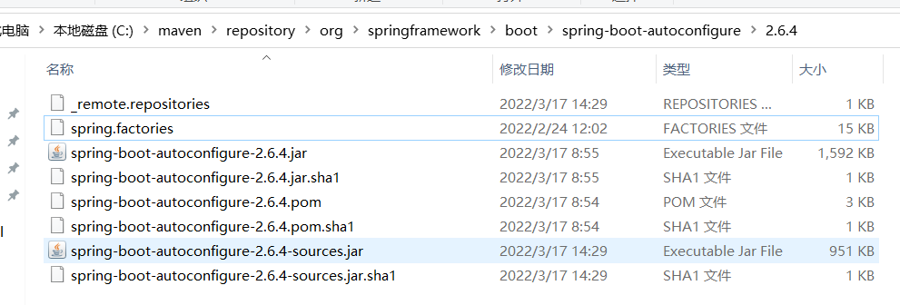

6. 在spring.factories文件中搜索security关键字，找到执行 SpringSecurity 自动配置的类：SecurityAutoConfiguration
7. 在SecurityAutoConfiguration里面发现它在上面使用 @Import导入 SpringBootWebSecurityConfiguration 类。
8. SpringBootWebSecurityConfiguration  会对所有的请求进行拦截，自此springsecurity的自动配置解析完毕：

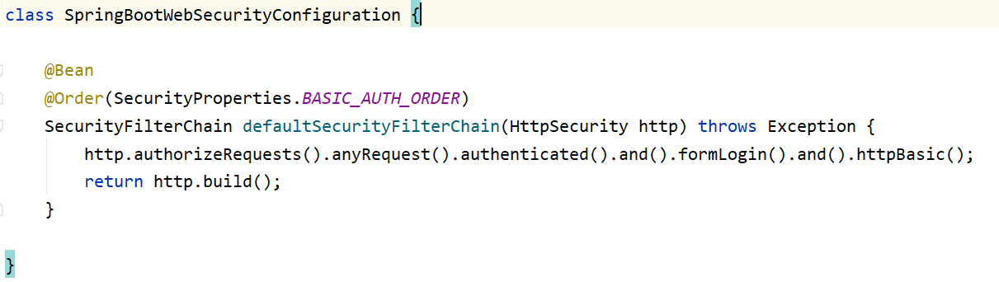

#### 4.2 SpringSecurity原理分析

> SpringSecurity的核心即是： 过滤器Filter , 翻开SpringSecurity的官方文档，找到如下说明：

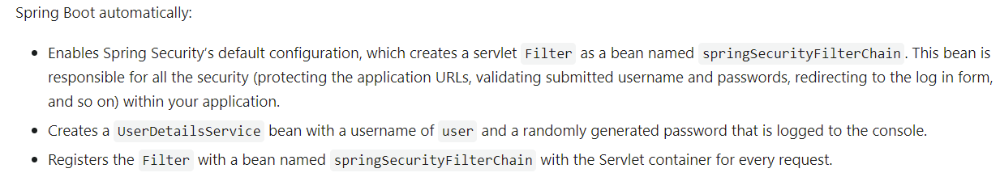

1. 这个SecurityFilterChain对象使用位置：WebSecurityConfiguration中的springSecurityFilterChain方法中
2. 通过debug发现，总共有15个过滤器需要配置，这些过滤器各司其职，每个过滤器负责的功能都不一样！

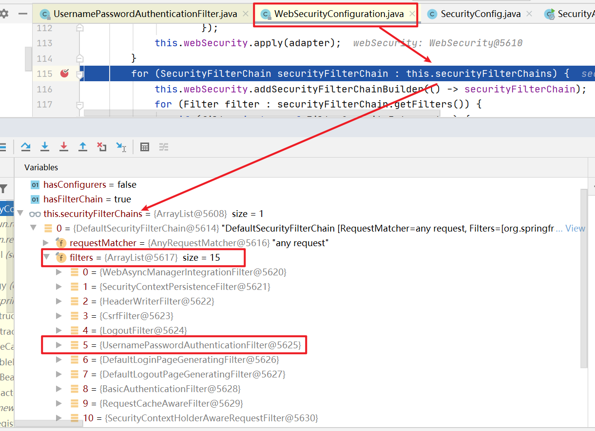

重点关注的过滤器：**UsernamePasswordAuthenticationFilter**

3. 参照官方文档的说明，可以看到有对 SpringSecurity 过滤器的描述、以及流程解释：

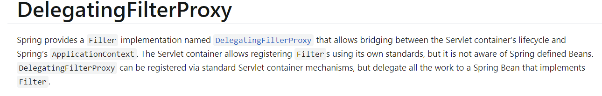

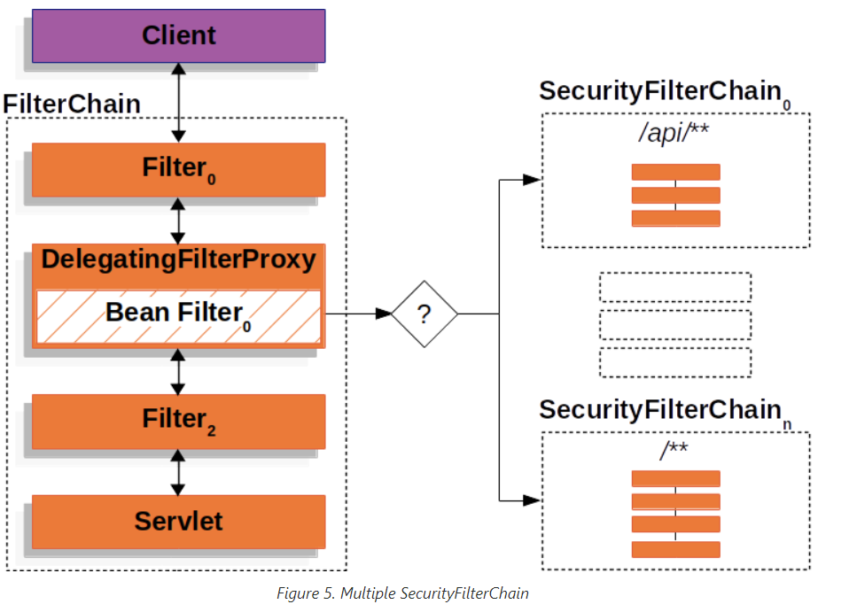

## 二 、认证授权

> 在DefaultWebSecurityCondition 里面存在注解  @ConditionalOnMissingBean({WebSecurityConfigurerAdapter.class,... }) 表明如果在JVM中缺失 WebSecurityConfigurerAdapter 则会启用默认的springsecurity的认证和授权流程。 所以如果我们希望自己执行认证和授权，那么编写一个类，继承 WebSecurityConfigurerAdapter 即可。

### 1.  内存方式

> 一般在开发当中，我们都会选择自己来认证授权！

#### 1.1.  定义配置类

```java
//为了让spring发现我们写的配置类，需要加上 @Configuration
@Configuration
public class SecurityConfigure extends WebSecurityConfigurerAdapter {
    
}
```

#### 1.2. 重写方法

##### 1.2.1 认证方法

```java
    /**
     * 认证
     *      什么样的账号和密码， 是什么样的角色
     * @param auth
     * @throws Exception
     */
    @Override
    protected void configure(AuthenticationManagerBuilder auth) throws Exception {
        //内存中的认证：{noop}代表密码不加密，直接使用明文存储
        auth.inMemoryAuthentication()
                .withUser("zhangsan")
                .password("{noop}123")
                .roles("ZS")
                .and()
                .withUser("admin")
                .password("{noop}666")
                .roles("ADMIN");
    }
```

##### 1.2.2 授权方法

```java
	/**
     * 授权：
     *  1. 什么样的请求地址允许直接访问
     *  2. 什么样的请求需要有相应角色权限才能访问
     *  3. 其他的请求全部要求认证通过之后才能访问。
     * @param http
     * @throws Exception
     */
    @Override
    protected void configure(HttpSecurity http) throws Exception {
        http.authorizeRequests()
                //直接访问，不需要登录的请求
                .antMatchers("/login.html").permitAll()
                //需要登录角色ADMIN，才能访问的请求
                .antMatchers("/show01").hasRole("ADMIN")
                //需要登录角色ZS或LS，才能访问的请求
                .antMatchers("/show02").hasAnyRole("ZS", "LS")
            	//其他请求，只需要登录就可以访问
                .anyRequest().authenticated()
                //and 用来拼接配置
                .and()
                //表示使用默认SpringSecurity的登录页面
                .formLogin(); 
    }
```


##### 1.2.3 异常处理

> 当我们已经登录，但是访问并不具有访问权限的资源时，那么会出现403 的异常：

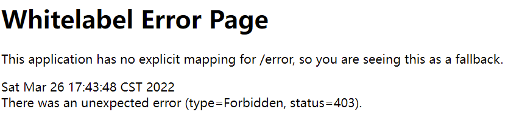

* 解决办法： 在授权方法里面添加关于异常的处理办法：

```java
    @Override
    protected void configure(HttpSecurity http) throws Exception {
        http.authorizeRequests()
                //直接访问，不需要登录的请求
                .antMatchers("/login.html").permitAll()
                //需要登录角色ADMIN，才能访问的请求
                .antMatchers("/show01").hasRole("ADMIN")
                //需要登录角色ZS或LS，才能访问的请求
                .antMatchers("/show02").hasAnyRole("ZS", "LS")
                //其他请求，只需要登录就可以访问
                .anyRequest().authenticated()
                //and 用来拼接配置
                .and()
                //表示使用默认SpringSecurity的登录页面
                .formLogin();

        //异常处理：方式一
        /*AccessDeniedHandlerImpl accessDeniedHandler = new AccessDeniedHandlerImpl();
        accessDeniedHandler.setErrorPage("/error.html");
        http.exceptionHandling().accessDeniedHandler(accessDeniedHandler);*/

        //异常处理：方式二
        /*http.exceptionHandling().accessDeniedHandler(new MyAccessDeniedHandler());*/

        //异常处理：方式三
        /*http.exceptionHandling().accessDeniedHandler(new AccessDeniedHandler() {
            @Override
            public void handle(HttpServletRequest request, HttpServletResponse response, AccessDeniedException accessDeniedException) throws IOException, ServletException {
                response.setContentType("text/json;charset=utf-8");
                response.getWriter().write(JSON.toJSONString(R.error("权限不足！-3")));
            }
        });*/

        //异常处理：方式四
        http.exceptionHandling().accessDeniedHandler((request, response, exception)->{
            response.setContentType("text/json;charset=utf-8");
            response.getWriter().write(JSON.toJSONString(R.error("权限不足！-4")));
        });
    }

```

* 异常处理类

```java
public class MyAccessDeniedHandler implements AccessDeniedHandler {
    @Override
    public void handle(HttpServletRequest request, HttpServletResponse response, AccessDeniedException accessDeniedException)
            throws IOException, ServletException {
        //response.setContentType("text/html;charset=utf-8");
        response.setContentType("application/json;charset=utf-8");
        response.getWriter().write("权限不足-1，禁止访问！");
    }
}

```


#### 1.3 自定义登录页面

> 默认springsecurity的登录操作，会被过滤器： **UsernamePasswordAuthenticationFilter** 拦截，它内部有几个判定： ==请求方式是 post==， 请求地址是 /login , 用户名参数是： username , 密码参数名是: password 
>
> 请求方式不能修改之外，其他的都可以修改

##### 1.3.1 定义登录页面

```html
<form action="/login" method="post">
    用户名： <input type="text" name="username"/><br/>
    密 码： <input type="password" name="password"/><br/>
    <input type="submit" value="登录"/>
</form>
```

##### 1.3.2 配置

```java
	/**
     * 授权：
     *  1. 什么样的请求地址允许直接访问
     *  2. 什么样的请求需要有相应角色权限才能访问
     *  3. 其他的请求全部要求认证通过之后才能访问
     * @param http
     * @throws Exception
     */
    @Override
    protected void configure(HttpSecurity http) throws Exception {
        //...
        
        http.formLogin()
                //登录页面
                .loginPage("/login.html")
                //用户名参数名称
                .usernameParameter("username")
                //密码参数名称
                .passwordParameter("password")
                //登录的请求地址
                .loginProcessingUrl("/login")
                //登录成功之后默认跳转的页面，设置true的话，则强制跳转到该页面
                .defaultSuccessUrl("/index.html",true)
                //登录失败之后跳转的页面
                .failureForwardUrl("/login.html")
                //禁用 csrf 跨站伪造请求
                .and().csrf().disable();
        
        //【扩展】前后端分离返回形式
        /*http.formLogin()
                //登录页面
                .loginPage("/login.html")
                //用户名参数名称
                .usernameParameter("username")
                //密码参数名称
                .passwordParameter("password")
                //登录的请求地址
                .loginProcessingUrl("/login")
                //登录成功处理器
                .successHandler((request, response, authentication)->{
                    response.setContentType("text/json;charset=utf-8");
                    response.getWriter().write(JSON.toJSONString(R.success("login success!")));
                })
                //登录失败处理器
                .failureHandler((request, response, exception)->{
                    response.setContentType("text/json;charset=utf-8");
                    response.getWriter().write(JSON.toJSONString(R.success("login fail!")));
                })
                //禁用 csrf 跨站伪造请求
                .and().csrf().disable();*/
        
        //...
    }
```

##### 1.3.3 csrf

> CSRF（Cross-site request forgery），中文名称：跨站请求伪造，缩写为：CSRF/XSRF。
>
> 一般来说，攻击者通过伪造用户的浏览器的请求，向访问一个用户自己曾经认证访问过的网站发送出去，使目标网站接收并误以为是用户的真实操作而去执行命令。常用于盗取账号、转账、发送虚假消息等。

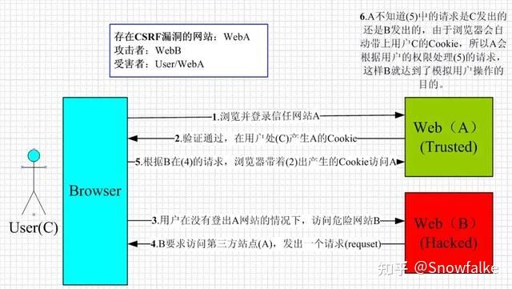

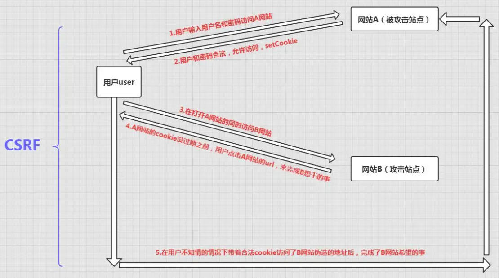

参考网址：https://blog.csdn.net/qq_45803593/article/details/124727762

##### 1.3.4 退出登录

```java
    /**
     * 授权：
     *  1. 什么样的请求地址允许直接访问
     *  2. 什么样的请求需要有相应角色权限才能访问
     *  3. 其他的请求全部要求认证通过之后才能访问
     * @param http
     * @throws Exception
     */
    @Override
    protected void configure(HttpSecurity http) throws Exception {
        //...
        
        http.formLogin()
                //登录页面
                .loginPage("/login.html")
                //用户名参数名称
                .usernameParameter("username")
                //密码参数名称
                .passwordParameter("password")
                //登录的请求地址
                .loginProcessingUrl("/login")
                //登录成功之后默认跳转的页面，设置true的话，则强制跳转到该页面
                .defaultSuccessUrl("/index.html",true)
                //登录失败之后跳转的页面
                .failureForwardUrl("/login.html")
                //禁用 csrf 跨站请求伪造
                .and().csrf().disable()
                //退出登录配置
                .logout()
                //退出的请求地址
                .logoutUrl("/logout")
                //退出之后跳转的页面
                .logoutSuccessUrl("/login.html");
        
        //...
    }
```

#### 1.4. 密码加密

##### 1.4.1 加密方式

> 在springsecurity里面，支持的加密方式有很多， 具体可以在 PasswordEncoderFactories 里面查看。官方推荐使用 bcrypt 加密方式。

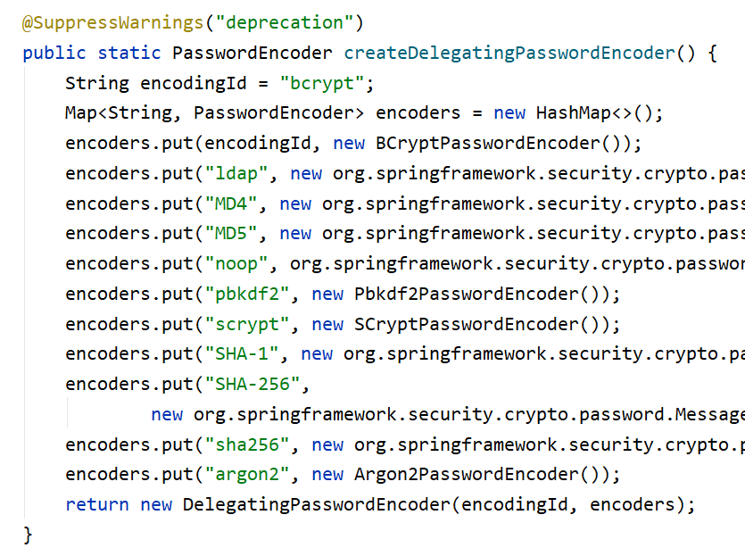

**MD5**：摘要算法采用Hash处理，加密方式不可逆（明文-->密文）， **但是每次加密的结果都是一样的**

针对它的缺陷，解决方式：										

​	方式一：加密多次 至少3次以上						

   	方式二：Md5(password+salt) salt：随机字符串 UUID 

**bcrypt**：将salt随机并混入最终加密后的密码，验证时也无需单独提供之前的salt，从而无需单独处理salt问题

SpringSecurity 中的BCryptPasswordEncoder方法采用 **SHA-256 +随机盐+密钥**  对密码进行加密。SHA系列是Hash算法，不是加密算法，使用加密算法意味着可以解密（这个与编码/解码一样），但是采用Hash处理，其过程是不可逆的。

（1）**加密(encode)：**注册用户时，使用**SHA-256+随机盐+密钥**把用户输入的密码进行hash处理，得到密码的hash值，然后将其存入数据库中。

（2）**密码匹配(matches)：**用户登录时，密码匹配阶段**并没有进行密码解密**（因为密码经过Hash处理，是不可逆的），而是使用相同的算法把用户输入的密码进行hash处理，得到密码的hash值，然后将其与从数据库中查询到的密码hash值进行比较。如果两者相同，说明用户输入的密码正确。

为什么处理密码时要用hash算法，而不用加密算法？因为这样处理即使数据库泄漏，黑客也很难破解密码。

* 加密结果解释

```java
$2a$10$7Pb7IxzTL1bXA9a/A92y.OPBqYjqFZpnw6poI8NGYAkHj4IBe0Zhu
```

加密后字符串的长度为固定的60位。其中：

$是分割符，无意义；

2a是bcrypt加密版本号：2a

10是循环10次加盐加密：10

$符号后接下来的22位是salt值：7Pb7IxzTL1bXA9a/A92y.O

剩下的字符串就是密码的密文了：PBqYjqFZpnw6poI8NGYAkHj4IBe0Zhu

##### 1.4.2 具体应用

> 要想使用BCrypt密码加密其实很简单，只需要在配置类中定义一个方法，返回 BcryptPasswordEncoder 对象即可，并且不要忘记了对认证的用户密码进行加密处理。
>
> 用户在输入密码登录时，SpringSecurity就会自动对用户输入的密码使用BCrypt进行加密，然后和内存|数据库中存储的用户密码进行比对   **注意：**内存|数据库中存储的用户密码也要使用BCrypt进行加密
>
> 密码加密使用步骤：
>
> ​	1.对用户输入的密码进行加密
>
> ​        2.对内存|数据库中存储的密码进行加密
>
> ​	**注意**：两边的加密方式要一致

* 添加方法

```java
	/**
     * 1.定义一个方法：创建 BCryptPasswordEncoder 对象，并且交由spring容器管理
     * 2.用户在输入密码登录时，SpringSecurity就会自动对用户输入的密码使用 BCrypt 进行加密
     * 3.然后在进行登录认证时就会和内存|数据库中存储的用户密码进行比对
     * **注意：**内存|数据库中存储的用户密码也要使用 BCrypt 进行加密之后再存储
     * @return
     */
    @Bean   //bean注解  代表该方法会创建出一个bean对象，并且将该对象交由spring容器管理
    public BCryptPasswordEncoder bp() {
        return new BCryptPasswordEncoder();
    }
```

* 认证处理

```java
/**
     * 认证
     *      什么样的账号和密码， 是什么样的角色
     * @param auth
     * @throws Exception
     */
    @Override
    protected void configure(AuthenticationManagerBuilder auth) throws Exception {
        //基于内存的认证
        auth.inMemoryAuthentication()
                .withUser("admin")
//                .password("{noop}666")
                .password(bp().encode("666"))
                .roles("ADMIN")
                .and()
                .withUser("zhangsan")
//                .password("{noop}123")
                .password(bp().encode("123"))
                .roles("ZS")
                .and()
                .withUser("lisi")
//                .password("{noop}456")
                .password(bp().encode("456"))
                .roles("LS");
    }
```

### 2. 数据库方式

#### 2.1 准备数据库

```sql
# 创建数据库day36_ss 并使用该数据库
CREATE DATABASE day36_ss;
USE day36_ss;

# 创建用户表
create table t_user(
    id bigint primary key auto_increment ,
    username varchar(25) ,
    password varchar(65) ,
    name varchar(25)
)ENGINE=InnoDB DEFAULT CHARSET=utf8mb4;

# 创建角色表
create table t_role(
    id int primary key auto_increment,
    name varchar(25) ,
    keyword varchar(25)
)ENGINE=InnoDB DEFAULT CHARSET=utf8mb4;

# 创建用户角色表
create table t_user_role(uid bigint , rid int )ENGINE=InnoDB DEFAULT CHARSET=utf8mb4;

# 添加外键
alter table t_user_role add constraint FK_user_ur foreign key (uid) references t_user(id);
alter table t_user_role add constraint FK_role_ur foreign key (rid) references t_role(id);

# 添加数据 密码是 123456 加密后的效果
insert into t_user values ( null , 'zhangsan' , '$2a$10$ezVuPO6NaUsQZ66p7y0QSeWfO6s.Qoz01vbTcI2vlcuLXy8Wk.DOy' , '张三');
insert into t_user values ( null , 'lisi' , '$2a$10$ezVuPO6NaUsQZ66p7y0QSeWfO6s.Qoz01vbTcI2vlcuLXy8Wk.DOy' , '李四');

insert into t_role values ( null , '管理员' , 'ROLE_ADMIN' );
insert into t_role values ( null , '普通员工' , 'ROLE_USER' );

insert into t_user_role value( 1 , 1 );
insert into t_user_role value( 2 , 2 );
```

#### 2.2：创建项目，添加mybatisplus、mysql驱动、lombok依赖

```xml
<dependency>
    <groupId>com.baomidou</groupId>
    <artifactId>mybatis-plus-boot-starter</artifactId>
    <version>3.4.2</version>
</dependency>
<dependency>
    <groupId>mysql</groupId>
    <artifactId>mysql-connector-java</artifactId>
</dependency>
<dependency>
    <groupId>org.projectlombok</groupId>
    <artifactId>lombok</artifactId>
</dependency>
```


#### 2.3：application.yml中配置数据源

```yaml
spring:
  datasource:
    driver-class-name: com.mysql.cj.jdbc.Driver
    url: jdbc:mysql://localhost:3306/day44?useSSL=false&serverTimezone=UTC
    username: root
    password: 1234
```


#### 2.4 准备实体类

* User

```java
@Data
public class User {

    private Long id ;
    private String username;
    private String password;
    private String name;

    //用于记录用户的角色信息，一个用户可以有多个角色身份。
    private List<Role> roleList;
}

```

* Role

```java
@Data
public class Role {
    private Long id ;
    private String name;
    private String keyword;
}

```


#### 2.5 准备dao

* UserDao

```java
@Mapper
public interface UserDao extends BaseMapper<User> {
    /**
     * 根据用户名查询用户
     * @param username
     * @return
     */
    User findByUsername(String username);
}

```

* UserDao.xml

> 位于： resources/mapper/

```xml
<?xml version="1.0" encoding="utf-8" ?>
<!DOCTYPE mapper
        PUBLIC "-//mybatis.org//DTD Mapper 3.0//EN"
        "http://mybatis.org/dtd/mybatis-3-mapper.dtd">
<mapper namespace="com.itheima.dao.UserDao">
    <resultMap id="userMap" type="com.itheima.bean.User">
        <result property="username" column="username" />
        <result property="password" column="password" />
        <!--
            collection:配置一对多 将查询出来的每条角色信息封装到一个Role对象中 最终存入到roleList集合中
            collection属性的封装规则:
                property="roleList": 指定这是哪个集合属性
                ofType: 指定集合内封装的JavaBean类型(集合内装的什么)，这里即为 Role 类
        -->
        <collection property="roleList" ofType="com.itheima.bean.Role">
            <result property="name" column="name"/>
            <result property="keyword" column="keyword"/>
        </collection>
    </resultMap>

    <select id="findByUsername" resultMap="userMap">
        SELECT
          u.username,
          u.password,
          r.name,
          r.keyword
        FROM
          t_user u
          LEFT JOIN t_user_role ur
            ON u.id = ur.uid
          LEFT JOIN t_role r
            ON r.id = ur.rid
          where username=#{username}
    </select>
</mapper>
```


* application.yml   （如果xml文件所在包名与dao所在包名不一致那么需要配置映射）

```yaml
mybatis-plus:
  type-aliases-package: com.itheima.bean
  mapper-locations: classpath:mapper/*.xml
```


#### 2.6 准备配置类

```java
@Service
public class UserDetailServiceImpl implements UserDetailsService {

    @Autowired
    private UserDao userDao;

    @Override
    public UserDetails loadUserByUsername(String username) throws UsernameNotFoundException {

        //1. 根据用户名查询用户
        User user = userDao.findByUsernameUser(username);
        System.out.println("user = " + user);

        //2. 构建返回
        List<GrantedAuthority> list = new ArrayList<>();
        List<Role> roleList = user.getRoleList();
        for (Role role : roleList) {
            list.add(new SimpleGrantedAuthority(role.getKeyword()));
        }

        //返回用户详情信息
        return new org.springframework.security.core.userdetails.User(
                user.getUsername() ,
                user.getPassword() ,
                list);
    }
}

```

#### 2.7 修改认证方法

```java
@Configuration
public class SecurityConfigure extends WebSecurityConfigurerAdapter {

    @Autowired
    private UserDetailServiceImpl us;

    @Bean
    public BCryptPasswordEncoder bp (){
        return new BCryptPasswordEncoder();
    }

    /*
        认证：
            什么样的账号和密码， 是什么样的角色

     */
    @Override
    protected void configure(AuthenticationManagerBuilder auth) throws Exception {
        auth.userDetailsService(us);
    }

    //...授权方法 
    @Override
    protected void configure(HttpSecurity http) throws Exception {

        http.authorizeRequests()
                .antMatchers("/**/*.html","/**/*.css","/**/*.js").permitAll()
                .antMatchers("/show").hasRole("ADMIN")
                .antMatchers("/show02").hasRole("USER")
                .anyRequest().authenticated()
                .and().formLogin()
                .loginPage("/login.html")
             .loginProcessingUrl("/login").defaultSuccessUrl("/index.html",true).failureForwardUrl("/login.html")
                .and().csrf().disable()
                .logout().logoutUrl("/logout").logoutSuccessUrl("/login.html")
                //403异常处理
                .and().exceptionHandling().accessDeniedHandler(new AccessDeniedHandler() {
                    @Override
                    public void handle(HttpServletRequest request, HttpServletResponse response, AccessDeniedException accessDeniedException) throws IOException, ServletException {
                        response.setContentType("text/html;charset=UTF-8");
                        response.getWriter().print("权限不足 禁止访问");
                    }
                });
    }

}
```

### 3. 注解动态授权

> springsecurity允许程序员在Controller方法上使用注解来动态授权，即配置角色|权限到方法上。表明需要具备什么样的角色身份或者是权限，才允许访问该方法！

* 1.在方法上使用  @PreAuthorize 进行调用 权限拦截

```java
    //表明调用方法需具有该角色身份。
	@PreAuthorize("hasRole('ADMIN')")
    @RequestMapping("/show66")
    public String show66(){
        System.out.println("执行了show66方法！~~！");
        return "show ... success...";
    }
```

* 2.要想让注解生效，需要在启动类上面设置注解

```java
//启用全局方法注解
@EnableGlobalMethodSecurity(prePostEnabled = true)
@SpringBootApplication
public class Demo1HelloworldApplication {

    public static void main(String[] args) {
        SpringApplication.run(Demo1HelloworldApplication.class, args);
    }

}
```

## 三 、整合项目

### 1. 添加依赖

```xml
<!--添加springsecurity-->
<dependency>
    <groupId>org.springframework.boot</groupId>
    <artifactId>spring-boot-starter-security</artifactId>
</dependency>
```

### 2.  创建表

可以直接执行资料中提供的sql脚本：role.sql、employ_role.sql

* 角色表

```sql
create table role
(
    id      bigint auto_increment primary key,
    name    varchar(100) null,
    keyword varchar(25)  null
)ENGINE=InnoDB DEFAULT CHARSET=utf8mb4;
```

* 员工角色表

```sql
create table if not exists employee_role
(
	eid bigint null,
	rid bigint null,
	constraint user_role_role_id_fk
		foreign key (rid) references role (id),
	constraint user_role_user_id_fk
		foreign key (eid) references employee (id)
)ENGINE=InnoDB DEFAULT CHARSET=utf8mb4;

```

### 3.  编写实体类

* Role

```java
package com.itheima.bean;

import lombok.Data;

@Data
public class Role {
    private Long id ;
    private String name;
    private String keyword;
}
```

* EmployeeRole

```java
/**
 * 员工角色关系表实体类
 */
@Data
public class EmployeeRole {
    private Long eid;
    private Long rid;
}
```


* Employee

> 让Employee实现UserDetails 这样在认证方法返回即可只返回Employee对象即可
>
> 因为它里面包含了权限内容

```java
@Data
public class Employee implements Serializable , UserDetails {

    private static final long serialVersionUID = 1L;


    @TableField(exist = false)
    private List<Role> roleList = new ArrayList<>();

    //原有属性省略...

  	//封装角色集合信息到List<GrantedAuthority>中
    @Override
    public Collection<? extends GrantedAuthority> getAuthorities() {
        List<GrantedAuthority> list = new ArrayList<>();
        roleList.forEach(r->{
            list.add(new SimpleGrantedAuthority(r.getKeyword()));
        });
        return list;
    }

    //没有过期
    @Override
    public boolean isAccountNonExpired() {
        return true;
    }

    //没有被锁定
    @Override
    public boolean isAccountNonLocked() {
        return true;
    }

    //认证后永不过期
    @Override
    public boolean isCredentialsNonExpired() {
        return true;
    }

    //是否可用  status=1为正常状态，status=0禁用状态
    @Override
    public boolean isEnabled() {
        return this.status == 1;
    }
}
```

### 4. 编写Dao

```java
public interface EmployeeDao extends BaseMapper<Employee> {
    /**
     * 根据用户名来查询员工信息及角色身份列表信息
     * @param username
     * @return
     */
    Employee findByUsername(String username);
}
```

### 5. 编写映射文件

* EmployeeDao.xml

```xml
<?xml version="1.0" encoding="utf-8" ?>
<!DOCTYPE mapper
        PUBLIC "-//mybatis.org//DTD Mapper 3.0//EN"
        "http://mybatis.org/dtd/mybatis-3-mapper.dtd">
<mapper namespace="com.itheima.dao.EmployeeDao">

    <resultMap id="empMap" type="Employee">
        <id property="id" column="id"/>
        <result property="name" column="name"/>
        <result property="username" column="username"/>
        <result property="password" column="password"/>
        <result property="status" column="status"/>
        <!--
            collection 配置一对多中的对象集合属性，数据填充
                property: 指定集合属性名称
                ofType: 指定集合内封装的JavaBean类型（集合内装的什么对象）
        -->
        <collection property="roleList" ofType="Role">
            <result property="name" column="r_name"/>
            <result property="keyword" column="keyword"/>
        </collection>
    </resultMap>

    <select id="findByUsername" resultMap="empMap">
        SELECT
          e.*,
          r.name r_name,
          r.keyword
        FROM
          employee AS e
          INNER JOIN employee_role er
            ON e.id = er.eid
          INNER JOIN role r
            ON er.rid = r.id
        WHERE e.username = #{username}
    </select>
</mapper>
```

* application.yml

```yaml
#别名映射、实体类包名映射
mybatis-plus:
  mapper-locations: classpath:/mapper/*.xml
  type-aliases-package: com.itheima.bean
```

### 6. 编写过滤器类

```java
/**
 * 自己定义的过滤器，用来顶替springsecurity的账号密码校验的过滤器
 */
public class SecurityLoginFilter extends UsernamePasswordAuthenticationFilter {
    @Override
    public Authentication attemptAuthentication(HttpServletRequest request, HttpServletResponse response)
            throws AuthenticationException {
        //如果登录请求方式不是post请求 就抛出异常
        if (!request.getMethod().equals("POST")) {
            throw new AuthenticationServiceException("Authentication method not supported: " + request.getMethod());
        }

        //获取用户名和密码封装到Employee对象中
        Employee emp = null;
        try {
            emp = JSON.parseObject(request.getInputStream(), Employee.class);
            System.out.println("SecurityLoginFilter:: 页面传递上来的对象：" + emp);
        } catch (IOException e) {
            e.printStackTrace();
        }
        System.out.println("SecurityLoginFilter-emp = " + emp);
        UsernamePasswordAuthenticationToken authRequest = new UsernamePasswordAuthenticationToken(emp.getUsername(), emp.getPassword());
        // Allow subclasses to set the "details" property
        setDetails(request, authRequest);
        return this.getAuthenticationManager().authenticate(authRequest);
    }
}
```

### 7. 编写认证授权配置类

```java
@Configuration
public class SecurityConfig extends WebSecurityConfigurerAdapter {

    @Autowired
    private EmployeeDao employeeDao;

    @Bean
    public BCryptPasswordEncoder bCryptPasswordEncoder(){
        return new BCryptPasswordEncoder();
    }

    /**
     * 认证
     * @param auth
     * @throws Exception
     */
    @Override
    protected void configure(AuthenticationManagerBuilder auth) throws Exception {
        //数据库认证：根据用户名去数据库查询用户信息（用户名、密码、角色身份信息）
        auth.userDetailsService(username -> employeeDao.findByUsername(username));
    }

    /**
     * 授权
     * @param http
     * @throws Exception
     */
    @Override
    protected void configure(HttpSecurity http) throws Exception {
        http.authorizeRequests()
                .antMatchers(urls).permitAll()
                .anyRequest().authenticated()
                .and().formLogin()
                .loginPage("/backend/page/login/login.html")
                .and().logout().logoutUrl("/employee/logout")
                .logoutSuccessHandler((request,response,authentication)->{
                    response.setContentType("application/json;charset=utf-8");
                    String json = JSON.toJSONString(R.success("退出登录成功！"));
                    response.getWriter().write(json);
                })
                .and().headers().frameOptions().sameOrigin() //加入同源策略，这样即可允许页面上加载iframe子页面
                .and().csrf().disable();

        //使用我们自定义的用户名密码验证过滤器顶替SpringSecurity提供的过滤器
        http.addFilterAt(securityLoginFilter() , UsernamePasswordAuthenticationFilter.class);
    }

    //放行规则
    private final String[] urls = {
            "/**/api/**/*.*",
            "/**/images/**/*.*",
            "/**/js/**/*.*",
            "/backend/page/login/login.html",
            "/front/page/login.html",
            "/**/plugins/**/*.*",
            "/**/styles/**/*.*",
            "/**/*.ico",
            "/**/fonts/**",
            "/employee/login",
            "/employee/logout",
            "/user/sendMsg",
            "/user/login"
    };

    @Bean
    public SecurityLoginFilter securityLoginFilter () throws Exception {
        //1.构建登录过滤器对象
        SecurityLoginFilter filter = new SecurityLoginFilter();
        //2.设置登录过滤器拦截地址
        filter.setFilterProcessesUrl("/employee/login");
        //3.设置认证管理员 将自定义的登录过滤器管理器加入到SpringSecurity认证管理员管理
        filter.setAuthenticationManager(authenticationManagerBean());

        //4.设置登录成功处理
        filter.setAuthenticationSuccessHandler((req,resp,auth)->{
            //用户认证成功后  会被SpringSecurity存入到一个域对象中，这个域对象就相当于session，
            Employee employee = (Employee) SecurityContextHolder.getContext().getAuthentication().getPrincipal();
            String json = JSON.toJSONString(R.success(employee));
            resp.setContentType("application/json;charset=utf-8");
            resp.getWriter().write(json);
        });

        //5.设置登录失败处理
        filter.setAuthenticationFailureHandler((req, resp ,e)->{
            //账号过期、账号锁定、密码过期、账号禁用、用户名不存在、密码错误 SpringSecurity都会抛出一个指定类型的异常
            resp.setContentType("application/json;charset=utf-8");
            //返回json数据
            R<Object> result = null;
            if (e instanceof AccountExpiredException) {
                //账号过期
                result = R.error("账号过期！");
            } else if (e instanceof BadCredentialsException) {
                //密码错误
                result = R.error("密码错误！");
            } else if (e instanceof CredentialsExpiredException) {
                //密码过期
                result = R.error("密码过期！");
            } else if (e instanceof DisabledException) {
                //账号不可用
                result = R.error("账号不可用！");
            } else if (e instanceof LockedException) {
                //账号锁定
                result = R.error("账号锁定！");
            } else if (e instanceof InternalAuthenticationServiceException) {
                //用户不存在
                result = R.error("用户不存在！");
            }else{
                //其他错误
                result = R.error("未知错误！");
            }
            String json = JSON.toJSONString(result);
            resp.getWriter().write(json);
        });
        return filter;
    }
}
```

### 8. 修改公共字段填充

```java
//把这个类交给spring管理
@Component
public class CommonFieldHandler implements MetaObjectHandler {

    @Override
    public void insertFill(MetaObject metaObject) {
        System.out.println("添加操作:::  来调用insertFill给公共字段赋值了！~~！");
        metaObject.setValue("createTime", LocalDateTime.now());
        metaObject.setValue("updateTime", LocalDateTime.now());

        //从springsecurity作用域对象中获取当前管理的认证用户对象【相当于session中存储】
        Employee e = (Employee) SecurityContextHolder.getContext().getAuthentication().getPrincipal();
        metaObject.setValue("createUser" , e.getId());
        metaObject.setValue("updateUser" , e.getId());
    }


    //当mybatisplus 执行更新操作的时候，会通过这个方法给公共字段赋值。
    @Override
    public void updateFill(MetaObject metaObject) {
        metaObject.setValue("updateTime", LocalDateTime.now());

        //从springsecurity中获取数据
        Employee e = (Employee) SecurityContextHolder.getContext().getAuthentication().getPrincipal();
        metaObject.setValue("updateUser" ,e.getId());
    }
}
```

### 9. 使用动态鉴权

* 在category的添加分类方法上，使用注解标记需要什么样的权限才能访问该方法。

```java
    /**
     * 添加分类
     * @param category
     * @return
     */
    @PreAuthorize("hasRole('ADMIN')")
    @PostMapping
    public R<String> add(@RequestBody Category category){

        //1. 调用service
        int row = cs.add(category);

        //2. 返回
        if(row > 0 ){
            return R.success("添加分类成功！");
        }else{
            return R.error("添加分类失败！");
        }
    }
```

* 启动类添加开启全局注解开关

```java
@EnableGlobalMethodSecurity(prePostEnabled = true)  //启用全局方法安全注解
@EnableTransactionManagement    //启用事务注解驱动支持
@ServletComponentScan           //将 Servlet、Filter 交由 Spring 容器管理
@MapperScan("com.itheima.dao")  //扫描dao包
@Slf4j
@SpringBootApplication
public class ReggieApplication {
    public static void main(String[] args) {
        SpringApplication.run(ReggieApplication.class, args);
        log.info("项目启动成功！");
    }
}

```


