 

学习目标：

- 了解架构演进过程
- 理解微服务拆分流程及远程调用过程
- 掌握注册中心Eureka(nacos)的使用
- 掌握负载均衡Ribbon的使用(配置)
- 能够基于Feign实现服务远程调用（使用）

<!-- more -->


## 1 服务架构演进

章节知识点

- 单体架构
- 分布式架构
- 微服务架构
- SpringCloud


过去的互联网：

```properties
1:用户量不多
2:并发低
3:数据少
```

现在的互联网:

```properties
1:用户多
2:并发高
3:数据庞大
```

互联网架构从简到繁的演进经历了单体架构、分布式架构、SOA架构、微服务架构以及最新的service mesh的演进过程。


### 1.1 单体架构

1)概念

```properties
早期互联网产品用户量少，并发量低，数据量小，单个应用服务器可以满足需要，这就是最早互联网架构。我们用一句话总结什么是单体架构：将业务的所有功能集中在一个项目中开发，部署为一个节点。
```


2)架构图

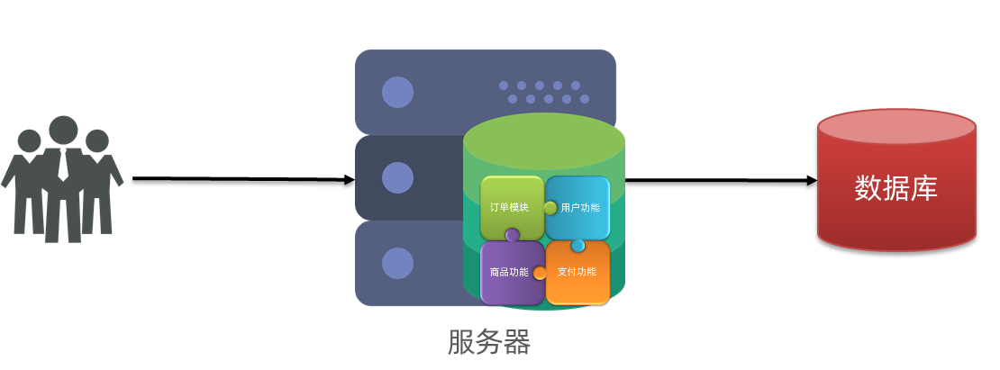


3)优缺点

```properties
#优点：
	1)架构简单
	2)部署成本低
	
#缺点：
	1)耦合度高
```


### 1.2 分布式架构

1)概念

```properties
根据业务功能对系统进行拆分，每个业务模块称为一个服务。
```


2)架构图

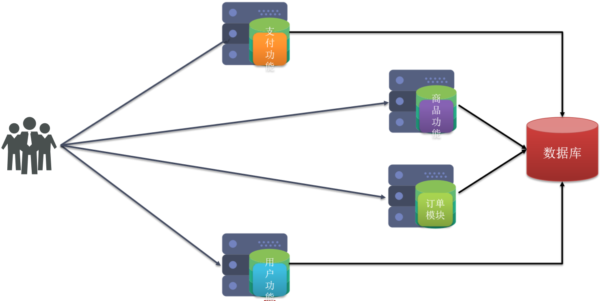


3)优缺点

```properties
#优点
	1)降低服务耦合度
	2)有利于服务升级拓展
	
#缺点
	1)维护成本增加
	2)服务间调用复杂度增加
```

4)需要解决的问题

```properties
1)服务拆分粒度如何？
2)服务之间如何实现调用？
3)服务关系如何管理？
```

### 1.3 微服务

1)概念

```properties
微服务是系统架构的一种设计风格,将一个原本独立的服务拆分成多个小型服务,每个服务独立运行在在各自的进程中,服务之间通过 HTTP RESTful API 进行通信.每个小型的服务都围绕着系统中的某个耦合度较高的业务进行构建。

#微服务是一种经过良好设计的分布式架构方案，而全球的互联网公司都在积极尝试自己的微服务落地方案。其中在java领域最引人注目的是SpringCloud提供的方案。
```

2)架构图

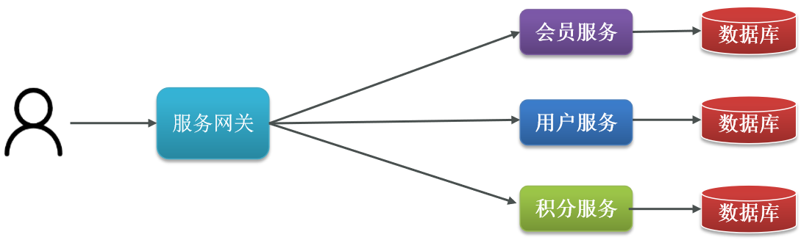


3)微服务架构特征

```properties
单一职责:微服务拆分粒度更小，每个服务都应对唯一的业务能力，做到单一职责
自治:团队独立、技术独立、数据独立，独立部署和交付
面向服务:服务提供统一标准的接口，与语言无关、与技术无关
隔离性强:服务调用做好隔离、容错、降级，避免出现级联问题
```

### 1.4 SpringCloud

- SpringCloud是目前国内使用最广泛的微服务技术栈。官网地址：https://spring.io/projects/spring-cloud。

- SpringCloud集成了各种微服务功能组件，并**基于SpringBoot**实现了这些组件的自动装配，从而提供了良好的开箱即用体验:


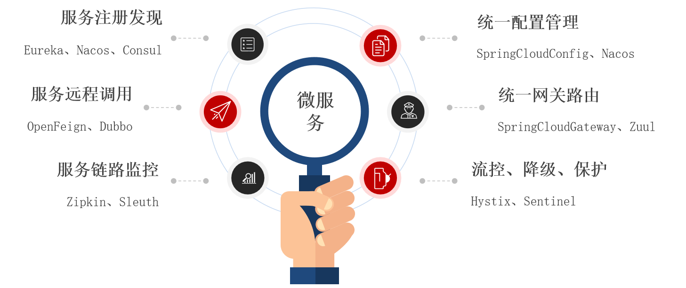


- SpringCloud与SpringBoot的版本兼容关系如下：

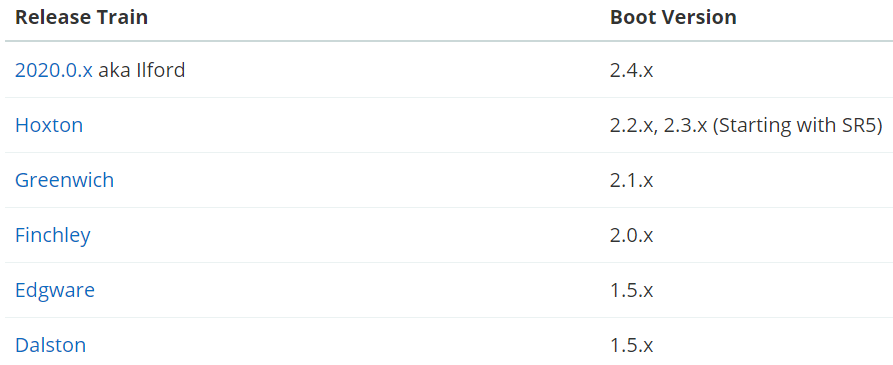


- 我们课堂学习的版本是 Hoxton.SR10，因此对应的SpringBoot版本是2.3.x（2.3.8）版本。

#### 1. SpringCloud是什么?

SpringCloud是微服务架构的一站式解决方案，集成了各种优秀微服务功能组件，并基于SpringBoot实现了这些组件的自动装配，从而提供了良好的开箱即用体验。

#### 2. SpringCloud用Hoxton版本，SpringBoot可以用2.1.x？

不可以，版本有对应关系。需使用SpringBoot 2.2.x 2.3.x


### 1.5 总结

- 单体架构:简单方便，高度耦合，扩展性差，适合小型项目。例如：学生管理系统，后台管理系统，ERP,OA 中小级企业级应用

- 分布式架构:松耦合，扩展性好，但架构复杂，难度大。适合大型互联网项目，例如：京东、淘宝

- 微服务:一种良好的分布式架构方案

- 优点:拆分粒度更小、服务更独立、耦合度更低

- 缺点:架构非常复杂，运维、监控、部署难度提高

- SpringCloud:SpringCloud是微服务架构的一站式解决方案，集成了各种优秀微服务功能组件


## 2 服务拆分及远程调用

### 2.1 分布式架构要考虑的问题

- 服务的拆分粒度如何？

> 1.不同微服务，不要重复开发相同业务

- 服务之间如何调用？

> 2.微服务数据独立，不要访问其它微服务的数据库
>
> 3.微服务可以将自己的业务暴露为接口，供其它微服务调用

- 服务关系如何处理？

> 1. 服务发现：服务发现是指服务之间的自动化发现和注册。通过服务发现机制，每个服务可以注册自己并查询其他服务。这种方式可以确保服务之间的通信是动态的和透明的，而且可以更容易地添加或删除服务。
> 2. API 网关：API 网关是一种代理服务器，用于在微服务之间进行请求路由和协议转换。API 网关可以提供安全性、负载均衡、缓存、协议转换等功能。此外，API 网关还可以对请求进行验证和授权，并可以对流量进行监控和日志记录。
> 3. 异步消息传递：异步消息传递是一种通过消息队列实现的解耦方式，它可以将消息发送到一个队列中，然后由另一个服务从队列中取出并处理消息。这种方式可以确保服务之间的通信是松散耦合的，并且可以处理高并发和高负载的情况。
> 4. 数据库共享：在某些情况下，多个服务需要访问同一个数据库。这种情况下，可以使用数据库共享来确保数据的一致性和完整性。但是，应该注意的是，这种方式可能会引起数据访问的竞争和冲突。

### 2.2 工程导入

① SQL导入

将`资料\工程代码\springcloud-parent\sql脚本`中的`cloud-order.sql`和`cloud-user.sql`分别导入到两个数据库中。

② 工程导入

将`资料\工程\springcloud-parent`导入到IDEA中

 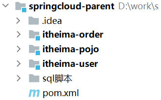

③ 修改数据库配置，并测试

查询某用户详情信息：`http://localhost:18081/user/1`

查询某订单详情信息：`http://localhost:18082/order/101`

### 2.3 远程调用

**远程调用的概念：**

> 远程调用是指在分布式系统中，一个节点通过网络调用另一个节点的服务方法。在分布式系统中，不同的节点可能运行不同的应用程序或服务，这些节点之间需要进行通信和协作。通过远程调用，节点之间可以共享资源、交换数据、协调工作等。


① RestTemplate介绍

```properties
RestTemplate 是spring家族中一款基于http协议的组件(HttpURLConnection)，他的作用就是：用来实现基于http的协议方式的服务之间的通信（也就是远程服务调用）。

RestTemplate 采用同步方式执行 HTTP 请求，底层使用 JDK 原生 HttpURLConnection API 。

#概念总结:RestTemplate是spring提供的一个用来模拟浏览器发送请求和接收响应的一个类,它能基于Http协议实现远程调用。
```

② 注册RestTemplate

在`itheima-order`的`OrderApp中注册`RestTemplate`:

```java
@SpringBootApplication
public class OrderApp {

    public static void main(String[] args) {
        SpringApplication.run(OrderApp.class, args);
    }

    //注册RestTemplate  发送http请求
    @Bean
    public RestTemplate restTemplate() {
        return new RestTemplate();
    }
} 
```

③ 远程调用

修改`itheima-order`中的`OrderServiceImpl`的`findById`方法

```java
/**
 * 根据ID查询订单信息
 */
@Override
public OrderInfo findById(Long id) {
    //1.查询订单
    OrderInfo orderInfo = orderDao.selectById(id);
    //2.根据订单查询用户信息->需要调用  【item-user】  服务
    //参数1：用户微服务的请求地址
    String url = "http://localhost:18081/user/"+orderInfo.getUserId();
    User user = restTemplate.getForObject(url, User.class);
    //3.封装user到订单中
    orderInfo.setUser(user);
    //4.返回订单信息
    return orderInfo;
}
```


### 2.3 服务提供者、服务消费者

- **服务提供者**

（提供接口给其他微服务）一次业务中被其他微服务调用的服务

- **服务消费者**

（调用其他微服务的接口）一次业务中，调用其他微服务的服务

- **服务提供者和服务消费者是相对的：**

服务的提供者可以成为服务的消费者，服务的消费者也可以成为服务的提供者


在上面案例中`itheima-order`调用了`itheima-user`提供的接口，所以`itheima-order`是服务消费者，`itheima-user`是服务提供者。


## 3. Eureka注册中心

**微服务调用出现的问题**

- 服务的消费者该如何获取服务提供者的信息？
- 如果有多个服务提供者，消费者该如何选择？
- 消费者如何得知服务提供者的健康状态？

### 3.1 Eureka的作用

**上述微服务调用出现的问题都能被Eureka解决，其作用有：**

> 1. 服务注册：服务提供者启动后，将自己注册到Eureka注册中心，并指定自己提供的服务接口和地址等信息。
> 2. 服务发现：服务消费者向Eureka注册中心查询所需的服务，Eureka注册中心返回可用的服务列表，消费者可以根据负载均衡策略选择其中的一个服务进行调用。
> 3. 健康检查：Eureka会周期性地向服务提供者发送健康检查请求，检查服务是否正常运行，如果服务异常，则将其从可用服务列表中移除。
> 4. 负载均衡：Eureka通过维护服务提供者的可用列表，可以提供基于客户端的负载均衡机制，通过选择性地调用可用服务，实现负载均衡。
> 5. 高可用性：Eureka支持多节点部署，通过集群方式提供高可用性，确保即使某些节点出现故障，也不会影响服务注册和发现的正常运行。

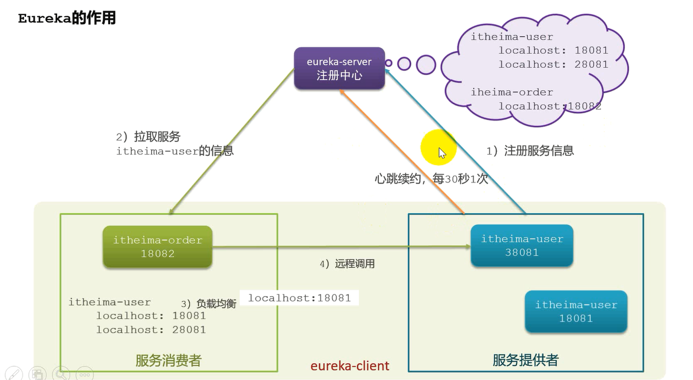


### 3.2 Eureka的工作原理

**1：消费者该如何获取服务提供者具体信息？**
	服务提供者启动时向eureka注册自己的信息
	eureka保存这些信息
	消费者根据服务名称向eureka拉取提供者信息
	
**2：如果有多个服务提供者，消费者该如何选择？**
	服务消费者利用负载均衡算法，从服务列表中挑选一个
	
**3：消费者如何感知服务提供者健康状态？**
	服务提供者会每隔30秒向EurekaServer发送心跳请求，报告健康状态
	EurekaServer在90秒内没有接收到某个微服务节点的心跳,EurekaServer将会注销该微服务的节点
	消费者就可以拉取到最新的信息


### 3.3 Eureka注册中心实战

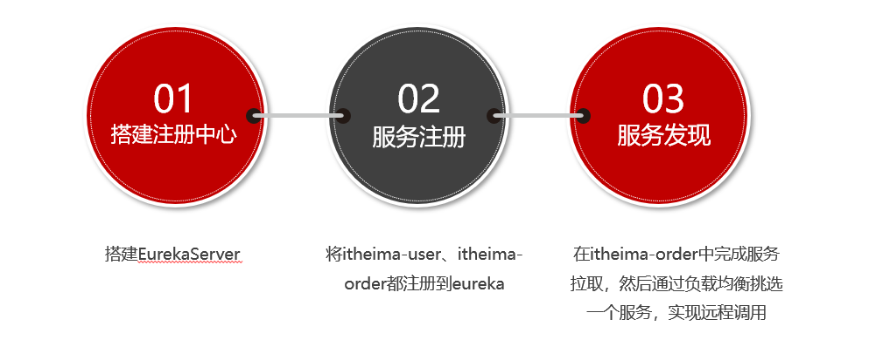

#### 3.3.1 搭建Eureka注册中心

搭建EurekaServer服务步骤如下：

① pom.xml引入依赖

创建项目`itheima-eurekaserver`，引入`spring-cloud-starter-netflix-eureka-server`的依赖:

```xml
<dependencies>
    <!--EurekaServer包-->
    <dependency>
        <groupId>org.springframework.cloud</groupId>
        <artifactId>spring-cloud-starter-netflix-eureka-server</artifactId>
    </dependency>
</dependencies>
```

② 启动类

创建启动类com.itheima.EurekaServerApp，代码如下：

```java
package com.itheima;

import org.springframework.boot.SpringApplication;
import org.springframework.boot.autoconfigure.SpringBootApplication;
import org.springframework.cloud.netflix.eureka.server.EnableEurekaServer;

@SpringBootApplication
@EnableEurekaServer
public class EurekaServerApp {
    public static void main(String[] args) {
        SpringApplication.run(EurekaServerApp.class,args);
    }
}
```

③ application.yml

```yaml
server:
  port: 8001    #端口号
spring:
  application:
    name: eureka-server # 应用名称，会在Eureka中作为服务的id标识（serviceId）
eureka:
  client:
    register-with-eureka: false   #是否将自己注册到Eureka中
    fetch-registry: false   #是否从eureka中获取服务信息
    service-url:
      defaultZone: http://localhost:8001/eureka
```

此时我们访问EurekaServer地址`http://localhost:8001/`，效果如下：

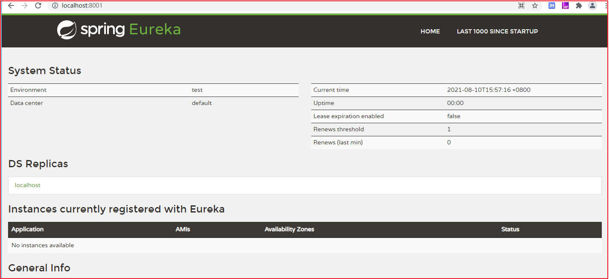

#### 3.3.2 服务提供者注册

将itheima-user服务注册到EurekaServer步骤如下：

① pom.xml

在`itheima-user`添加如下依赖：

```xml
<!--EurekaClient包-->
<dependency>
    <groupId>org.springframework.cloud</groupId>
    <artifactId>spring-cloud-starter-netflix-eureka-client</artifactId>
</dependency>
```

② 修改application.yml

修改`itheima-user`的`application.yml`，添加如下配置：

```yaml
...
【注意缩进】【注意缩进】【注意缩进】
eureka:
  client:
    service-url:
      # EurekaServer的地址
      defaultZone: http://localhost:8001/eureka
  instance:
  	#以IP地址注册到服务中心
    prefer-ip-address: true
    #服务向eureka注册时，注册名默认：“IP名:应用名:应用端口名”
    #现在配置：注册名：应用名:端口:项目版本号
    instance-id: ${spring.application.name}:${server.port}:@project.version@
```

prefer-ip-address:true 效果图

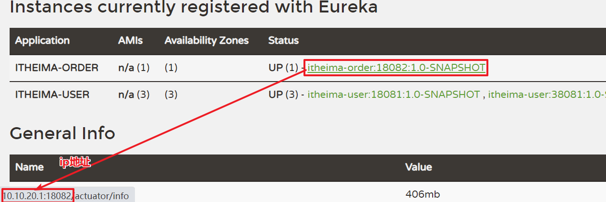

 prefer-ip-address:flase 效果图

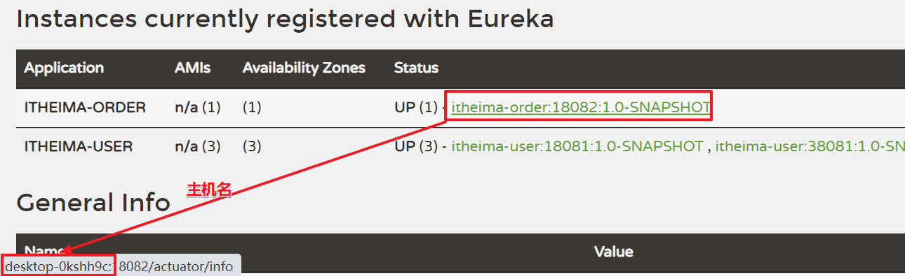

③ 多实例启动

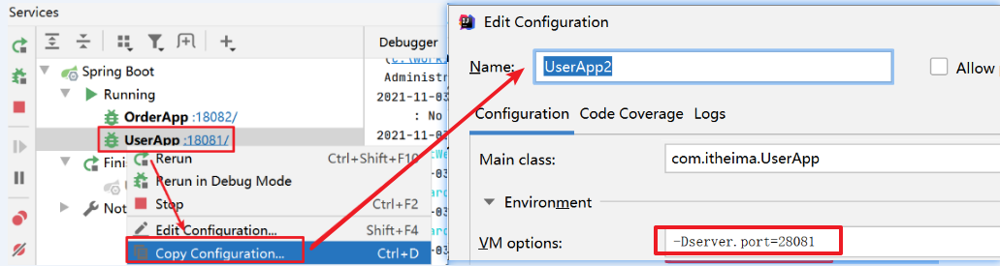

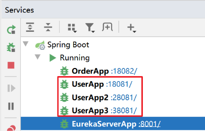 


分别启动3个服务配置后，Eureka(http://localhost:8001/)信息如下：

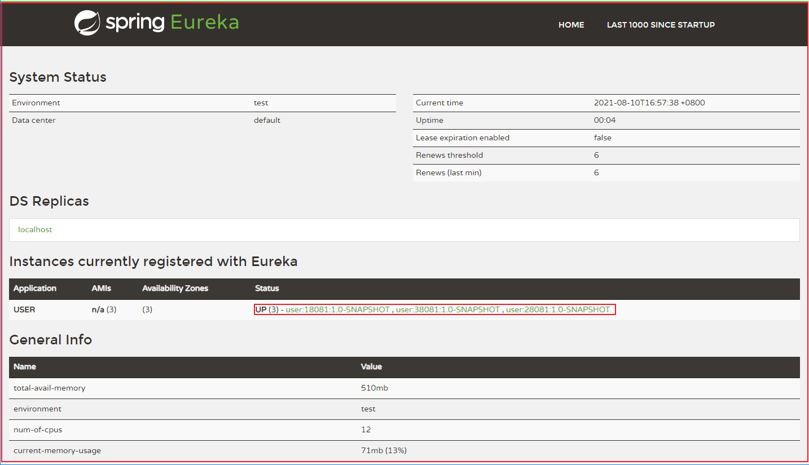

#### 3.3.3 服务消费者注册

`itheima-order`虽然是消费者，但与`itheima-user`一样都是`eureka`的`client`端，同样可以实现服务注册：
在`itheima-order`项目引入`spring-cloud-starter-netflix-eureka-client`的依赖

① pom.xml

在`itheima-order`的`pom.xml`中引入如下依赖

```xml
<!--EurekaClient包-->
<dependency>
    <groupId>org.springframework.cloud</groupId>
    <artifactId>spring-cloud-starter-netflix-eureka-client</artifactId>
</dependency>
```

② 修改application.yml

修改`itheima-order`的`application.yml`，添加如下配置：

```yaml
...
【注意缩进】【注意缩进】【注意缩进】
eureka:
  client:
    service-url:
      # EurekaServer的地址
      defaultZone: http://localhost:8001/eureka
  instance:
    prefer-ip-address: true
    instance-id: ${spring.application.name}:${server.port}:@project.version@
```

#### 3.3.4 远程调用

在`itheima-order`完成服务拉取实现远程调用，服务拉取是基于服务名称获取服务列表，然后在对服务列表做负载均衡。

修改`itheima-order`的OrderServiceImpl的代码，修改访问的url路径，用服务名代替ip、端口，代码如下：

在itheima-order项目的启动类OrderApplication中的RestTemplate添加负载均衡注解：

 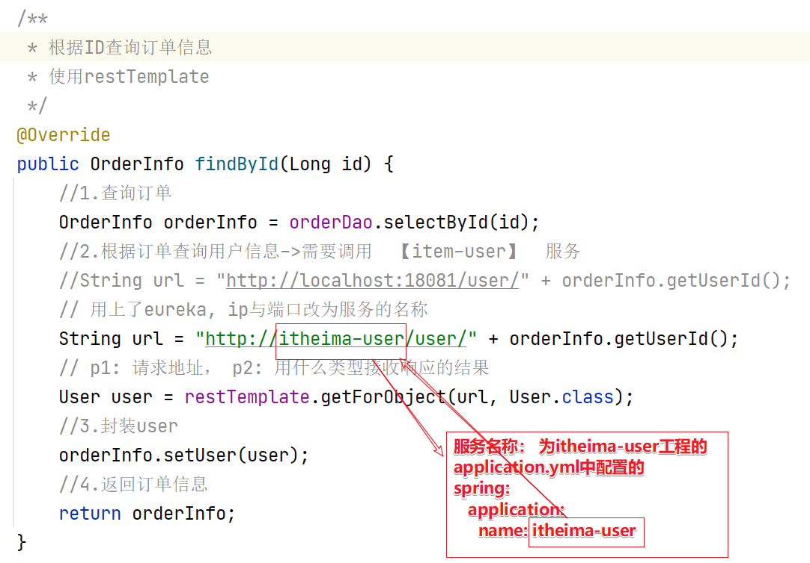


在itheima-order工程启动类OrderApp中，开启负载均衡

```java
/***
 * 注册RestTemplate
 */
@Bean
@LoadBalanced//开启负载均衡
public RestTemplate restTemplate(){
    return new RestTemplate();
}
```

我们访问`http://localhost:18082/order/101`测试效果如下：

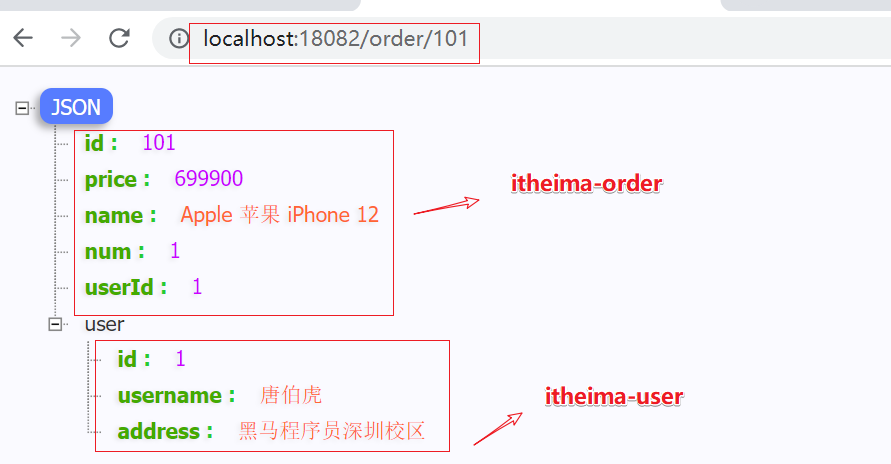 


#### 3.3.5 Eureka配置说明

服务注册时默认使用的是主机名，如果我们想用ip进行注册，可以在客户端(提供者与消费者)中的application.yml添加配置：

```yaml
eureka:
  client:
    service-url:
      # EurekaServer的地址
      defaultZone: http://localhost:8001/eureka
  instance:
    prefer-ip-address: true
    instance-id: ${spring.application.name}:${server.port}:@project.version@
    lease-renewal-interval-in-seconds: 30 #心跳周期，默认是30秒
    lease-expiration-duration-in-seconds: 90 #心跳失败最长超时间，默认90秒
```

itheima-eurekaserver 服务端，可以关闭保护机制

```yaml
eureka:
  ...
  server:
    enable-self-preservation: false # false关闭保护机制。 15分钟内，如果心跳成功率<85%，则启动保护（服务提供者列表不再变化）
```

#### 3.3.6 总结

- 搭建EurekaServer
  - 引入eureka-server依赖
  - 启动类上添加@EnableEurekaServer注解
  - 在application.yml中配置eureka地址
- 服务注册
  - 引入eureka-client依赖
  - 在application.yml中配置eureka地址

- 服务发现
  - 引入eureka-client依赖
  - 在application.yml中配置eureka地址
  - 给RestTemplate添加@LoadBalanced注解
  - 用服务提供者的服务名称远程调用(由原来的ip:port改服务名(spring.application.name))


## 4 负载均衡Ribbon

章节知识点

- Ribbon是什么
- 负载均衡流程讲解
- 负载均衡算法学习
- Ribbon负载均衡使用


Ribbon是什么？

Ribbon是Netflix发布的负载均衡器，有助于控制HTTP客户端行为。为Ribbon配置服务提供者地址列表后，Ribbon就可基于负载均衡算法，自动帮助服务消费者请求。

概念：Ribbon是基于Http协议请求的客户端负载均衡器，能实现很丰富的负载均衡算法。


### 4.1 负载均衡原理

1. 用户发起请求，会先到达itheima-order服务
2. itheima-order服务通过Ribbon负载均衡器从eurekaserver中获取服务列表
3. 获取了服务列表后，轮询（负载均衡算法）调用


### 4.2 负载均衡策略

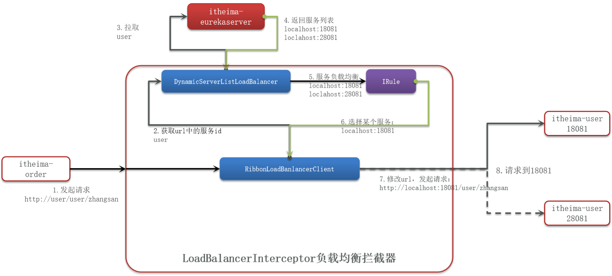

轮询调用会涉及到很多负载均衡算法，负载均衡算法比较多，关系图如下：

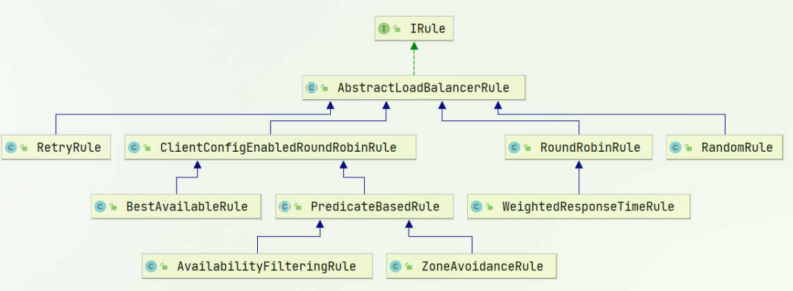


Ribbon的负载均衡算法策略如下表：

| **内置负载均衡规则类**    | **规则描述**                                                 |
| ------------------------- | ------------------------------------------------------------ |
| RoundRobinRule            | **简单轮询**服务列表来选择服务器。                           |
| AvailabilityFilteringRule | 对以下两种服务器进行忽略： <br/>（1）在默认情况下，这台服务器如果3次连接失败，这台服务器就会被设置为“短路”状态。短路状态将持续30秒，如果再次连接失败，短路的持续时间就会几何级地增加。<br/>（2）并发数过高的服务器。如果一个服务器的并发连接数过高，配置了AvailabilityFilteringRule规则的客户端也会将其忽略。并发连接数的上限，可以由客户端的`<clientName>.<clientConfigNameSpace>.ActiveConnectionsLimit`属性进行配置。 |
| WeightedResponseTimeRule  | 为每一个服务器赋予一个权重值。服务器响应时间越长，这个服务器的权重就越小。这个规则会随机选择服务器，这个权重值会影响服务器的选择。 |
| ZoneAvoidanceRule【默认】 | 以区域可用的服务器为基础进行服务器的选择。使用Zone对服务器进行分类，这个Zone可以理解为一个机房、一个机架等。而后再对Zone内的多个服务做轮询。它是Ribbon默认的负载均衡规则。 |
| BestAvailableRule         | 忽略哪些短路的服务器，并选择并发数较低的服务器。             |
| RandomRule                | 随机选择一个可用的服务器。                                   |
| RetryRule                 | 重试机制的选择逻辑                                           |

### 4.3 饥饿加载

从懒加载 变为 饥饿加载

Ribbon默认是采用懒加载，即第一次访问时才会去创建LoadBalanceClient，请求时间会很长。
而饥饿加载则会在项目启动时创建，降低第一次访问的耗时，在`itheima-order`的核心配置文件中，添加如下配置开启饥饿加载：

```yaml
#注意配置到根节点

#饥饿加载
ribbon:
  eager-load:
    clients: itheima-user #开启饥饿加载 
    enabled: true #指定对user这个服务饥饿加载
```

### 4.4. 总结

- Ribbon负载均衡规则
  - 规则接口是IRule
  - 默认实现是ZoneAvoidanceRule，根据zone选择服务列表，然后轮询

- 负载均衡自定义方式
  - 代码方式：配置灵活，但修改时需要重新打包发布，全局配置
  - 配置文件方式：直观，方便，无需重新打包发布，但是无法做全局配置，指定某个提供者的负载均衡策略【推荐】

- 饥饿加载, 拉取服务提供者的方式
  - 开启饥饿加载
  - 指定饥饿加载的微服务名称


## 5 http客户端Feign

章节知识点

- Feign介绍
- Feign入门案例学习
- Feign日志功能、性能优化、最佳实践讲解


### 5.1 Feign介绍

先来看我们以前利用RestTemplate发起远程调用的代码：

```java
User user = restTemplate.getForObject("http://itheima-user/user/"+orderInfo.getUserId(), User.class);
```

存在下面的问题：

- 代码可读性差，编程体验不统一
- 参数复杂URL难以维护


上面RestTemplate存在的问题可以使用Feign解决，那么什么是Feign？

Feign是一个声明式的http客户端，官方地址：https://github.com/OpenFeign/feign
其作用就是帮助我们优雅的实现http请求的发送，解决上面提到的问题。

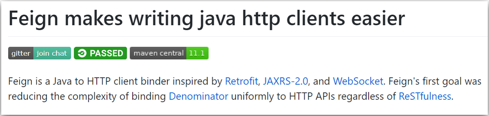


### 5.2 Feign入门案例

定义和使用Feign客户端的步骤如下：

```properties
1:引入依赖包 spring-cloud-starter-openfeign
2:添加注解@EnableFeignClients开启Feign功能
3:消费者端定义远程调用接口，在接口中远程调用的【服务名字】、【方法签名】
4:消费者端注入接口，执行远程调用(接口)
```

① 引入依赖

在`itheima-order`中引入如下依赖：

```xml
<!--openfeign-->
<dependency>
    <groupId>org.springframework.cloud</groupId>
    <artifactId>spring-cloud-starter-openfeign</artifactId>
</dependency>
```

② 开启Feign功能

在`itheima-order`的启动类`OrderApplication`添加`@EnableFeignClients`注解开启Feign功能，代码如下：

```java
@SpringBootApplication
@EnableFeignClients
public class OrderApplication {

    public static void main(String[] args) {
        SpringApplication.run(OrderApplication.class, args);
    }
    //...其他略
}
```

③ 定义远程调用接口

在`itheima-order`中创建接口`UserClient`，代码如下：

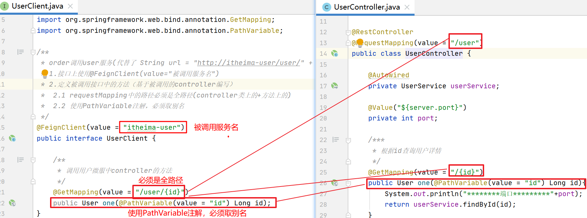

上图代码如下：在itheima-order工程中添加

```java
package com.itheima.client;
import com.itheima.user.pojo.User;
import org.springframework.cloud.openfeign.FeignClient;
import org.springframework.web.bind.annotation.GetMapping;
import org.springframework.web.bind.annotation.PathVariable;

/**
 * order调用user服务(代替了 String url = "http://itheima-user/user/" + orderInfo.getUserId();)
 * 1.接口上使用@FeignClient(value="被调用服务名")
 * 2.定义被调用接口中的方法（基于被调用的controller编写）
 *  2.1 requestMapping中的路径必须是全路径(controller类上的+方法上的)
 *  2.2 使用PathVariable注解，必须取别名
 */
@FeignClient(value = "itheima-user")
public interface UserClient {

    /**
     * 调用用户微服中controller的方法
     */
    @GetMapping(value = "/user/{id}")
    public User one(@PathVariable(value = "id") Long id);
}
```

主要是基于SpringMVC的注解来声明远程调用的信息，比如：

- 服务名称：user
- 请求方式：GET
- 请求路径：/user/{username}
- 请求参数：String username
- 返回值类型：User


④ 远程调用

修改`itheima-order`的`OrderServiceImpl.one()`方法，执行远程调用，代码如下：

```java
@Autowired
private UserClient userClient;

/**
 * 根据ID查询订单信息
 */
@Override
public OrderInfo findById(Long id) {
    //1.查询订单
    OrderInfo orderInfo = orderDao.selectById(id);
    //2.根据订单查询用户信息->需要调用  【item-user】  服务
    User user = userClient.one(orderInfo.getUserId());
    //3.封装user
    orderInfo.setUser(user);
    //4.返回订单信息
    return orderInfo;
}
```

### 5.3 Feign其他功能

Feign运行自定义配置来覆盖默认配置，可以修改的配置如下：


| 类型                   | 作用             | 说明                                                   |
| ---------------------- | ---------------- | ------------------------------------------------------ |
| **feign.Logger.Level** | 修改日志级别     | 包含四种不同的级别：NONE、BASIC、HEADERS、FULL         |
| feign.codec.Decoder    | 响应结果的解析器 | http远程调用的结果做解析，例如解析json字符串为java对象 |
| feign.codec.Encoder    | 请求参数编码     | 将请求参数编码，便于通过http请求发送                   |
| feign. Contract        | 支持的注解格式   | 默认是SpringMVC的注解                                  |
| feign. Retryer         | 失败重试机制     | 请求失败的重试机制，默认是没有，不过会使用Ribbon的重试 |

```properties
NONE:默认的，不显示任何日志
BASIC:仅记录请求方法、URL、响应状态码以及执行时间
HEADERS:除了BASIC中定义的信息以外，还有请求和响应的头信息
FULL:除了HEADERS中定义的信息之外，还有请求和响应的正文及元数据
```

SpringBoot日志配置;

#### 5.3.1 Feign日志配置

要想让Feign日志生效，得结合着SpringBoot的日志配置一起使用

SpringBoot日志配置

```yaml
logging:
  pattern:
    # 输出到控制台
    console: '%d{HH:mm:ss} %-5level %msg [%thread] - %logger{15}%n\'
  level:
    root: info # 全局用info
    # 只有在com.itheima包下才输出debug信息
    com:
      itheima: debug
```

配置Feign日志有两种方式：

- 配置文件方式

  - 全局生效

    ```yaml
    feign:
      client:
        config:
          default: #这里用default就是全局配置，如果是写服务名称，则是针对某个微服务的配置
            loggerLevel: HEADERS #日志级别
    ```

  - 局部生效

    ```yaml
    feign:
      client:
        config:
          itheima-user: #指定服务
            loggerLevel: HEADERS #日志级别
    ```

- 代码方式

  - 注册日志级别

    ```java
    /**
     * 注册日志级别
     * @return
     */
    @Bean
    public Logger.Level feignLogLevel() {
        return Logger.Level.FULL;
    }
    ```

  - 全局生效

    ```properties
    #如果是全局配置，则把它放到@EnableFeignClients这个注解中
    @EnableFeignClients(defaultConfiguration = FeignClientConfiguration.class)
    ```

  - 局部生效

    ```properties
    #如果是局部配置，则把它放到@FeignClient这个注解中
    @FeignClient(value = "itheima-user",configuration = FeignClientConfiguration.class)
    ```

#### 5.3.2 Feign性能优化

Feign底层的客户端实现：

- URLConnection：默认实现，不支持连接池
- Apache HttpClient ：支持连接池
- OKHttp：支持连接池


因此优化Feign的性能主要包括：

- 使用连接池代替默认的URLConnection
- 日志级别，最好用basic或none


Feign切换Apache HttpClient步骤如下：

```properties
1:引入依赖
2:配置连接池
```

1)引入依赖

在`itheima-order`中引入如下依赖：

```xml
<!--httpClient依赖-->
<dependency>
    <groupId>io.github.openfeign</groupId>
    <artifactId>feign-httpclient</artifactId>
</dependency>
```

2)配置连接池

在`itheima-order`的核心配置文件`application.yml`中添加如下配置：

```yaml
feign:
  client:
    config:
      default: #这里用default就是全局配置，如果是写服务名称，则是针对某个微服务的配置
        loggerLevel: BASIC #日志级别
      itheima-user: #指定服务
        loggerLevel: BASIC #日志级别
  httpclient:
    enabled: true #开启feign对HttpClient的支持
    max-connections: 200 #最大的连接数
    max-connections-per-route: 50 #每个路径的最大连接数
```

#### 5.3.3 Feign最佳实现

方式一（继承）：给消费者的FeignClient和提供者的controller定义统一的父接口作为标准。

- 服务紧耦合
- 父接口参数列表中的映射不会被继承

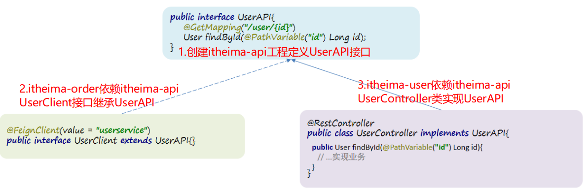


方式二（抽取）：将FeignClient抽取为独立模块，并且把接口有关的POJO、默认的Feign配置都放到这个模块中，提供给所有消费者使用

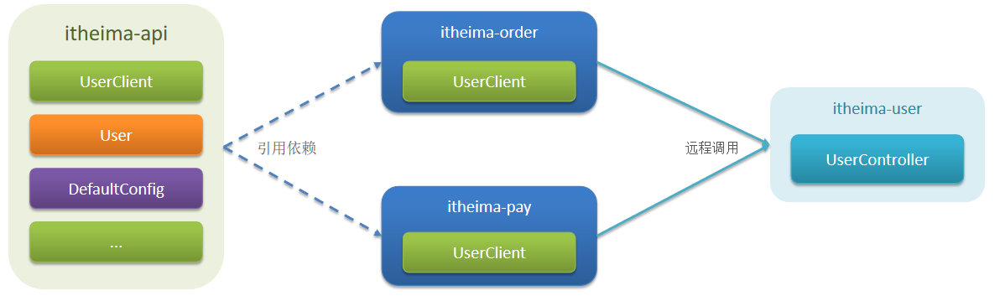


Feign最佳实现流程如上图所示：

```properties
实现最佳实践方式二的步骤如下：
1:创建itheima-api，然后引入feign的starter依赖 itheima-pojo依赖
2:将itheima-order中编写的UserClient继承到itheima-api项目中
3:在itheima-order中引入itheima-api的依赖，controller实现itheima-api中的接口
4:重启测试
```

1)引入依赖

创建itheima-api，然后引入feign的starter依赖 itheima-user依赖

```xml
<dependencies>
     <!--openfeign-->
     <dependency>
         <groupId>org.springframework.cloud</groupId>
         <artifactId>spring-cloud-starter-openfeign</artifactId>
     </dependency>

     <!--httpClient依赖-->
     <dependency>
         <groupId>io.github.openfeign</groupId>
         <artifactId>feign-httpclient</artifactId>
     </dependency>

     <dependency>
         <groupId>com.itheima</groupId>
         <artifactId>itheima-pojo</artifactId>
         <version>1.0-SNAPSHOT</version>
     </dependency>
</dependencies>
```

2)编写的UserClient

将itheima-order中编写的UserClient复制到itheima-api项目中

```java
package com.itheima.client;

import com.itheima.user.pojo.User;
import org.springframework.cloud.openfeign.FeignClient;
import org.springframework.web.bind.annotation.GetMapping;
import org.springframework.web.bind.annotation.PathVariable;

/**
 * order调用user服务(代替了 String url = "http://itheima-user/user/" + orderInfo.getUserId();)
 * 1.接口上使用@FeignClient(value="被调用服务名")
 * 2.定义被调用接口中的方法（基于被调用的controller编写）
 *  2.1 requestMapping中的路径必须是全路径(controller类上的+方法上的)
 *  2.2 使用PathVariable注解，必须取别名
 */
@FeignClient(value = "itheima-user")
public interface UserClient {

    /**
     * 调用用户微服中controller的方法
     */
    @GetMapping(value = "/user/{id}")
    public User one(@PathVariable(value = "id") Long id);
}
```

3)在itheima-order中引入itheima-api的依赖

```xml
<!--引入feign-api-->
<dependency>
    <groupId>com.itheima</groupId>
    <artifactId>itheima-api</artifactId>
    <version>1.0-SNAPSHOT</version>
</dependency>
```

4) 【注意】当定义的FeignClient不在SpringBootApplication的**扫描包范围**时，这些FeignClient无法使用。

有两种方式解决：
方式一：指定FeignClient所在包

`@EnableFeignClients(basePackages = "com.itheima.user.feign")`

方式二：指定FeignClient字节码

`@EnableFeignClients(clients = {UserClient.class})`

#### 5.3.4. 总结

- Feign的使用步骤
  - 引入依赖
  - 启动类添加@EnableFeignClients注解，如果feignclient接口不在启动类包下，则需要添加扫包(basePackages )
  - 编写FeignClient接口
  - 使用FeignClient中定义的方法代替RestTemplate

- Feign的日志配置:
  - 方式一是配置文件，feign.client.config.xxx.loggerLevel
  - 如果xxx是default则代表全局
  - 如果xxx是服务名称，例如userservice则代表某服务

- 方式二是java代码配置Logger.Level这个Bean
  - 如果在@EnableFeignClients注解声明则代表全局
  - 如果在@FeignClient注解中声明则代表某服务

- Feign的优化
  - 日志级别尽量用basic
  - 使用HttpClient或OKHttp代替URLConnection
    - 引入feign-httpClient依赖
    - 配置文件开启httpClient功能，设置连接池参数

- Feign的最佳实践：
  - 让controller和FeignClient继承同一接口
  - 将FeignClient、POJO、Feign的默认配置都定义到一个项目中，供所有消费者使用


# 总结

1. 微服务，为什么使用微服务。为了更高的并发。
   * 单体 
   * 分布式
   * 微服务 属于分布式
2. 远程调用案例
   * 订单服务
   * 用户服务
   * 怎么调用? 用RestTemplate(??? 发请求的postman)
   * 问题： 服务单点问题（订单只能依赖于用户，localhost:18081/user/1)
3. Eureka 注册中心(房产中介、美团、饿了么), 解决服务单点问题
   * 是个什么 注册中心。 提供者、消费者
   * 有什么作用 解决服务单点问题
   * 使用: 平台。
     * 启动： 依赖、启动类、配置文件
     * 提供者: 注册
     * 消费者: 注册
     * 远程调用: 获取提供者列表、通过负载均衡的方式来调用。 使用localhost:18081改为itheima-user，开启负载均衡(restTemplate @LoadBalanced)
4. ribbon 做负载均衡
   * 使用：IRule， 默认使用ZoneAvoidanceRule
   * 配置：
     * 全局 配置类
     * 局部 配置文件 指定服务提供都负载均衡方式
   * 饥饿加载, 配置

5. OpenFeign

   * 是什么？ 代替restTemplate

   * 使用? 

     * 导入依赖，启动类开启注解，消费者创建接口(方法：服务提供者controller的方法, 全路径)，使用的注入

     * @FeignClient(name=服务提供者名称)
     * 优化：使用httpclient配置连接池（线程隔离）
     * 日志：BASIC

   * 最佳实现

     * 抽取Feign的接口独立为工程。其它服务想调用时，引入依赖


## 问题

#### 1. SpringCloud是什么?

Spring Cloud是一套基于Spring Boot的分布式系统开发工具集，它提供了一系列组件和框架，用于快速构建分布式系统应用程序。Spring Cloud可以帮助开发者解决分布式系统中的一些常见问题，如服务注册与发现、负载均衡、配置管理、服务熔断、路由、分布式跟踪等。

Spring Cloud提供了以下核心组件：

1. Eureka：服务注册和发现组件，用于实现分布式系统中服务的自动注册和发现。
2. Ribbon：客户端负载均衡组件，用于实现客户端负载均衡，提高系统的可用性和稳定性。
3. Hystrix：服务熔断和容错组件，用于实现服务的自动熔断和容错，提高系统的可靠性。
4. Zuul：API网关组件，用于实现请求的路由和过滤，提高系统的安全性和可维护性。
5. Config：配置管理组件，用于实现分布式系统中的配置管理，支持配置中心和分布式配置等模式。
6. Sleuth：分布式跟踪组件，用于实现分布式系统的跟踪和监控，帮助开发者定位问题和优化系统性能。

Spring Cloud的优点包括：

1. 降低分布式系统的复杂度：Spring Cloud提供了一系列组件和框架，使得分布式系统的开发更加简单和高效。
2. 提高系统的可用性和稳定性：Spring Cloud提供了服务注册和发现、客户端负载均衡、服务熔断和容错等机制，可以提高系统的可用性和稳定性。
3. 提高系统的安全性和可维护性：Spring Cloud提供了API网关、配置管理和分布式跟踪等组件，可以提高系统的安全性和可维护性。
4. 兼容Spring Boot：Spring Cloud基于Spring Boot开发，可以无缝集成Spring Boot的各种特性，如自动配置、启动器等。

总之，Spring Cloud是一个优秀的分布式系统开发工具集，可以帮助开发者更加轻松地构建高可用、高可靠、高性能的分布式系统应用程序。

#### 2. RestTemplate如何实现远程调用？

1. **创建RestTemplate对象**：使用RestTemplate进行远程调用前，需要先创建RestTemplate对象，可以通过new关键字创建，也可以使用Spring容器进行注入。
2. **发送HTTP请求**：通过RestTemplate对象发送HTTP请求，可以使用RestTemplate提供的getForObject()、postForObject()、put()、delete()等方法，选择合适的方法根据业务需求进行远程调用。
3. **处理HTTP响应**：RestTemplate发送HTTP请求后，会返回一个HTTP响应对象，我们可以通过RestTemplate提供的一系列方法获取响应状态码、响应头、响应体等信息。如果服务端返回的是JSON或XML格式的数据，可以通过RestTemplate自动将响应数据转换成Java对象，简化开发

```java
// 创建RestTemplate对象
RestTemplate restTemplate = new RestTemplate();

// 发送HTTP请求，并获取响应数据
String response = restTemplate.getForObject("http://example.com/api/users/1", String.class);

// 将响应数据转换成Java对象
User user = restTemplate.getForObject("http://example.com/api/users/1", User.class);
```

#### 3. 微服务的拆分粒度，一般从哪个方面考虑？

微服务拆分的粒度应该根据具体业务场景来进行设计，没有一种标准的方法可以适用于所有场景。通常，微服务应该遵循单一职责原则（SRP），即每个微服务应该只负责一个特定的业务功能，而且这个功能应该足够小，不应该包含太多的业务逻辑。

1. 业务功能：将系统中的不同业务功能划分为不同的微服务，每个微服务只负责一个特定的业务功能。
2. 数据库：将不同的数据库或数据表拆分为不同的微服务，每个微服务只访问它所对应的数据库或数据表。
3. 用户角色：将系统中不同的用户角色或者权限划分为不同的微服务，每个微服务只对应一种用户角色或者权限。
4. 流程或者任务：将系统中的不同流程或任务划分为不同的微服务，每个微服务只负责一个特定的流程或任务。


#### 4. 订单微服务调用用户微服务的底层实现流程？

1. 页面发起请求进入订单微服务，订单微服发起http请求 http://itheima-user/user/用户id
2. 请求会被LoadBalancerInterceptor负载均衡拦截器拦截
3. 通过RibbonLoadBanlanceClient获取服务名itheima-user
4. 通过DynamicServerListLoadBalnancer根据服务名itheima-user连接eureka-server注册微服务，获取到服务地址列表：192.168.200.1:28081, 192.168.200.1:18081, 192.168.200.1:38081
5. 根据Ribbon负载均衡策略（ZoneAvoidanceRule 默认轮询策略）选择一个服务地址，得到一个http地址192.168.200.1:38081
6. 通过RibbonLoadBanlancerClient发送http请求，调用JDK自带URLConnection(最底层对象)实现请求发送
7. 订单微服务得到用户微服务响应的数据，并响应页面

#### 5. Ribbon默认负载均衡策略是什么？

ZoneAvoidanceRule【默认】  
以区域可用的服务器为基础进行服务器的选择。使用Zone对服务器进行分类，这个Zone可以理解为一个机房、一个机架等。而后再对Zone内的多个服务做轮询。它是Ribbon默认的负载均衡规则。

#### 6. 如何改变默认的负载均衡策略？

- 在启动类中通过@Bean注册RandomRule 			（全局配置，针对所有被调用微服务）

- 修改application.yml 文件中配置负载均衡的配置 （针对某个被调用微服务）

#### 7. Feign如何使用？

1. 引入Feign依赖
2. 在启动类加上@EnableFeignClients 注解 开启Feign组件
3. 创建`FeignClient`接口
4. 使用`FeignClient`中的定义方法代替RestTemplate

#### 8. Feign日志如何使用？

1. 在application.yml中配置SpringBoot日志

2. Feign日志使用两种方式

 配置文件方式：在application.yml中配置Feign日志（全局配置、局部配置）

 java代码方式：定义一个类，通过@Bean注册Logger日志对象并指定日志级别（全局配置@EnableFeignClients、局部配置@FeignClient）

注意：开发环境使用FULL 生产环境使用BASIC

#### 9. HttpClient连接池有什么用，如何使用？

HttpClient连接池是用于管理HTTP请求的连接池。在发送HTTP请求时，每次都创建一个新的连接会消耗大量的系统资源，并且在高并发的情况下，创建连接的时间可能会成为瓶颈，导致系统性能下降。使用连接池可以缓存已经创建的连接，避免重复创建连接和销毁连接，提高系统性能。

**使用方法**

1. 引入依赖  httpClient的依赖
2. 配置文件开启httpClient功能，设置连接池的参数 