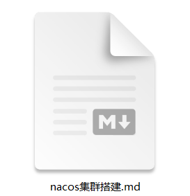

- SpringCloud Gateway 微服务网关
- Nacos 服务注册中心
- Nacos 服务配置中心

<!-- more -->


## 1 Nacos 服务注册

国内公司一般都推崇阿里巴巴的技术，比如注册中心，SpringCloudAlibaba也推出了一个名为Nacos的注册中心。

### 1.1.认识和安装Nacos

[Nacos](https://nacos.io/)是阿里巴巴的产品，现在是[SpringCloudAlibaba](https://spring.io/projects/spring-cloud)中的一个组件。相比[Eureka](https://github.com/Netflix/eureka)功能更加丰富，在国内受欢迎程度较高。


安装方式可以看我的其他文章。

nacos访问地址：http://localhost:8848/nacos

控制台账号：nacos  密码：nacos

### 1.2.服务注册到nacos【重点】

Nacos是SpringCloudAlibaba的组件，而SpringCloudAlibaba也遵循SpringCloud中定义的服务注册、服务发现规范。因此使用Nacos和使用Eureka对于微服务来说，并没有太大区别。

主要差异在于：

- 依赖不同
- 服务地址不同


1）引入依赖

在`springcloud-parent`父工程的pom文件中的`<dependencyManagement>`中引入SpringCloudAlibaba的依赖：

```xml
    <dependencyManagement>
        <dependencies>
            .......
            <!--引入SpringCloudAlibaba的依赖-->
            <dependency>
                <groupId>com.alibaba.cloud</groupId>
                <artifactId>spring-cloud-alibaba-dependencies</artifactId>
                <version>2.2.5.RELEASE</version>
                <type>pom</type>
                <scope>import</scope>
            </dependency>
        </dependencies>
    </dependencyManagement>
```

然后在itheima-user和itheima-order中的pom文件中引入nacos-discovery依赖：


```xml
<dependency>
    <groupId>com.alibaba.cloud</groupId>
    <artifactId>spring-cloud-starter-alibaba-nacos-discovery</artifactId>
</dependency>
```

> **注意**：不要忘了注释掉eureka的依赖。

2）配置nacos地址

在itheima-user和itheima-order的application.yml中添加nacos地址：

```yaml
spring:
  cloud:
    nacos:
      server-addr: localhost:8848
```

> **注意**：不要忘了注释掉eureka的地址

3）修改原来的负载均衡配置, 使用NacosRule

```yml
itheima-user:
  ribbon:
    NFLoadBalancerRuleClassName: com.alibaba.cloud.nacos.ribbon.NacosRule # 负载均衡规则 
```


4）重启

重启微服务后，登录nacos管理页面，可以看到微服务信息：


5）测试

访问：http://localhost:18082/order/101   http://localhost:18081/user/1

### 1.3.服务(集群配置)分级存储模型【重点】

一个**服务**可以有多个**实例**，例如我们的itheima-user，可以有:

- 127.0.0.1:18081
- 127.0.0.1:28081
- 127.0.0.1:38081

假如这些实例分布于全国各地的不同机房，例如：

- 127.0.0.1:18081，在深圳机房
- 127.0.0.1:28081，在深圳机房
- 127.0.0.1:38081，在杭州机房

Nacos就将同一机房内的实例 划分为一个**集群**。

也就是说，itheima-user是服务，一个服务可以包含多个集群，如深圳、杭州，每个集群下可以有多个实例，形成分级模型，如图：


微服务互相访问时，应该尽可能访问同集群实例，因为本地访问速度更快。当本集群内不可用时，才访问其它集群。例如：


深圳机房内的itheima-order应该优先访问同机房的itheima-user。

#### 1.3.1.给itheima-user配置集群

修改itheima-user的application.yml文件，添加集群配置：

```yaml
spring:
  cloud:
    nacos:
      server-addr: localhost:8848
      discovery:
        cluster-name: SZ # 集群名称
```

重启两个user-service实例后，我们可以在nacos控制台看到下面结果：


我们再次复制一个itheima-user启动配置，添加属性：

```sh
-Dserver.port=38081 -Dspring.cloud.nacos.discovery.cluster-name=HZ
```

配置如图所示：


启动UserApp3后再次查看nacos控制台：


#### 1.3.2.同集群优先的负载均衡

默认的`ZoneAvoidanceRule`并不能实现根据同集群优先来实现负载均衡。

因此Nacos中提供了一个`NacosRule`的实现，可以优先从同集群中挑选实例。

1）给order-service配置集群信息

修改order-service的application.yml文件，添加集群配置：

```yaml
spring:
  cloud:
    nacos:
      server-addr: localhost:8848
      discovery:
        cluster-name: SZ # 集群名称
```

2）【注意】修改负载均衡规则，才能生效

修改itheima-order的application.yml文件，修改负载均衡规则：

```yaml
itheima-user:
  ribbon:
    NFLoadBalancerRuleClassName: com.alibaba.cloud.nacos.ribbon.NacosRule # 负载均衡规则 
```

3) 测试访问：http://localhost:18082/order/101

### 1.4.权重配置【了解】

实际部署中会出现这样的场景：

服务器设备性能有差异，部分实例所在机器性能较好，另一些较差，我们希望性能好的机器承担更多的用户请求。

但默认情况下NacosRule是同集群内随机挑选，不会考虑机器的性能问题。

因此，Nacos提供了权重配置来控制访问频率，权重越大则访问频率越高。

在nacos控制台，找到user-service的实例列表，点击编辑，即可修改权重：


在弹出的编辑窗口，修改权重：

 

> **注意**：如果权重修改为0，则该实例永远不会被访问

### 1.5.环境隔离【重点】

Nacos提供了namespace来实现环境隔离功能。

- nacos中可以有多个namespace（**环境隔离:test dev pro**）
- namespace下有group(**项目隔离 探花项目 头条项目**)、service(**实例隔离tanhua-server tanhua-service**)等
- 不同namespace之间相互隔离，例如不同namespace的服务互相不可见


#### 1.5.1.创建namespace

默认情况下，所有service、data、group都在同一个namespace，名为public：


我们可以点击页面新增按钮，添加一个namespace：


然后，填写表单：


就能在页面看到一个新的namespace：


#### 1.5.2.给微服务配置namespace

给微服务配置namespace只能通过修改配置来实现。

例如，修改itheima-order的application.yml文件：

```yaml
spring:
  cloud:
    nacos:
      server-addr: localhost:8848
      discovery:
        cluster-name: SZ
        namespace: devnamespace # 命名空间，填ID
```

重启itheima-order后，访问控制台，可以看到下面的结果：


此时访问itheima-order，因为namespace不同，会导致找不到user，控制台会报错：


在itheima-user修改配置：

```
-Dspring.cloud.nacos.discovery.namespace=devnamespace
```

 

重启itheima-user后，访问控制台，可以看到下面的结果：


此时访问itheima-user，因为namespace相同，找到itheima-user：

 

### 1.6.Nacos与Eureka的区别【面试】

Nacos的服务实例分为两种类型：

- 临时实例：如果实例宕机超过一定时间，会从服务列表剔除，默认的类型。
- 非临时实例：如果实例宕机，不会从服务列表剔除，也可以叫永久实例。


配置一个服务实例为永久实例：

```yaml
spring:
  cloud:
    nacos:
      discovery:
        ephemeral: false # 设置为非临时实例
```

Nacos和Eureka整体结构类似，服务注册、服务拉取、心跳等待，但是也存在一些差异：


- Nacos与eureka的共同点
  - 都支持服务注册和服务拉取
  - 都支持服务提供者心跳方式做健康检测
- Nacos与Eureka的区别
  - Nacos支持服务端主动检测提供者状态：临时实例采用心跳模式，非临时实例采用主动检测模式
  - 临时实例心跳不正常会被剔除，非临时实例则不会被剔除（标记不健康）
  - Nacos支持服务列表变更的消息推送模式，服务列表更新更及时
  - Nacos集群默认采用AP方式，当集群中存在非临时实例时，采用CP模式；Eureka采用AP方式（CAP理论:C一致性,A高可用,P分区容错性）
  - Nacos使用的netty和服务进行连接,属于长连接。eureka使用定时发送和服务进行连接,属于短连接


## 2.Nacos配置管理

Nacos除了可以做注册中心，同样可以做配置管理来使用。

### 2.1.统一配置管理【重点】

当微服务部署的实例越来越多，达到数十、数百时，逐个修改微服务配置就会让人抓狂，而且很容易出错。我们需要一种统一配置管理方案，可以集中管理所有实例的配置。


Nacos一方面可以将配置集中管理，另一方可以在配置变更时，及时通知微服务，实现配置的热更新。

#### 2.1.1.在nacos中添加配置文件

如何在nacos中管理配置呢？


然后在弹出的表单中，填写配置信息：

 

配置内容:

 

> 注意：项目的核心配置，需要热更新的配置才有放到nacos管理的必要。基本不会变更的一些配置还是保存在微服务本地比较好。

#### 2.1.2.微服务从配置中心拉取配置

微服务要拉取nacos中管理的配置，并且与本地的`application.yml`配置合并，才能完成项目启动。

但如果尚未读取`application.yml`，又如何得知nacos地址呢？

因此spring引入了一种新的配置文件：`bootstrap.yaml`文件，会在`application.yml`之前被读取，流程如下：


1）引入nacos-config依赖

首先，在user-service服务中，引入nacos-config的客户端依赖：

```xml
<!--nacos配置管理依赖-->
<dependency>
    <groupId>com.alibaba.cloud</groupId>
    <artifactId>spring-cloud-starter-alibaba-nacos-config</artifactId>
</dependency>
```

2）修改application.yaml

将application.yaml 修改为 bootstrap.yaml，并修改配置完整内容如下：

```yaml
server:
  port: 18081
spring:
  application:
    name: itheima-user
  profiles:
    active: dev #开发环境，这里是dev
  datasource:
    driverClassName: com.mysql.cj.jdbc.Driver
    url: jdbc:mysql://localhost:3306/cloud_user?useSSL=falsecharacterEncoding=UTF8&&serverTimezone=Asia/Shanghai
    username: root
    password: root
  cloud:
    nacos:
      server-addr: localhost:8848
      config:
        file-extension: yaml # 文件后缀名
        server-addr: localhost:8848 #nacos配置中心地址
        namespace: devnamespace
      discovery:
        cluster-name: SZ
        #ephemeral: false # 设置为非临时实例
        namespace: devnamespace
```

这里会根据spring.cloud.nacos.server-addr获取nacos地址，再根据

`${spring.application.name}-${spring.profiles.active}.${spring.cloud.nacos.config.file-extension}`作为文件id，来读取配置`itheima-user-dev.yaml`：

   

3）读取nacos配置

3）读取nacos配置

在user-service中的UserController中，读取uname配置：

```java
@Value("${myconfig.welcome}")
private String welcome;

@GetMapping("welcome")
public String now(){
    return "********"+welcome+"*********";
}
```

4) 在页面访问，可以看到效果：

  

### 2.2.配置热更新

我们最终的目的，是修改nacos中的配置后，微服务中无需重启即可让配置生效，也就是**配置热更新**。

要实现配置热更新，可以使用两种方式：

#### 2.2.1.方式一

在@Value注入的变量所在类上添加注解@RefreshScope：

```java
@RestController
@RequestMapping(value = "/user")
@RefreshScope //刷新配置
public class UserController { 
```

#### 2.2.2.方式二

使用@ConfigurationProperties注解代替@Value注解。

- com.itheima.properties;

```java
/**
 * 自动刷新  方式二（推荐）
 */
@Component
@Data
//prefix nacos中配置
@ConfigurationProperties(prefix = "myconfig")
public class PersonProperties {
    private String name;
    private int age;
}
```

- package com.itheima.controller;

```java
@RestController
@RefreshScope //刷新配置
@RequestMapping(value = "/user")
public class UserController {
@Autowired
    private PersonProperties properties;
    /**
     * 配置中心获取配置
     * @param
     * @return
     */
    @GetMapping
    public String hello(){
        System.out.println("配置中心获取配置=  "+properties.getName());
        return properties.getName();
    }
}
```

### 2.3.配置共享【了解】

其实微服务启动时，会去nacos读取多个配置文件，例如：

- `[spring.application.name]-[spring.profiles.active].yaml`，例如：itheima-user-dev.yaml
- `[spring.application.name].yaml`，例如：itheima-user.yaml

而`[spring.application.name].yaml`不包含环境，因此可以被多个环境共享。

下面我们通过案例来测试配置共享

1）添加一个环境共享配置

我们在nacos中添加一个itheima-user.yaml文件：

 

2）在user-service中读取共享配置

在user-service服务中，修改UserController

```java
@RestController
@RequestMapping(value = "/user")
//@RefreshScope //注释掉
@ConfigurationProperties(prefix = "user")
@Setter
public class UserController {

    @Autowired
    private UserService userService;

    //@Value("${user.uname}")
    private String uname;

    private String sysname;

    @GetMapping("name")
    public String now(){
        return "********"+uname+"*********"+sysname+"*********";
    }
    ............
}
```

3）运行两个UserApp，使用不同的profile

UserApp(18081)使用的profile是dev，UserApp2(28081)使用的profile是test。

修改UserApp2这个启动项，改变其profile值：

 

启动UserApp和UserApp2，访问http://localhost:18081/user/name，结果：

  

访问http://localhost:28081/user/name，结果：

 

可以看出来，不管是dev，还是test环境，都读取到了sysname这个属性的值。


4）配置共享的优先级

当nacos、服务本地同时出现相同属性时，优先级有高低之分：

itheima-user-dev.yaml > itheima-user.yaml > application.yml

 

### 2.4.搭建Nacos集群【了解】

Nacos生产环境下一定要部署为集群状态，部署方式参考课前资料中的文档：

 


## 3 微服务网关【重点】

在SpringCloud中网关的实现包括两种：

- springcloud-gateway spring开发
- springcloud-zuul  netflix 2.0闭源

Zuul是基于Servlet的实现，功能不强，性能较低，是阻塞式 。

SpringCloud-Gateway则是基于Spring5中提供的WebFlux，属于响应式编程的实现，具备更好的性能。

Spring Cloud Gateway 是 Spring Cloud 的一个全新项目，该项目是基于 Spring 5.0，Spring Boot 2.0 和 Project Reactor 等响应式编程和事件流技术开发的网关，它旨在为微服务架构提供一种简单有效的统一的 API 路由管理方式。

### 3.1 为什么需要网关

Gateway网关是我们服务的守门神，所有微服务的统一入口。

网关的**核心功能特性**：

- 请求路由
- 权限控制
- 限流


**权限控制**：网关作为微服务入口，需要校验用户是是否有请求资格，如果没有则进行拦截。

**路由和负载均衡**：一切请求都必须先经过gateway，但网关不处理业务，而是根据某种规则，把请求转发到某个微服务，这个过程叫做路由。当然路由的目标服务有多个时，还需要做负载均衡。

**限流**：当请求流量过高时，在网关中按照下流的微服务能够接受的速度来放行请求，避免服务压力过大。

### 3.2.gateway快速入门

下面，我们就演示下网关的基本路由功能。基本步骤如下：

1. 创建SpringBoot工程gateway，引入网关依赖
2. 编写启动类
3. 编写基础配置和路由规则
4. 启动网关服务进行测试

1）创建微服务网关并引入依赖

```xml
<?xml version="1.0" encoding="UTF-8"?>
<project xmlns="http://maven.apache.org/POM/4.0.0"
         xmlns:xsi="http://www.w3.org/2001/XMLSchema-instance"
         xsi:schemaLocation="http://maven.apache.org/POM/4.0.0 http://maven.apache.org/xsd/maven-4.0.0.xsd">
    <parent>
        <artifactId>springcloud-parent</artifactId>
        <groupId>com.itheima</groupId>
        <version>1.0-SNAPSHOT</version>
    </parent>
    <modelVersion>4.0.0</modelVersion>
    <artifactId>itheima-gateway</artifactId>

    <dependencies>
        <!--网关-->
        <dependency>
            <groupId>org.springframework.cloud</groupId>
            <artifactId>spring-cloud-starter-gateway</artifactId>
        </dependency>

        <!-- nacos客户端 -->
        <dependency>
            <groupId>com.alibaba.cloud</groupId>
            <artifactId>spring-cloud-starter-alibaba-nacos-discovery</artifactId>
        </dependency>
    </dependencies>
</project>
```


2）配置文件`application.yml`

```yaml
server:
  # 网关端口
  port: 7001
spring:
  application:
    name: gateway
  cloud:
    nacos:
      server-addr: localhost:8848
      discovery:
        namespace: devNamespaceId
    gateway:
      routes: # 网关路由配置
        - id: user-service # 路由id，自定义，只要唯一即可
          # uri: http://127.0.0.1:18081 # 路由的目标地址 http就是固定地址
          uri: lb://itheima-user # 路由的目标地址 lb就是负载均衡，后面跟服务名称
          predicates: # 路由断言，也就是判断请求是否符合路由规则的条件
            - Path=/user/** # 这个是按照路径匹配，只要以/user/开头就符合要求

```

我们将符合`Path` 规则的一切请求，都代理到 `uri`参数指定的地址。

本例中，我们将 `/user/**`开头的请求，代理到`lb://itheima-user`，lb是负载均衡，根据服务名拉取服务列表，实现负载均衡。

3）创建启动类`com.itheima.GatewayApplication`

```java
package com.itheima;

import org.springframework.boot.SpringApplication;
import org.springframework.boot.autoconfigure.SpringBootApplication;

@SpringBootApplication
public class GatewayApplication {

	public static void main(String[] args) {
		SpringApplication.run(GatewayApplication.class, args);
	}
}
```


4）路由测试

重启网关，访问http://localhost:7001/user/1时，符合`/user/**`规则，请求转发到uri：http://user/user/1，得到了结果：

 

思考：

比如所有以`/order`开始的请求交给`itheima-order`服务，如何配置`itheima-order`服务的路由请求？


### 3.3 断言工厂

我们在配置文件中写的断言规则只是字符串，这些字符串会被Predicate Factory读取并处理，转变为路由判断的条件

例如Path=/user/**是按照路径匹配，这个规则是由

`org.springframework.cloud.gateway.handler.predicate.PathRoutePredicateFactory`类来

处理的，像这样的断言工厂在SpringCloudGateway还有十几个:

| **名称**   | **说明**                       | **示例**                                                     |
| ---------- | ------------------------------ | ------------------------------------------------------------ |
| After      | 是某个时间点后的请求           | -  After=2037-01-20T17:42:47.789-07:00[America/Denver]       |
| Before     | 是某个时间点之前的请求         | -  Before=2031-04-13T15:14:47.433+08:00[Asia/Shanghai]       |
| Between    | 是某两个时间点之前的请求       | -  Between=2037-01-20T17:42:47.789-07:00[America/Denver],  2037-01-21T17:42:47.789-07:00[America/Denver] |
| Cookie     | 请求必须包含某些cookie         | - Cookie=chocolate, ch.p                                     |
| Header     | 请求必须包含某些header         | - Header=X-Request-Id, \d+                                   |
| Host       | 请求必须是访问某个host（域名） | -  Host=**.somehost.org,**.anotherhost.org                   |
| Method     | 请求方式必须是指定方式         | - Method=GET,POST                                            |
| Path       | 请求路径必须符合指定规则       | - Path=/red/{segment},/blue/**                               |
| Query      | 请求参数必须包含指定参数       | - Query=name, Jack或者-  Query=name                          |
| RemoteAddr | 请求者的ip必须是指定范围       | - RemoteAddr=192.168.1.1/24                                  |
| Weight     | 权重处理                       |                                                              |

我们只需要掌握Path这种路由工程就可以了。

上面使用案例如下：

```yaml
spring:
  application:
    name: gateway
  cloud:
    nacos:
      server-addr: localhost:8848
      discovery:
        namespace: devNamespaceId
    gateway:
      routes: # 网关路由配置
        - id: user-service # 路由id，自定义，只要唯一即可
          # uri: http://127.0.0.1:18081 # 路由的目标地址 http就是固定地址
          uri: lb://itheima-user # 路由的目标地址 lb就是负载均衡，后面跟服务名称
          predicates: # 路由断言，也就是判断请求是否符合路由规则的条件
            - Path=/user/** # 这个是按照路径匹配，只要以/user/开头就符合要求
        - id: order-service
          uri: lb://itheima-order
          predicates:
            - Path=/order/**
            - After=2020-12-30T23:59:59.789+08:00[Asia/Shanghai]
            - Before=2022-12-30T23:59:59.789+08:00[Asia/Shanghai]
            - Between=2020-12-30T23:59:59.789+08:00[Asia/Shanghai],2022-12-30T23:59:59.789+08:00[Asia/Shanghai]
            - Cookie=uname, itheima
            - Header=X-Request-Id, \d+
            - Host=localhost:7001
            - Method=GET,POST
            - Query=uname,zhangsan
            - RemoteAddr=127.0.0.1/16
```

### 3.4.过滤器工厂

GatewayFilter是网关中提供的一种过滤器，可以对进入网关的请求和微服务返回的响应做处理：


#### 3.4.1.路由过滤器的种类

Spring提供了31种不同的路由过滤器工厂。例如：

| **名称**             | **说明**                     |
| -------------------- | ---------------------------- |
| AddRequestHeader     | 给当前请求添加一个请求头     |
| RemoveRequestHeader  | 移除请求中的一个请求头       |
| AddResponseHeader    | 给响应结果中添加一个响应头   |
| RemoveResponseHeader | 从响应结果中移除有一个响应头 |
| RequestRateLimiter   | 限制请求的流量               |

#### 3.4.2.请求头过滤器

下面我们以AddRequestHeader 为例来讲解。

> **需求**：给所有进入itheima-order的请求添加一个请求头：Heima=szheima nb!

1）只需要修改gateway服务的application.yml文件，添加路由过滤即可：

```yaml
spring:
  cloud:
    gateway:
      routes: # 网关路由配置
        - id: order-service # 路由id，自定义，只要唯一即可
          #uri: http://127.0.0.1:18082 # 路由的目标地址 http就是固定地址
          uri: lb://itheima-order # 路由的目标地址 lb就是负载均衡，后面跟服务名称
          filters: # 过滤器
            - AddRequestHeader=Heima,szheima125 nb! # 添加请求头
          predicates: # 路由断言，也就是判断请求是否符合路由规则的条件
            - Path=/order/** # 这个是按照路径匹配，只要以/user/开头就符合要求
```

**注意：**当前过滤器写在order-service路由下，因此仅仅对访问order-service的请求有效。


### 3.5.全局过滤器【重点】

上一节学习的过滤器，网关提供了31种，但每一种过滤器的作用都是固定的。如果我们希望拦截请求，做自己的业务逻辑则没办法实现。

#### 3.5.1.全局过滤器作用

全局过滤器的作用也是处理一切进入网关的请求和微服务响应，与GatewayFilter的作用一样。区别在于GatewayFilter通过配置定义，处理逻辑是固定的；而GlobalFilter的逻辑需要自己写代码实现。

定义方式是实现GlobalFilter接口。

```java
public interface GlobalFilter {
    /**
     *  处理当前请求，有必要的话通过{@link GatewayFilterChain}将请求交给下一个过滤器处理
     *
     * @param exchange 请求上下文，里面可以获取Request、Response等信息
     * @param chain 用来把请求委托给下一个过滤器 
     * @return {@code Mono<Void>} 返回标示当前过滤器业务结束
     */
    Mono<Void> filter(ServerWebExchange exchange, GatewayFilterChain chain);
}
```

在filter中编写自定义逻辑，可以实现下列功能：

- 登录状态判断
- 权限校验
- 请求限流等


#### 3.5.2.自定义全局过滤器

需求：定义全局过滤器，拦截请求，判断请求的参数是否满足下面条件：

- 参数中是否有authorization，
- authorization参数值是否为admin

如果同时满足则放行，否则拦截

实现：在gateway中定义一个过滤器：

```java
package com.itheima.filters;

import org.apache.commons.lang.StringUtils;
import org.springframework.cloud.gateway.filter.GatewayFilterChain;
import org.springframework.cloud.gateway.filter.GlobalFilter;
import org.springframework.core.Ordered;
import org.springframework.core.annotation.Order;
import org.springframework.http.HttpStatus;
import org.springframework.http.server.reactive.ServerHttpRequest;
import org.springframework.http.server.reactive.ServerHttpResponse;
import org.springframework.stereotype.Component;
import org.springframework.web.server.ServerWebExchange;
import reactor.core.publisher.Mono;

@Component // 注册到spring容器
//@Order(1)
public class AuthorizeFilter implements GlobalFilter, Ordered {

    /**
     * @param exchange the current server exchange  里面，请求，响应对象
     * @param chain    provides a way to delegate to the next filter, 过滤链
     * @return {@code Mono<Void> }响应式编程 to indicate when request processing is complete,
     */
    @Override
    public Mono<Void> filter(ServerWebExchange exchange, GatewayFilterChain chain) {
        //1. 获取请求对象
        ServerHttpRequest request = exchange.getRequest();
        //2. 获取请求参数, getQueryParams 请求参数, getFirst获取第一个参数
        String authorization = request.getQueryParams().getFirst("authorization");
        //3. 请求参数是否有值
        if(StringUtils.isNotEmpty(authorization)) {
            //3.1 有值，还要判断是否为admin
            if("admin".equals(authorization)){
                // 相同 【注意】 要返回, 放行
                return chain.filter(exchange);
            }
        }
        //4 没有参数或参数值不为admin
        //5 获取响应对象
        ServerHttpResponse response = exchange.getResponse();
        //6. 设置响应状态码
        response.setStatusCode(HttpStatus.FORBIDDEN);
        //7. 结束处理
        return response.setComplete();
    }

    /**
     * 决定过滤器将来执行的顺序
     * @return
     */
    @Override
    public int getOrder() {
        // 值越小越先执行
        return Ordered.LOWEST_PRECEDENCE;
    }
}

```

了解：响应提示信息：

```java
response.setStatusCode(HttpStatus.UNAUTHORIZED);
response.getHeaders().setContentType(MediaType.APPLICATION_JSON);
return response.writeWith(Flux.just(response.bufferFactory().wrap("请您先登录！".getBytes(Charset.forName("UTF-8")))));
```

测试：

http://localhost:7001/order/101?authorization=admin

http://localhost:7001/user/1?authorization=admin

 

 

#### 3.5.3.过滤器执行顺序

请求进入网关会碰到三类过滤器：当前路由的过滤器、DefaultFilter、GlobalFilter

请求路由后，会将当前路由过滤器和DefaultFilter、GlobalFilter，合并到一个过滤器链（集合）中，排序后依次执行每个过滤器：


排序的规则是什么呢？

- 每一个过滤器都必须指定一个int类型的order值，**order值越小，优先级越高，执行顺序越靠前**。
- GlobalFilter通过实现Ordered接口，或者添加@Order注解来指定order值，由我们自己指定
- 路由过滤器和defaultFilter的order由Spring指定，默认是按照声明顺序从1递增。
- 当过滤器的order值一样时，会按照 defaultFilter > 路由过滤器 > GlobalFilter的顺序执行。


详细内容，可以查看源码：

`org.springframework.cloud.gateway.route.RouteDefinitionRouteLocator#getFilters()`方法是先加载defaultFilters，然后再加载某个route的filters，然后合并。

`org.springframework.cloud.gateway.handler.FilteringWebHandler#handle()`方法会加载全局过滤器，与前面的过滤器合并后根据order排序，组织过滤器链

 

### 3.6.跨域问题【纯小抄】

#### 3.6.1.什么是跨域问题

跨域：域名不一致就是跨域，主要包括：

- 域名不同： www.taobao.com 和 www.taobao.org 和 www.jd.com 和 miaosha.jd.com
- 域名相同，端口不同：localhost:8080和localhost8081

跨域问题：浏览器禁止请求的发起者与服务端发生跨域ajax请求，请求被浏览器拦截的问题

#### 3.6.2.模拟跨域问题

找到**资料nginx-1.18.0跨域测试.7z** 解压放到**没有空格和中文目录**下，启动并访问。

可以在浏览器控制台看到下面的错误：


从localhost:8090访问localhost:7001，端口不同，显然是跨域的请求。


#### 3.6.3.解决跨域问题

如果没有网关下，可以在Controller类上加@CrossOrigin// 允许跨域访问

在gateway服务的application.yml文件中，添加下面的配置：

```yaml
spring:
  cloud:
    gateway:
      ...
      globalcors: # 全局的跨域处理
        add-to-simple-url-handler-mapping: true # 解决options请求被拦截问题
        corsConfigurations:
          '[/**]':
            allowedOrigins: # 允许所有跨域请求 
              - "*"
            allowedMethods: # 允许的跨域ajax的请求方式
              - "GET"
              - "POST"
              - "DELETE"
              - "PUT"
              - "OPTIONS"
            allowedHeaders: "*" # 允许在请求中携带的头信息
            allowCredentials: true # 是否允许携带cookie
            maxAge: 360000 # 这次跨域检测的有效期
```


## 问题

### 1. Nacos注册中心如何使用

1. 父工程中添加spring-cloud-alibaba的管理依赖
2. order-service和user-service添加nacos的客户端依赖
3. 修改user-service&order-service中的application.yml文件，添加nacos地址
4. 启动测试

### 2. Nacos和Eureka的区别

1. 语言支持：Nacos支持多种语言，包括Java、Go、C++等；而Eureka主要是为Java开发的。
2. 数据持久化：Nacos可以支持多种数据源作为存储后端，包括MySQL、MongoDB、Redis等；而Eureka只支持内存存储和配合Netflix的Eureka Server进行部署。
3. 健康检查：Nacos可以支持TCP、HTTP、MySQL等多种健康检查方式；而Eureka只支持HTTP方式的健康检查。
4. 动态配置管理：Nacos可以提供动态配置管理，支持实时修改配置并且可以对不同环境进行分组管理；而Eureka不支持动态配置管理。
5. 服务管理：Nacos提供了服务管理的功能，包括流量管理、服务降级、熔断降级等；而Eureka不提供服务管理的功能。

### 3. Nacos和Eureka有什么共同点

1. 都支持服务注册和服务拉取
2. 都支持服务提供者心跳方式做健康检测

### 4. 如何搭建Nacos配置中心

1. 在微服务中引入nacos的config依赖
2. 在nacos的管理界面，在对应的环境中添加配置文件 `服务名称`-`profile`.`后缀名`
3. 在微服务中添加bootstrap.yml,配置nacos地址、当前环境、服务名称、文件后缀名
4. 代码中通过@value注解获取Nacos的配置
5. 重启测试

### 5. 网关有什么用

**权限控制**：网关作为微服务入口，需要校验用户是是否有请求资格，如果没有则进行拦截。

**路由和负载均衡**：一切请求都必须先经过gateway，但网关不处理业务，而是根据某种规则，把请求转发到某个微服务，这个过程叫做路由。当然路由的目标服务有多个时，还需要做负载均衡。

**限流**：当请求流量过高时，在网关中按照下流的微服务能够接受的速度来放行请求，避免服务压力过大。

### 6. 如何搭建网关

1. 创建网关微服务，引入nacos的服务发现和getway依赖
2. 配置application.yml，包括服务基本信息、nacos地址……
3. 编写启动类
4. 编写基础的路由规则
5. 启动网关服务测试

### 7. 路由过滤器的作用是什么

1. 请求头修改：可以通过路由过滤器修改请求头信息，比如添加、删除、修改某个请求头。
2. 请求参数修改：可以通过路由过滤器修改请求参数信息，比如添加、删除、修改某个请求参数。
3. 请求体修改：可以通过路由过滤器修改请求体信息，比如添加、删除、修改某个请求体参数。
4. 请求转发前验证：可以通过路由过滤器对请求进行验证，比如验证请求头、请求参数、请求体等信息的有效性，从而决定是否允许请求转发到目标服务。
5. 路径重写：可以通过路由过滤器修改请求路径，比如将请求路径中的某个字符串替换为另一个字符串，或者添加前缀或后缀等。

### 8. GlobalFilter全局过滤器的作用是什么？

GlobalFilter是Spring Cloud Gateway中的全局过滤器，它的作用是对所有进入网关的请求进行过滤处理。

具体来说，GlobalFilter能够在请求被路由到具体的服务之前对请求进行修改、增强和校验等操作。例如，可以通过GlobalFilter实现全局的身份认证、请求日志记录、请求参数校验等功能。

与其他过滤器相比，GlobalFilter具有更高的优先级，会先于其他过滤器执行，因此可以对请求进行全局的统一处理。

同时，GlobalFilter也可以在请求被路由到具体服务之后对响应进行处理，例如添加响应头、对响应内容进行加密等操作

### 9. 过滤器的执行顺序

1. 每一个过滤器都必须指定一个int类型的order值，**order**值越小，优先级越高，执行顺序越靠前。
2. GlobalFilter通过实现Ordered接口，或者添加@Order注解来指定order值，由我们自己指定
3. 路由过滤器和defaultFilter的order由Spring指定，默认是按照声明顺序从1递增。
4. 当过滤器的order值一样时，会按照 defaultFilter > 路由过滤器 > GlobalFilter的顺序执行。

### 10. 什么是跨域？

浏览器不能执行其他网站的脚本，从一个域名的网页去请求另一个域名的资源时，域名、端口、协议任一不同，都是跨域。

### 11. 如何解决跨域？

在网关微服务中进行跨域配置，允许哪些网站的跨域请求 

### 12. 网关微服务中需要配置哪些跨域参数？

1.允许哪些域名跨域

2.允许哪些请求头

3.允许哪些请求方式

4.是否允许使用cookie